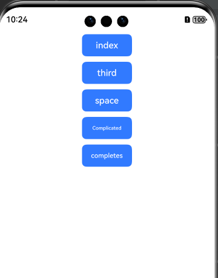

# Compare Text

## Introduction
> This project uses the Levenshtein distance algorithm to measure the difference between two strings.
> Compare Text is used to compare and replace strings.




## How to Install
```shell
ohpm install leven;
ohpm install easy-replace;
```
For details about the OpenHarmony ohpm environment configuration, see [OpenHarmony HAR](https://gitcode.com/openharmony-tpc/docs/blob/master/OpenHarmony_har_usage.en.md).

## How to Use

### Differences of LEVEN Strings
```
      import leven from "leven";
      @State TextString: string = "Text entry"
      @State messaged: string= "cer"
 
      TextInput({ placeholder: "Enter characters to compare," text: this.messaged })
        .width("70%")
        .onChange((value) => {
          this.messaged = value
        })
      Button("Compare Strings")
        .onClick(() => {
          this.messagevl = 'Number of different characters: ${leven(this.TextString, this.messaged)}'
          setData(this.messagevl, this)
        })
       Result => 8
```
### Comparison of easy-replace Strings
```
  import {er} from 'easy-replace'  

  @State TextString: string = "Text entry"// Enter a text string.
  @State ReplaceString: string= "t"// Character to be used for replacement.
  @State StringResults: string = "��"// Character to be replaced.
  Button("Simple Replace")
        .margin({ top: 10, bottom: 10 })
        .onClick(() => {
          this.Text = er(
            this.TextString,
            {
              leftOutsideNot: "",
              leftOutside: "",
              leftMaybe: "",
              searchFor: this.ReplaceString,
              rightMaybe: "",
              rightOutside: "",
              rightOutsideNot: "",
              i: {
                leftOutsideNot: false,
                leftOutside: false,
                leftMaybe: false,
                searchFor: true,
                rightMaybe: false,
                rightOutside: false,
                rightOutsideNot: false,
              },
            },
            this.StringResults
          );
          setData(this.Text, this)
        })
    }
```

## Constraints

This project has been verified in the following versions:
- DevEco Studio: NEXT Developer Beta1(5.0.3.122), SDK: API12(5.0.0.18)
- DevEco Studio: 4.1 (4.1.3.413), SDK: API 11 (4.1.0.53)
- DevEco Studio: 4.0 (4.0.3.512), SDK: API 10 (4.0.10.9)
- DevEco Studio: IDE Canary1 (4.0.3.212), SDK API 10 (4.0.8.3)

## Directory Structure
````
|---- Compare Text  
|     |---- entry  # Sample code
|           |---- index.ets  # External APIs
|     |---- README.md  # Readme                   
|     |---- README_zh.md  # Readme                   
````

## Available APIs

| API                                                      | Parameter                                                                                                                                                                            | Description                                                                                                                                                                                                                                                  |
|----------------------------------------------------------|--------------------------------------------------------------------------------------------------------------------------------------------------------------------------------------|--------------------------------------------------------------------------------------------------------------------------------------------------------------------------------------------------------------------------------------------------------------|
| leven(str1:string, str2:string)                          | str1: String 1.<br/>    str2: String 2.<br/>                                                                                                                                         | Indicates the minimum number of editing operations required to convert one string into another string.                                                                                                                                                       |
| er(source:string, opts:Plain Object, replacement:String) | source: Original string<br/>  opts: Required option object<br/> replacement: Use this string to replace all results. If not specified, the library will run in a deletion mode.<br/> | Performs complex string replacement operations. It allows you to define replacement rules through a configuration object, including search patterns, replacement content, and case sensitivity, etc. [More information](https://codsen.com/os/easy-replace/) |

## How to Contribute
If you find any problem during the use, submit an [Issue](https://gitcode.com/openharmony-tpc/openharmony_tpc_samples/issues) or a [PR](https://gitcode.com/openharmony-tpc/openharmony_tpc_samples/pulls) .

## License
The project is licensed under [Apache License 2.0](https://gitcode.com/openharmony-tpc/openharmony_tpc_samples/blob/master/Easyrelpace/LICENSE).
