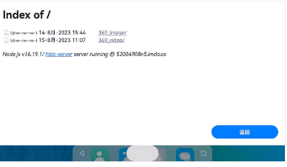

## ThreeJs360Demo

### 介绍

ThreeJs360Demo,使用系统提供的Web组件，加载threeJs，实现360度的全景渲染功能

### 效果展示



### 样例说明

参照该Demo工程[Index](./entry/src/main/ets/pages/Index.ets)页面

如：

```
    //https://53004908n5.imdo.co   ThreeJs实现全景效果的h5页面
   Web({ src: "https://53004908n5.imdo.co", controller: this.controller })
        .width('100%')
        .height('100%')
        .margin({ top: 10 })
        .imageAccess(true)
        .horizontalScrollBarAccess(true)
        .onProgressChange((ev) => {
          console.log("ThreeJs360 progress:" + ev.newProgress);
        })
        .onErrorReceive((error) => {
          console.log("ThreeJs360 error:" + error.error.getErrorInfo() + ";code:" + error.error.getErrorCode());
          console.log("ThreeJs360 error url:" + error.request.getRequestUrl());
        })
```

### 验证说明：

1丶将工程目录中的source文件下代码放到服务器，用系统的web组件访问

```
    运行命令：npx http-server.
```

2丶设置资源文件（图片或者视频）

图片

```
    Panorama.init(container, "xxxxx.jpg", 180);
```

视频

```
    <video
		preload
		ref="video"
		controls
		loop
		style="width: 100%; visibility: hidden; position: absolute"
		src="xxxxxxxxxxxxxxxxxxxxx.mp4"
		class="my_video"
	></video>
```

3丶web组件访问

```
    Web({ src: "https://53004908n5.imdo.co", controller: this.controller })
```

### 软件架构

```
|-ets
|   |-entryability
|           |-EntryAbility.ts
|   |-pages
|           |-Index.ets             #主页demo
|-doc      #threeJs实现源码
```

### 约束与限制

在下述版本验证通过：

DevEco Studio: 4.0 Canary2(4.0.1.300), SDK: API10 Beta(4.0.8.6)

### 贡献代码

使用过程中发现任何问题，都可以提[Issue](https://gitee.com/openharmony-tpc/openharmony_tpc_samples/issues)
给我们，当然，我们也非常欢迎给我们发[PR](https://gitee.com/openharmony-tpc/openharmony_tpc_samples/pulls)

### 开源协议

本项目基于[Apache License 2.0](./LICENSE)
,请自由的享受和参与开源