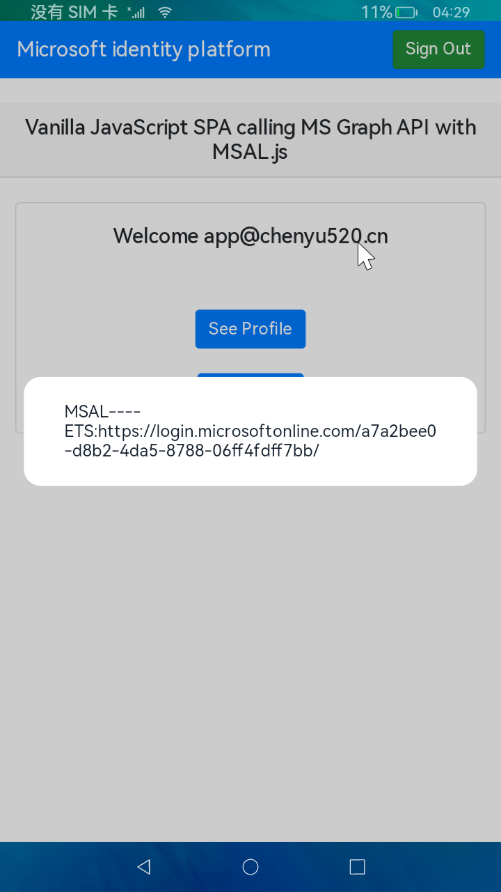
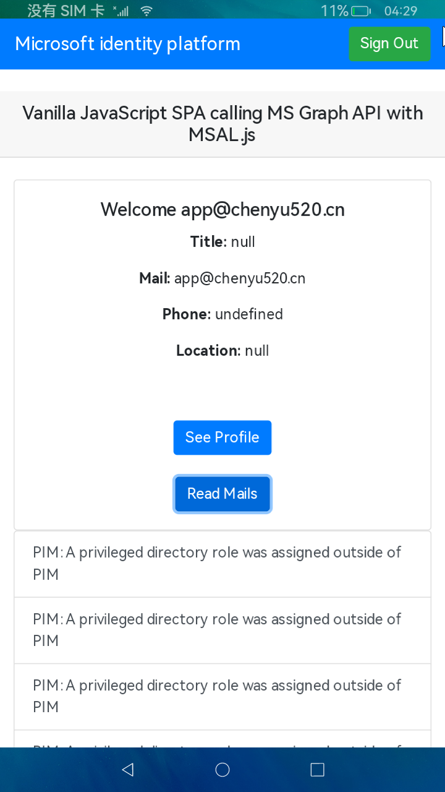
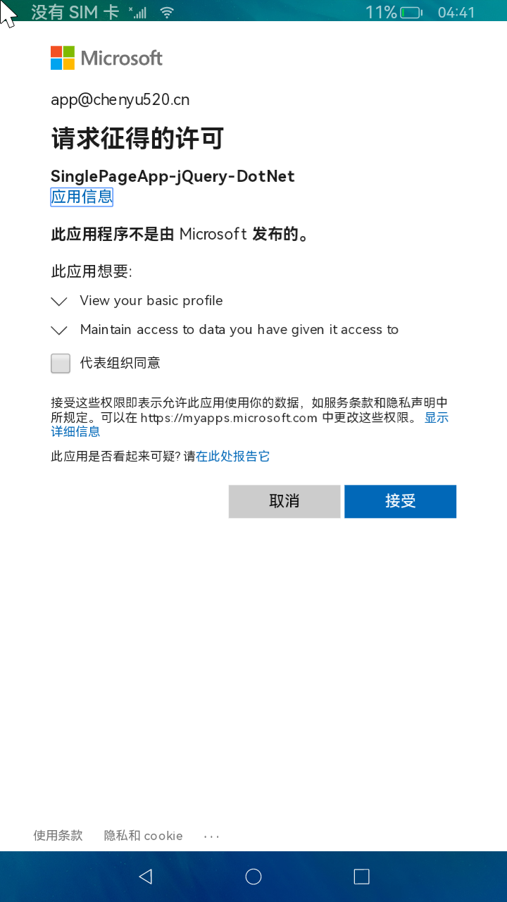
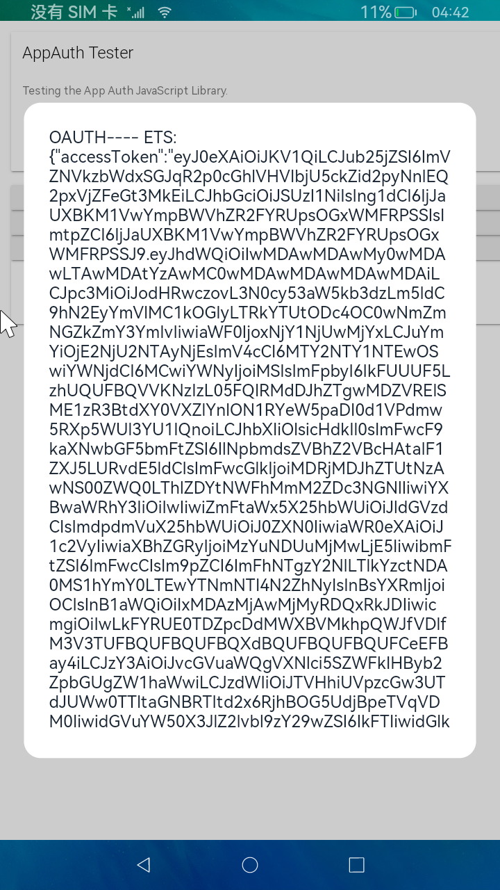
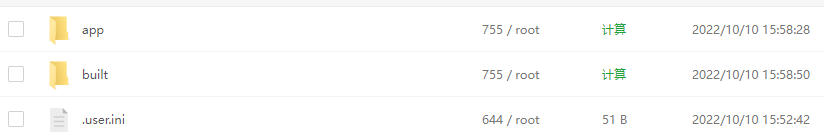
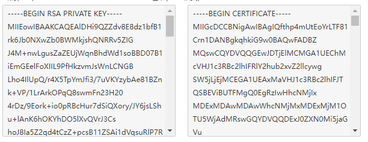
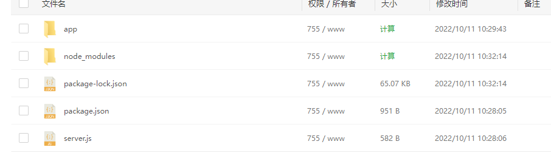
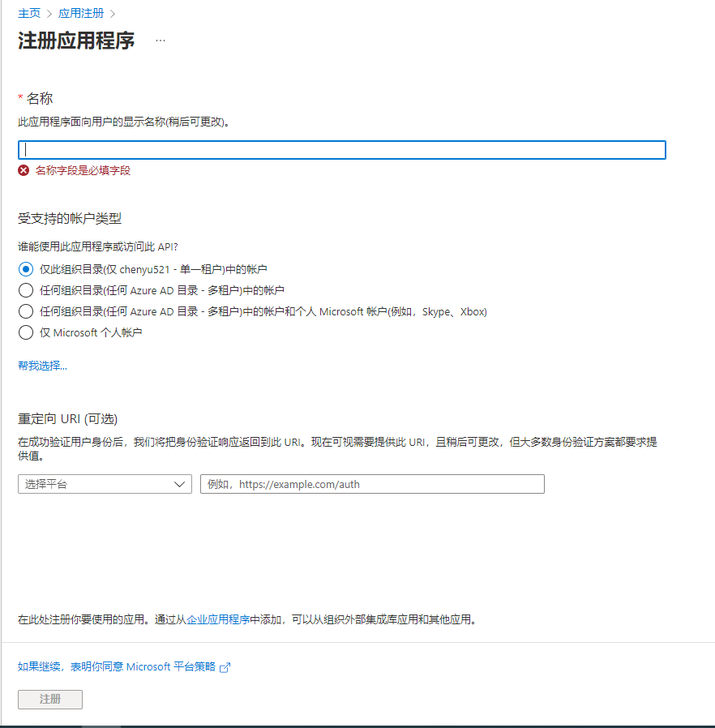

# AppAuth-js

## 简介

- OAUTH

此库可使用OAuth 2.0和OpenID Connect对用户进行身份验证和授权，它还支持对OAuth 的PKCE扩展

- MSAL

借助此库，开发人员能够从 Microsoft 标识平台获取令牌，以便对用户进行身份验证并访问受保护的 Web API。 它可用于提供对 Microsoft Graph、其他 Microsoft API、第三方 Web API 或你自己的 Web API 的安全访问。

## 效果演示

- MSAL





- OAUTH





## 下载安装

- OAUTH

```shell
npm install @openid/appauth
```

- MSAL

  - node方式安装

  ```shell
  npm install @azure/msal-browser
  ```

  - 使用CDN引入

  ```javascript
  <script type="text/javascript" src="https://alcdn.msauth.net/browser/2.30.0/js/msal-browser.min.js"></script>	
  ```


服务器端示例DEMO代码[下载](https://download.chenyu520.cn)

## 使用说明

- OAUTH

### 1.网站配置

将@openid/appauth路径下的app与built文件上传到服务器，使用node或者Nginx挂载网站



将域名解析到该站点，并给网站申请配置SSL证书，否则会造成跨域错误



### 2.配置应用信息

##### 2.1 在built/app/bundle.js中配置，如下所示（此处配置地址以微软Azure平台为例）：

 ```javascript
 var openIdConnectUrl = 'https://login.microsoftonline.com/a7a2bee0-d8b2-4da5-8788-06ff4fdff7bb/v2.0';
 
 var clientId = '04c02ae5-7005-4ed4-8ed6-5aa2c6d774ce';
 
 var redirectUri = 'https://test2.chenyu520.cn/app/redirect.html';
 ```

### 3.配置ArkTs工程

##### 3.1 在entry/src/main 目录下配置module.json5文件

 ```javascript
  "requestPermissions": [
       {
         "name": 'ohos.permission.INTERNET'
       }
     ]
 ```

##### 3.2  使用Web组件引用上面配置好的网站地址

 ```javascript
   Web({ src: 'https://test2.chenyu520.cn', controller: this.controller })
     .javaScriptAccess(true)
     .domStorageAccess(true)
     .mixedMode(this.mode)
     .onConsole((event) => {
       console.log('getMessage:' + event.message.getMessage());
       return false;
     });
 ```

##### 3.3 在bundle.js令牌响应结果中添加方法

 ```javascript
 window.objName.test(JSON.stringify(response));
 ```

##### 3.4 在ArkTs中接收结果

 ```javascript
    testObj = {
     test: (data) => {
       prompt.showDialog({message:'Web---- ArkTs:' + data})
       prompt.showDialog({message:'Web---- ArkTs tokenType:' + JSON.parse(data).tokenType})
       return data;
     }
   }
 
   onPageShow() {
     this.controller.registerJavaScriptProxy({
       object: this.testObj,
       name: "objName",
       methodList: ["test"],
     });
     this.controller.refresh()
   }
 ```

- MSAL

<font color='red'>注意：服务器需有node环境支持</font>

### 1.网站配置

将node_app上传到服务器，使用npm start启动服务，将域名解析到对应站点，并申请SSL证书（必备，否则PKCE过不去）



### 2.配置应用信息（此处以Azure平台为例）

##### 2.1 在Azure平台完成应用注册



重定向URL选择单页应用程序，地址为：node_app所运行页面域名（一定要为https）

##### 2.1 初始化MSAL对象

在app/authConfig.js中配置验证服务器相关信息，如下所示（此处配置地址以微软Azure平台为例）

```javascript
const msalConfig = {
    auth: {
        clientId: "0df059c0-5ee9-484b-82e4-6da77db41fa8",  			//此处为应用注册完成后的应用程序id
        authority: "https://login.microsoftonline.com/a7a2bee0-d8b2-4da5-8788-06ff4fdff7bb", 	//此处https://login.microsoftonline.com/租户id值
        redirectUri: "https://test.chenyu520.cn",	//此处为重定向URI
    },
    cache: {
        cacheLocation: "sessionStorage", 
        storeAuthStateInCookie: false, 
    },
    system: {	
        loggerOptions: {	
            loggerCallback: (level, message, containsPii) => {	
                if (containsPii) {		
                    return;		
                }		
                switch (level) {		
                    case msal.LogLevel.Error:		
                        console.error(message);		
                        return;		
                    case msal.LogLevel.Info:		
                        console.info(message);		
                        return;		
                    case msal.LogLevel.Verbose:		
                        console.debug(message);		
                        return;		
                    case msal.LogLevel.Warning:		
                        console.warn(message);		
                        return;		
                }	
            }	
        }	
    }
};
const loginRequest = {
    scopes: ["User.Read"]
};
const tokenRequest = {
    scopes: ["User.Read", "Mail.Read"],
    forceRefresh: false // Set this to "true" to skip a cached token and go to the server to get a new token
};
```

初始化对象

```javascript
const msalInstance = new msal.PublicClientApplication(msalConfig);
```

##### 2.2 用户登录

```javascript
var loginRequest = {
    scopes: ["user.read", "mail.send"] // optional Array<string>
};

try {
    msalInstance.loginRedirect(loginRequest);
} catch (err) {
    // handle error
}
```

##### 2.3 获取令牌以及使用令牌

- 请求令牌

```javascript
var request = {
    scopes: ["Mail.Read"],
    cacheLookupPolicy: CachePolicyLookup.Default 
};

msalInstance.acquireTokenSilent(request).then(tokenResponse => {
    // Do something with the tokenResponse
}).catch(error => {
    if (error instanceof InteractionRequiredAuthError) {
        return msalInstance.acquireTokenRedirect(request)
    }
});
```

- 使用令牌

```javascript
var headers = new Headers();
var bearer = "Bearer " + tokenResponse.accessToken;
headers.append("Authorization", bearer);
var options = {
        method: "GET",
        headers: headers
};
var graphEndpoint = "https://graph.microsoft.com/v1.0/me";

fetch(graphEndpoint, options)
    .then(resp => {
            //do something with response
    });
```

- 续订令牌

```javascript
var username = "test@contoso.com";
var currentAccount = msalInstance.getAccountByUsername(username);
var silentRequest = {
    scopes: ["Mail.Read"],
    account: currentAccount,
    forceRefresh: false
};

var request = {
    scopes: ["Mail.Read"],
    loginHint: currentAccount.username 
};

const tokenResponse = await msalInstance.acquireTokenSilent(silentRequest).catch(error => {
    if (error instanceof InteractionRequiredAuthError) {
        return msalInstance.acquireTokenRedirect(request)
    }
});
```

##### 2.4 注销登录

```javascript
const currentAccount = msalInstance.getAccountByHomeId(homeAccountId);
await msalInstance.logoutRedirect({
    account: currentAccount,
    postLogoutRedirectUri: "https://contoso.com/loggedOut"
});
```

## 接口说明

- MSAL
  - loginRedirect    		  此接口用于重定向发起登录请求
  - acquireTokenSilent   此接口用于请求令牌
  - logoutRedirect           此接口用于注销登录
- OAUTH
  - checkForAuthorizationResponse				检查授权响应
  - fetchServiceConfiguration                            获取终结点配置
  - makeAuthorizationRequest                         授权请求
  - makeTokenRequest                                      令牌请求

## 兼容性

支持 OpenHarmony API version 9 版本。

## 目录结构

````
|---- OHOS_APP_appauth_js  
|     |---- entry  # 示例代码文件夹
|         |---- src
|             |---- main
|                 |---- ets
|                     |---- pages  
|                         |---- index.ets 
|                         |---- MsalSample.ets # MSAL示例
|                         |---- OAuthSample.ets # OAuth示例
|     |---- README.md  # 安装使用方法                    
````

## 贡献代码

使用过程中发现任何问题都可以提 [ISSUE](https://gitee.com/hihopeorg/appauth-js/issues)给我们,当然，我们也非常欢迎你给我们发 [PR](https://gitee.com/hihopeorg/appauth-js/pulls) 。

## 开源协议

本项目基于 [Apache License 2.0](https://gitee.com/hihopeorg/appauth-js/blob/master/LICENSE) ，请自由地享受和参与开源。
