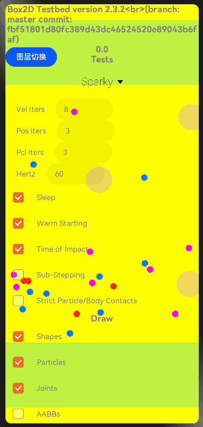

# box2d

## 简介

> 用于游戏开发，使物体的运动更加真实，让游戏场景看起来更具交互性，比如愤怒的小鸟

## 效果展示


## 下载安装

```shell
ohpm install @ohos/box2d
```

OpenHarmony ohpm环境配置等更多内容，请参考 [如何安装OpenHarmony ohpm包](https://gitcode.com/openharmony-tpc/docs/blob/master/OpenHarmony_har_usage.md)

## 使用说明

   ```
   import * as box2d from '@ohos/box2d'
   ...
   
  aboutToAppear() {
    selectArr = [];
    
    for (let i: number = 0; i < g_testEntries.length; ++i) {
      let o = {};
      o['value'] = g_testEntries[i].name;
      selectArr[i] = o;//初始化数据
    }
        //循环调用渲染
        this.init();
    }
    private init() {
        setTimeout(inits, timeStep);
    }
    const inits = function (time) {
      setTimeout(loop, timeStep);
    }
    
    const loop = function (time) {
      setTimeout(loop, timeStep);
      app.SimulationLoop(time);
    }

   ...
       //动画切换
       Select(selectArr)
              .selected(this.index)
              .value(selectArr[this.index].value)
              .font({ size: 20, weight: 200, family: 'serif', style: FontStyle.Normal })
              .selectedOptionFont({ size: 30, weight: 300, family: 'serif', style: FontStyle.Normal })
              .optionFont({ size: 20, weight: 200, family: 'serif', style: FontStyle.Normal })
              .onSelect((index: number) => {
                this.index = index;
                if (app) {
                  app.m_test_index = index;
                  //加载动画
                  app.LoadTest();
                }
              })
   ```

## 接口说明

### b2Body类接口 
1. 创建夹具
   `CreateFixture(def: b2FixtureDef): b2Fixture`
   • 输入：def - 夹具定义（形状、密度、摩擦力等）

   • 输出：新创建的夹具对象

2. 销毁夹具
   `DestroyFixture(fixture: b2Fixture): void`  
   • 输入：fixture - 要销毁的夹具对象

   • 输出：无

3. 设置变换
   `SetTransform(position: XY): void`  
   • 输入：position - 世界坐标位置

   • 输出：无

4. 获取变换
   `GetTransform(): b2Transform`  
   • 输出：返回当前刚体的变换矩阵（位置和角度）

5. 获取位置
   `GetPosition(): b2Vec2`  
   • 输出：刚体中心的世界坐标

6. 设置位置
   `SetPosition(position: XY): void`  
   • 输入：position - 目标世界坐标

   • 输出：无

7. 获取世界中心
   `GetWorldCenter(): b2Vec2`  
   • 输出：刚体质心的世界坐标

8. 获取本地中心
   `GetLocalCenter(): b2Vec2`  
   • 输出：刚体质心相对于本地坐标系的偏移

9. 设置线性速度
   `SetLinearVelocity(velocity: XY): void`  
   • 输入：velocity - 目标线性速度向量

   • 输出：无

### b2World类接口
1. 设置子步长
   `setSubStepping(flag: boolean): void`  
   • 输入：flag - 是否启用子步长（用于复杂模拟）

   • 输出：无

2. 设置销毁侦听器
   `SetDestructionListener(listener: b2DestructionListener | null): void`  
   • 输入：listener - 回调接口（处理对象销毁事件）

   • 输出：无

3. 设置接触筛选器
   `SetContactFilter(filter: b2ContactFilter): void`  
   • 输入：filter - 回调接口（决定是否允许碰撞）

   • 输出：无

4. 设置接触监听
   `SetContactListener(listener: b2ContactListener): void`  
   • 输入：listener - 回调接口（处理碰撞事件）

   • 输出：无

5. 设置调试绘图
   `SetDebugDraw(debugDraw: b2Draw | null): void`  
   • 输入：debugDraw - 调试绘图接口

   • 输出：无

6. 创建刚体
   `CreateBody(def: b2BodyDef): b2Body`  
   • 输入：def - 刚体定义（类型、位置、阻尼等）

   • 输出：新创建的刚体对象

7. 销毁刚体
   `DestroyBody(body: b2Body): void`  
   • 输入：body - 要销毁的刚体

   • 输出：无

8. 创建关节
   `CreateJoint(def: b2JointDef): b2Joint`  
   • 输入：def - 关节定义（连接体、锚点等）

   • 输出：新创建的关节对象

9. 销毁关节
   `DestroyJoint(joint: b2Joint): void`  
   • 输入：joint - 要销毁的关节

   • 输出：无

### b2Contact类接口
1. 重置
   `Reset(): void`  
   • 输出：无（重置接触状态）

2. 获取歧管
   `GetManifold(): b2Manifold`  
   • 输出：碰撞歧管数据（接触点集合）

3. 获取世界歧管
   `GetWorldManifold(worldManifold: b2WorldManifold): void`  
   • 输入/输出：worldManifold - 存储世界坐标系下的歧管数据

4. 设置切线速度
   `SetTangentSpeed(speed: number): void`  
   • 输入：speed - 切线方向的速度值

   • 输出：无

5. 重置摩擦力
   `ResetFriction(): void`  
   • 输出：无（恢复默认摩擦力）

6. 设置摩擦力
   `SetFriction(friction: number): void`  
   • 输入：friction - 新的摩擦系数

   • 输出：无

7. 设置是否启用
   `SetEnabled(flag: boolean): void`  
   • 输入：flag - 是否启用接触

   • 输出：无

8. 获取夹具A
   `GetFixtureA(): b2Fixture`  
   • 输出：接触中的第一个夹具

### b2Shape类接口
1. 光线投射
   `RayCast(output: b2RayCastOutput, input: b2RayCastInput, transform: b2Transform, childIndex: number): boolean`  
   • 输入：input - 光线参数； transform - 变换矩阵； childIndex - 子形状索引

   • 输出：output - 存储交点信息；返回是否命中

2. 获取类型
   `GetType(): b2ShapeType`  
   • 输出：形状类型枚举（圆形、多边形等）

3. 拷贝
   `Copy(other: b2Shape): b2Shape`  
   • 输出：返回形状的深拷贝

4. 获取孩子数量
   `GetChildCount(): number`  
   • 输出：子形状的数量（复合形状用）

5. 计算AABB
   `ComputeAABB(aabb: b2AABB, xf: b2Transform, childIndex: number): void`  
   • 输入：xf - 变换矩阵；childIndex - 子形状索引

   • 输出：aabb - 存储计算结果

6. 计算质量
   `ComputeMass(massData: b2MassData, density: number): void`  
   • 输入：density - 密度值

   • 输出：massData - 存储质量、质心等数据

7. 计算距离
   `ComputeDistance(xf: b2Transform, p: b2Vec2, normal: b2Vec2, childIndex: number): number`  
   • 输入：xf - 变换矩阵；p - 世界坐标系中的一个点；normal - distance返回与当前形状的距离； childIndex -  子形状索引

   • 输出：返回最小距离

8. 克隆
   `clone(): b2Shape`  
   • 输出：返回新实例（同Copy）

## 关于混淆
- 代码混淆，请查看[代码混淆简介](https://docs.openharmony.cn/pages/v5.0/zh-cn/application-dev/arkts-utils/source-obfuscation.md)
- 如果希望box2d库在代码混淆过程中不会被混淆，需要在混淆规则配置文件obfuscation-rules.txt中添加相应的排除规则：
```
-keep
./oh_modules/@ohos/box2d
```

## 约束与限制

在下述版本验证通过：

- DevEco Studio: NEXT Beta1-5.0.3.806, SDK: API12 Release (5.0.0.66)
- DevEco Studio 版本： 4.1 Canary(4.1.3.317) OpenHarmony SDK:API11 (4.1.0.36)

## 目录结构
````
|---- box2d
|     |---- entry
|	        |----src
|                |----main
|                     |----ets
|                          |----pages
|                               |----Index.ets                          # 效果主页面
|                          |----Testbed
|                               |----Framework 
|                                    |----DebugDraw.ets                 # 效果绘制具体实现
|                                    |----FullscreenUI.ts               # 全局页面初始化，是否启用粒子参数
|                                    |----Main.ets                      # 效果绘制入口
|                                    |----ParticleEmitter.ts            # 粒子发射器
|                                    |----ParticleParameter.ts          # 粒子参数
|                                    |----Test.ets                      # canvas相关初始化设置
|                               |----Tests                              # 所有效果具体实现
|                               |----Testbed.ts                         # 对外接口
|     |---- library                                                       # box2d核心库
|	        |----src
|                |----main
|                     |----ets
|                          |----Box2D
|                               |----Collision                          # 碰撞目录
|                                    |----Shapes                        # 形状目录
|                                         |----b2ChainShape.ts          # 链条形状
|                                         |----b2CircleShape.ts         # 圆形状
|                                         |----b2EdgeShape.ts           # 边缘形状
|                                         |----b2PolygonShape.ts        # 多边形形状
|                                         |----b2Shape.ts               # 形状抽象类
|                                    |----b2BroadPhase.ts               # 广义定义
|                                    |----b2CollideCircle.ts            # 圆形碰撞
|                                    |----b2CollideEdge.ts              # 边缘碰撞
|                                    |----b2CollidePolygon.ts           # 多边形碰撞
|                                    |----b2Collision.ts                # 碰撞类
|                                    |----b2Distance.ts                 # 距离类
|                                    |----b2DynamicTree.ts              # 动态树
|                                    |----b2TimeOfImpact.ts             # 影响时间
|                               |----Common                             # 通用代码：绘制、设置、定时器等
|                                    |----b2BlockAllocator.ts           # 块分配器
|                                    |----b2Draw.ts                     # 绘制类
|                                    |----b2GrowableStack.ts            # 生长堆栈
|                                    |----b2Math.ts                     # 数学计算类
|                                    |----b2Settings.ts                 # 设置类
|                                    |----b2StackAllocator.ts           # 堆栈分配器
|                                    |----b2Timer.ts                    # 计时器类
|                               |----Controllers                        # 控制器目录
|                                    |----b2BuoyancyController.ts       # 浮力控制器
|                                    |----b2ConstantAccelController.ts  # 恒定加速度控制器
|                                    |----b2ConstantForceController.ts  # 恒力控制器
|                                    |----b2Controller.ts               # 重力控制器
|                                    |----b2GravityController.ts        # 张量阻尼控制器
|                               |----Dynamics
|                                    |----Contacts                      # 接触类目录
|                                    |----Joints                        # 关节目录
|                                    |----b2Body.ts                     # 刚体类
|                                    |----b2ContactManager.ts           # 接触管理类
|                                    |----b2Fixture.ts                  # 夹具类
|                                    |----b2Island.ts                   # 岛类
|                                    |----b2TimeStep.ts                 # 时间步类
|                                    |----b2World.ts                    # 世界类
|                                    |----b2WorldCallbacks.ts           # 世界回调类
|                               |----Particle                           # 粒子目录
|                                    |----b2Particle.ts                 # 粒子类
|                                    |----b2ParticleGroup.ts            # 粒子群类
|                                    |----b2ParticleSystem.ts           # 粒子系统类
|                                    |----b2StackQueue.ts               # 堆栈队列类
|                                    |----b2VoronoiDiagram.ts           # 诺图类
|                               |----Rope                               # 绳索目录
|                                    |----b2Rope.ts                     # 绳索
|                               |----Box2D.ts                           # 所有接口导出类
|                               |----box2d.umd.js                       # 所有接口导出实现类
|     |---- README.md                                                   # 安装使用方法   
|     |---- README_zh.md                                                # 安装使用方法                    
````

## 贡献代码

使用过程中发现任何问题都可以提 [Issue](https://gitcode.com/openharmony-tpc/openharmony_tpc_samples/issues) 给我们，当然，我们也非常欢迎你给我们发 [PR](https://gitcode.com/openharmony-tpc/openharmony_tpc_samples/pulls) 。

## 开源协议

本项目基于 [MIT License](https://gitcode.com/openharmony-tpc/openharmony_tpc_samples/blob/master/box2d/LICENSE) ，请自由地享受和参与开源。

