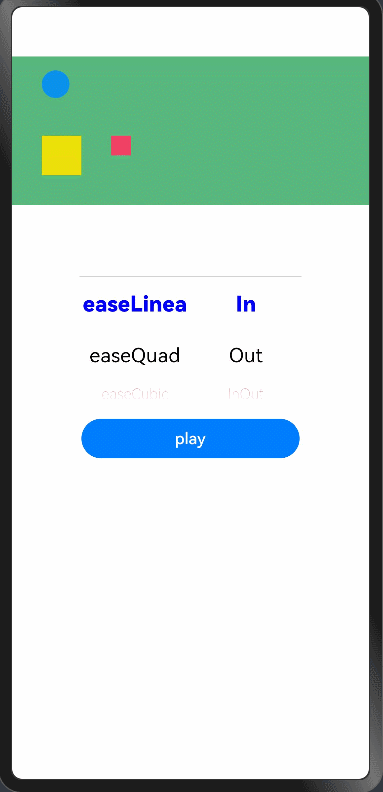
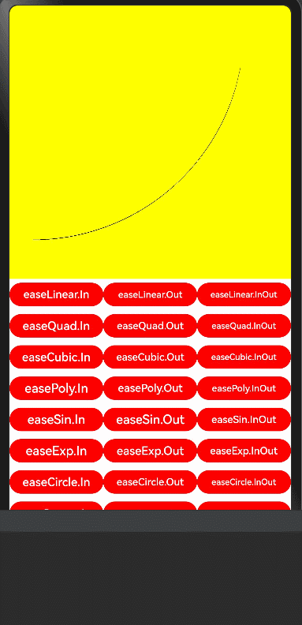

## d3.js easing Functions

## 简介

该库为UI动画组件 easing 缓动函数是用来描述数值的变化速率，这些数值可以是动画对象的宽高，透明度，旋转，缩放等属性值，它们的变化率可以用函数曲线来表示,制作出更加符合直觉的UI动效,使动画看上去更加真实。已经实现的函数如下所示：





## 下载安装

```javascript
ohpm install d3-ease
```

OpenHarmony ohpm环境配置等更多内容，请参考[如何安装 OpenHarmony ohpm包](https://gitee.com/openharmony-tpc/docs/blob/master/OpenHarmony_har_usage.md)


## 使用说明

```
import * as Easing from 'd3-ease';
```

使用示例

### 第一步：创建自己需要的动画

  ```javascript
import Animator, { AnimatorResult } from '@ohos.animator';

backAnimator: AnimatorResult = Animator.create({
    duration: 1000,
    easing: 'linear',
    direction: 'normal',
    iterations: 1,
    delay: 0,
    fill: 'none',
    begin: 0,
    end: 1
});
  ```

### 第二步，实现onframe方法，并调用函数方法进行计算(小球动画示例)

```javascript

  ballBeginX = 30;
  ballEndX = 320;
  @State ballAnimateValue: number = 30;

  this.animator.onframe = (normalizedTime) => {
      const distance = this.ballEndX - this.ballBeginX;
      this.ballAnimateValue = this.ballBeginX + Easing.Linear(normalizedTime) * distance;
  }

  build() {
        Column() {
              Stack({alignContent: Alignment.TopStart}) {
                  // 小球 动画作用在 margin left 属性
                  Column(){}.width(28).height(28)
                      .backgroundColor('#ff0991ec')
                      .borderRadius(14)
                      .margin({left: this.ballAnimateValue, top: 14});
              }
        }
  }
```

## 接口说明

### Easing

| 接口名              | 参数类型   | 返回值类型  | 说明                   |
|------------------|--------|--------|----------------------|
| easeBackIn       | number | number | 偏移动画估值               |
| easeBackOut      | number | number | 偏移动画估值               |
| easeBackInOut    | number | number | 偏移动画估值               |
| easeBounceIn     | number | number | 弹簧动画估值               |
| easeBounceOut    | number | number | 弹簧动画估值               |
| easeBounceInOut  | number | number | 弹簧动画估值               |
| easeCircleIn     | number | number | 圆弧的动画估值              |
| easeCircleOut    | number | number | 圆弧的动画估值              |
| easeCircleInOut  | number | number | 圆弧的动画估值              |
| easeCubicIn      | number | number | 三次曲线动画估值             |
| easeCubicOut     | number | number | 三次曲线动画估值             |
| easeCubicInOut   | number | number | 三次曲线动画估值             |
| easeElasticIn    | number | number | 心电图动画估值              |
| easeElasticOut   | number | number | 心电图动画估值              |
| easeElasticInOut | number | number | 心电图动画估值              |
| easeExpIn        | number | number | 外露函数动画估值             |
| easeExpOut       | number | number | 外露函数动画估值             |
| easeExpInOut     | number | number | 外露函数动画估值             |
| easeQuadIn       | number | number | 四次曲线动画估值             |
| easeQuadOut      | number | number | 四次曲线动画估值             |
| easeQuadInOut    | number | number | 四次曲线动画估值             |
| easePolyIn       | number | number | 五次曲线动画估值             |
| easePolyOut      | number | number | 五次曲线动画估值             |
| easePolyInOut    | number | number | 五次曲线动画估值             |
| easeSinIn        | number | number | 正弦函数动画估值             |
| easeSinOut       | number | number | 正弦函数动画估值             |
| easeSinInOut     | number | number | 正弦函数动画估值             |
| easeLinear   | number | number | 直线动画估值               |


## 约束与限制

在下述版本验证通过：

DevEco Studio 版本： 4.1 Canary(4.1.3.500), OpenHarmony SDK: API11 (4.1.3.1)

## 目录结构

```javascript
|---- animationFunction  
|     |---- entry  # 示例代码文件夹
|     |---- README_zh.MD  # 安装使用方法                   
```

## 贡献代码

使用过程中发现任何问题都可以提 [Issue](https://gitee.com/openharmony-tpc/openharmony_tpc_samples/issues) 给我们，当然，我们也非常欢迎你给我们发 [PR](https://gitee.com/openharmony-tpc/openharmony_tpc_samples/pulls) 。

## 开源协议

本项目基于 [BSD 3-Clause License](https://gitee.com/openharmony-tpc/openharmony_tpc_samples/blob/master/d3JsEasingDemo/LICENSE)，请自由地享受和参与开源。
