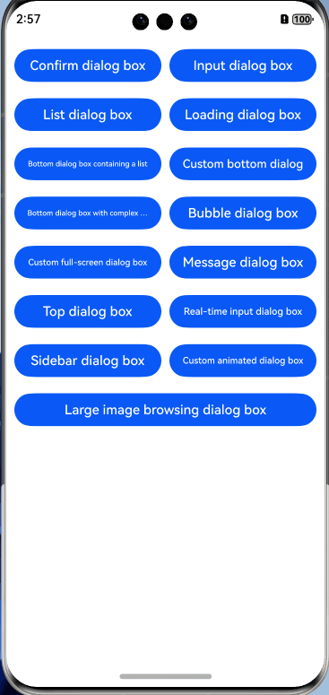
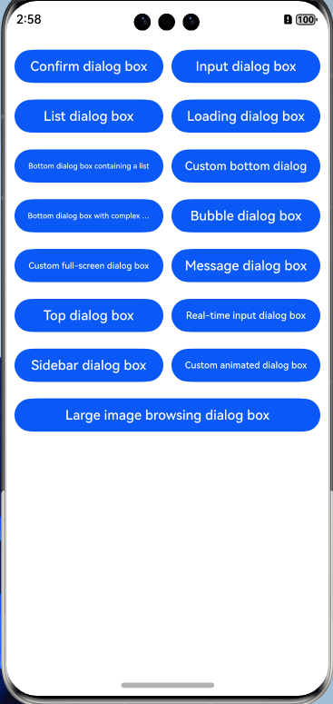

# dialogs

## Introduction
This project is a UI library that encapsulates and combines the basic and custom  dialog box capabilities in OpenHarmony. It implements a variety of dialog boxes that address different purposes (such as confirmation, selection, information presentation, and image browsing) and come in a wide range of styles (animated, slider, and more) and locations (top, bottom, or full-screen).


## Demos

1. Confirm dialog box.


2. Input dialog box.


3. List dialog box.


4. Loading dialog box.


5. Bottom dialog box containing a list.


6. Custom bottom dialog.


7. Bottom dialog box with complex interactions.


8. Bubble dialog box.


9. Custom full-screen dialog box.


10. Message dialog box.


11. Top dialog box.



12. Real-time input dialog box.


13. Sidebar dialog box.


14. Custom animated dialog box.


15. Large image browsing dialog box.




## How to Install

1. Install @ohos/dialogs.

```
ohpm install @ohos/dialogs
```
For details about the OpenHarmony ohpm environment configuration, see [OpenHarmony HAR](https://gitcode.com/openharmony-tpc/docs/blob/master/OpenHarmony_har_usage.en.md).

2. Import the required components to the page, for example, **ConfirmDialog.ets**.

```
import { ConfirmDialog } from '@ohos/dialogs'
```

## How to Use

Example of using the confirm dialog box.
   ```typescript
import { ConfirmDialog } from '@ohos/dialogs'
import { BaseCenterMode } from '@ohos/dialogs' // Custom property.
import { TestType } from '@ohos/hypium'

@Entry
@Component
struct ConfirmExample {
  @State textValue: string = 'Title'
  @State contentValue: string ='Before my bed a pool of light. Can it be hoarfrost on the ground? Looking up, I find the moon bright; Bowing, in homesickness I'm drowned.'
  @State inputValue: string = 'click me'
  @State positionDialog: string = 'center'
  @State animitionMove:string = 'center'
  @State model:BaseCenterMode = new BaseCenterMode()

  aboutToAppear(){
    this.model.title ='Title',
    this.model.contentValue ='Before my bed a pool of light. Can it be hoarfrost on the ground? Looking up, I find the moon bright; Bowing, in homesickness I'm drowned.'
    // this.model.contentMargin = 20
    this.model.titleMargin = { top: 30,bottom: 10 }
this.model.btnWidth = '100%'
this.model.btnHeight = '100%'
this.model.confirmBtnFontColor = '#87C5BF'
this.model.confirmBtnBgColor = '#fff'
this.model.confirm = this.onAccept
this.model.btnContentHeight = 60
this.model.btnContentMargin = { top: 20 }
this.model.btnContentBorder = {
  width: { top: 1 },
  color:{ top:'#F0F0F0' },
  style:{ top:BorderStyle.Solid },
}
}

dialogController: CustomDialogController = new CustomDialogController({
  builder: ConfirmDialog({
    slotContent: () => {
      this.componentBuilder()
    },
    model:this.model
  }),
  cancel: this.existApp,
  autoCancel: true,
  alignment: DialogAlignment.Center,
  offset: { dx: 0, dy: 0 },
  gridCount: 4,
  customStyle: true
})

// Delete dialogController and set it to undefined when the custom component is about to be destroyed.
aboutToDisappear() {
  delete this.dialogController, // Delete dialogController.
  this.dialogController = undefined // Set dialogController to undefined.
}

onAccept() {
  console.info('Callback when the second button is clicked')
}

existApp() {
  console.info('Click the callback in the blank area')
}

// Custom content
@Builder componentBuilder() {
  Text ('Before my bed a pool of light. Can it be hoarfrost on the ground? Looking up, I find the moon bright; Bowing, in homesickness I'm drowned.')
    .fontSize(this.model.contentFontSize)
    .margin(20)
    .textAlign(this.model.contentTextAlign)
}

build() {
    Column() {
      Button ('Display confirm dialog box').onClick (() => {
        this.dialogController.open()
      })
    }
}
}
   ```

## Global Properties
| Name                | Type            | Description                          |
|---------------------|------------------|--------------------------------|
| autoClose           | function         | Whether to close the dialog box after an operation. This property is used for confirmation and selection scenarios.       |
| popupAnimation      | TransitionEffect | Dialog animator, which can be customized.                 |
| positionDialog      | string           | Position of the dialog. The value can be **Left**, **Right**, **Top**, or **Bottom**.|
| isSupportGesture    | boolean          | Whether to support dragging gestures.                      |
| isDeleteOnDisappear | boolean          | Whether to delete objects and release resources when the dialog box is closed.                      |
| customCallback      | CustomCallback   | Callback before and after the dialog is built.                      |

#### Components

**confirmDialog**

Defines a confirm dialog box.

Parameters

| Name            | Type                         | Mandatory| Description               |
| ------------------ | ----------------------------- | ---- |-------------------|
| slotContent | @Builder                      | Yes  | Container of the confirm dialog box.|

**inputDialog**

Defines an input dialog box.

Parameters

| Name            | Type                        | Mandatory| Description               |
| ------------------ | ---------------------------- | ---- |-------------------|
| inputValue | string                      | Yes  | Value of the input dialog box.|


**listSelectDialog**

Defines a list dialog box, with support for single selection or multiple selections.

Parameters

| Name            | Type           | Mandatory| Description  |
| ------------------ |---------------| ---- |------|
| arrList | object[]      | Yes  | List.|

**loadingDialog**

Defines a loading dialog box.

Parameters

| Name            | Type    | Mandatory| Description  |
| ------------------ |--------| ---- |------|
| loadingTitle | string | Yes  | Title of the loading dialog box.|

**Custom Bottom Dialog**

Defines a custom bottom dialog.

Parameters

| Name            | Type    | Mandatory| Description                |
| ------------------ |--------| ---- |--------------------|
| customComponent | function | Yes  | Function used to return a builder as a container.|
| arr | string[] | Yes  | List content.            |
| dialogInput | CustomDialog | Yes  | Secondary dialog.           |


customComponent

| API   | Parameter                           | Description    |
| --------- |-------------------------------|--------|
| customComponent  | item: string, itemIndex: number| Content of the container.|

Return value

| Type                 | Description         |
| --------------------- |-------------|
|  @Builder   | Returns the content of a custom container.|


**Complex Interaction Bottom Dialog**

Parameters

| Name            | Type      | Mandatory | Description                |
| ------------------ |----------|-----|--------------------|
| customComponent | function | Yes  | Function used to return a builder as a container.|
| arr | string[] | Yes  | List content.            |
| dialogTitle | string   | Yes  | Title of the dialog.              |
| scrollEmptyHeight | number   | No  | Scroll height, which is used internally. The default value is **20**. |


**popopDialog**

Defines a bubble dialog.

Parameters

| Name            | Type       | Mandatory| Description   |
| ------------------ |-----------| ---- |-------|
| placement | Placement | Yes  | Position of the dialog box.|
| firstText | string    | Yes  | Text on the left. |
| secondText | string    | Yes  | Text on the right. |

**fullScreen**

Defines a full-screen dialog.

Parameters

| Name            | Type                       | Mandatory   | Description          |
| ------------------ | --------------------------- |-------|--------------|
| slotContent | @Builder                    | Yes    | Container of the full-screen component.|
| slotBgColor | string | No           | Background color of the dialog. The default color is white. |

**message**

Defines a message dialog box.

Parameters

| Name            | Type    | Mandatory | Description                          |
| ------------------ |--------|-----|------------------------------|
| positionDialog | string | Yes  | Position of the dialog box, which can be top, left, right, and bottom.|
| blurValue | number | Yes  | Background blur value.                       |

**topDialog**

Defines a top dialog.

Parameters

| Name            | Type      | Mandatory | Description                          |
| ------------------ |----------|-----|------------------------------|
| slotContent | @Builder | Yes  | Container of the top component.                |
| isAnimation | boolean  | Yes  | Whether to display the animation effect. If the value is set to **true**, the animation effect is displayed; otherwise, the animation effect is not displayed|

**realtimeInput**

Defines a real-time input dialog box.

Parameters

| Name            | Type    | Mandatory | Description   |
| ------------------ |--------|-----|-------|
| inputVal | string | Yes  | Input value.  |

**sideBarCustomDialog**

Defines a sidebar dialog box.

Parameters

| Name            | Type    | Mandatory | Description  |
| ------------------ |--------|-----|------|
| customComponent | @Builder | Yes  | Container.|


**positionDialog**

Defines a custom animated dialog.

Parameters

| Name            | Type                 | Mandatory | Description    |
| ------------------ |---------------------|-----|--------|
| slotContent | @Builder            | Yes  | Container.  |
| animateOptions | AnimateDialogOptions | Yes  | Default animation options.|
| duration | number              | Yes  | Duration of the animation.  |
| curve | Curve              | Yes  | Animation curve.  |

**imageBrowser**

Defines a large image browsing dialog.

Parameters

| Name      | Type   | Mandatory | Description    |
|-----------|-------|-----|--------|
| imageList | Resource[] | Yes  | Image list.|
| index     | number              | Yes  | Image index.|

## Constraints

This project has been verified in the following versions:

DevEco Studio: NEXT Beta1-5.0.3.806, SDK: API12 Release(5.0.0.66)
DevEco Studio: 5.0 Canary3(5.0.3.320), OpenHarmony SDK: API 11 (4.1.0.36)


## Directory Structure
Below is the software architecture.
```

|---- Xpopup 
|    |----Dialog # Component
        |----src # Component entry
            |----main
                |----ets
                    |----components # Component library
                        |----confirmDialog # Confirm dialog box
                        |----InputDialog # Input dialog box
                        |----listSelectDialog # List dialog box
                        |----loadingDialog # Loading dialog box
                        |----bottomDialog
                            |----BottomListDialog # Bottom list dialog box
                            |----BottomScrollDialog # Custom bottom dialog
                        |----popupBottom # Bubble dialog box
                        |----fullScreenDialog #Custom full-screen dialog box
                        |----messageDialog # Message dialog box
                        |----topDialog # Top dialog box
                        |----realtimeInputPopup # Real-time input dialog box
                        |----sliderdialog # Slider dialog box
                        |----positionDialog # Custom animated dialog box
                        |----imageBrowser # Large image browsing dialog box
        |----resource
        |----index # External components
| |----entry # Page entry
        |----src # Component entry
            |----main
                |----ets
                    |----components # Common components
                    |----entryability # Page configuration of the components
                    |----pages # Page entry
                    |----utils # Common methods
                |----resource # Project resource configuration
                    |----base
                        |----profile 
                            |----main_pages.json # Page route configuration

```


## How to Contribute

If you find any problem when using the project, submit an [issue](https://gitcode.com/openharmony-tpc/openharmony_tpc_samples/issues) or a [PR](https://gitcode.com/openharmony-tpc/openharmony_tpc_samples/pulls).

## License

This project is licensed under [Apache-2.0 License](https://gitcode.com/openharmony-tpc/openharmony_tpc_samples/blob/master/dialogs/LICENSE).
