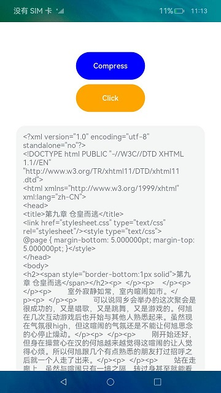

# epublib

## Introduction

> Epublib is an ETS library used to read, write, or operate EPUB files.


## Effect



## How to Install

```shell
ohpm install @ohos/epublib
```
For details about the OpenHarmony ohpm environment configuration, see [OpenHarmony HAR](https://gitee.com/openharmony-tpc/docs/blob/master/OpenHarmony_har_usage.en.md).


## How to Use
### Sample Code
1. Import GlobalContext to entryAbility.
```
import { GlobalContext } from '@ohos/epublib'

onWindowStageCreate(windowStage: window.WindowStage) {
// The main window is created. Set a main page for this ability.
GlobalContext.getContext().setValue('filePath',this.context.filesDir)
}
```
2. Import epublib to the page.
```
import {DOMParser,EpubReader,EpubWriter, Book,Author,EpubResource,MediaType,Metadata,MediatypeService} from "@ohos/epublib"
```
3. Use the project.

```
  funcStart(input: string) {
    console.log("-----funcStart----filePath-----------------" + input)
    let result = EpubReader.readEpub(input);
    if (result != undefined) {
      result.then((book) => {
        this.text = book.getResources()
          .getResourceMap()
          .get("chapter_446465249.xhtml")
          .getStrData()
          .toString();
        console.error("----index-result-------" + this.text)
        this.testEpubWriter(book)

      });
    }
  }

```

## Available APIs
1. Obtains a book instance.
   `readEpub(inPath:string, encoding?:string, lazyLoadedTypes?: Array<MediaType>):Book`
2. Reads the eBook through resources.
   `readEpubToBook(resources:Resources, result?:Book):Book`
3. Reads and parses the EPUB ebook from EPUB files in a lazy manner.
   `readEpubLazy(inPath: string, encoding?: string, lazyLoadedTypes?: Array<MediaType>): Book `
4. Obtains the collection of all images, chapters, sections, XHTML files, and style sheets of the book.
   `getResources(): Resources `
5. Obtains the book content.
   `getStrData()`
6. Writes the book content.
   `write(book: Book, fileName: string)`
7. Obtains the content sequence of the EPUB eBook.
   `getSpine()`
8. Obtains the metadata of the EPUB eBook.
   `getMetadata()`
9. Adds a resource to the EPUB eBook.
   `addResource(resource: EpubResource): EpubResource`
10. Obtains the location of the EPUB file in the folder.
       `getHref()`
11. Loads resources through compressed files.
       `loadResources(ZipFile zipFile, String defaultHtmlEncoding, List<MediaType> lazyLoadedTypes) `
12. Captures the output directory.
       `outFile(inZipPath: string): string`
13. Sets the author.
       `addAuthor(author: Author)`
14. Adds the title.
       `addTitle(title: string): string`
15. Sets the language.
       `setLanguage(language: string)`

## Constraints

This project has been verified in the following version:

- DevEco Studio: NEXT Beta1-5.0.3.806, SDK: API12 Release(5.0.0.66)

- DevEco Studio: 4.1 Canary (4.1.3.521), OpenHarmony SDK: API 11 (4.1.0.65)

## Directory Structure

````
|---- epublib  
|     |---- entry  # Sample code
|     |---- epublib   # eBook library
|         |---- index.ets External APIs   
|             |---- src
|                 |---- main
|                     |---- ets
|                         |---- components
|                             |---- domain # Book data models
|                             |---- epub   # Parsing and processing
|                             |---- service # Supported media types
|                             |---- util # Common method library
|                             |---- Constants.ets # Constant definition
|     |---- README.md  # Readme                   
````


## How to Contribute

If you find any problem when using the project, submit an [issue](https://gitee.com/openharmony-tpc/openharmony_tpc_samples/issues) or a [PR](https://gitee.com/openharmony-tpc/openharmony_tpc_samples/pulls).

## License

This project is licensed under [LGPL License 3.0](https://gitee.com/openharmony-tpc/openharmony_tpc_samples/blob/master/epublib/LICENSE).
