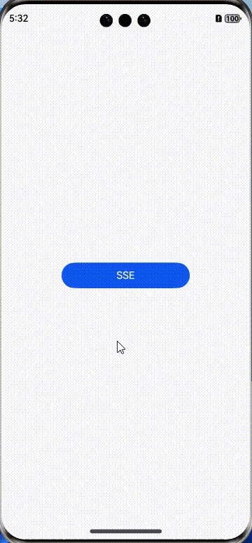

# eventsource
# Introduction
The eventsource third-party library is a pure JavaScript implementation of the EventSource client. It provides a mechanism for establishing a one-way continuous connection between the client and the server. The server can use this connection to send event updates to the client, and the client can receive and process the updates in real time.



# How to Install
    ohpm install @ohos/eventsource
For details about the OpenHarmony ohpm environment configuration, see [OpenHarmony HAR](https://gitee.com/openharmony-tpc/docs/blob/master/OpenHarmony_har_usage.en.md).


# How to Use
1. Import the dependency.
```javascript
import EventSource from '@ohos/eventsource';
```


2. Add permissions in the `module.json5` file.
```javascript
"requestPermissions": [
    {
        "name": "ohos.permission.INTERNET"
    }
]
```
### SSE Server Required for Co-working
#### Server sample code
Create a node server that can transmit event stream data. For details, see the server directory (./server).
```javascript
const express = require('express');
const serveStatic = require('serve-static');
const SseStream = require('ssestream');

const app = express()
app.use(serveStatic(__dirname));
app.get('/sse', (req, res) => {
  console.log('new connection');

  const sseStream = new SseStream(req);
  sseStream.pipe(res);
  const pusher = setInterval(() => {
    sseStream.write({
      event: 'server-time',
      data: new Date().toTimeString()
    })
  }, 1000)

  res.on('close', () => {
    console.log('lost connection');
    clearInterval(pusher);
    sseStream.unpipe(res);
  })
})

app.listen(8080, (err) => {
  if (err) throw err;
  console.log('server ready on http://localhost:8080');
})
```
#### Client sample code

```javascript
import promptAction from '@ohos.promptAction';
import EventSource from '@ohos/eventsource'
@State es: null | Eventsource = null;
@State url:string = "http://localhost:8080/sse";
eventListener = (e: Record<"data", string>) => {
  this.simpleList.push(e.data);
}
// Create a connection.
this.es = new EventSource(this.url)

// Enable a listener.
this.es.addEventListener("server-time", this.eventListener);

// Remove the listener.
this.es.removeEventListener("server-time", this.eventListener);

// Disconnect from the server.
this.es.close();

// Error listener.
this.es.onFailure((e: Record<"message", string>) => {
    // Obtain and process the error message.
})
```
Error listening needs to be enabled when a connection is created.


# Available APIs
### API list
| API| Type                         | Description                  |
| -------- |-------------------------------|----------------------|
| addEventListener | (type:string,callback:()=>{}) | Adds a listening event. |
| removeEventListener | (type:string,callback:()=>{}) |  Removes the listening event.              |
| close | No parameter is transferred.                          | Stops a connection.                |
| onFailure | ((e:object)=>{})              |  Captures an error. **e** indicates an error object.          |


For details about unit test cases, see [TEST.md](https://gitee.com/openharmony-tpc/openharmony_tpc_samples/blob/master/eventsource/TEST.md).

# Constraints
- DevEco Studio: 4.1.3.500; SDK: API11 Release (4.1.0)

# Directory Structure
    |---- eventsource 
    |     |---- entry  # Sample code
          |---- library # eventsource library file
            |---- src
    |             |---- main
    |                  |---- ets
    |                       |---- eventsource.js  #eventsource           
    |     |---- README.md  # Readme
    |     |---- README_zh.md  # Readme

# How to Contribute
If you find any problem during the use, submit an [issue](https://gitee.com/openharmony-tpc/openharmony_tpc_samples/issues) or a [PR](https://gitee.com/openharmony-tpc/openharmony_tpc_samples/pulls) to us.

# License
This project is licensed under [MIT License](https://gitee.com/openharmony-tpc/openharmony_tpc_samples/blob/master/eventsource/LICENSE).
