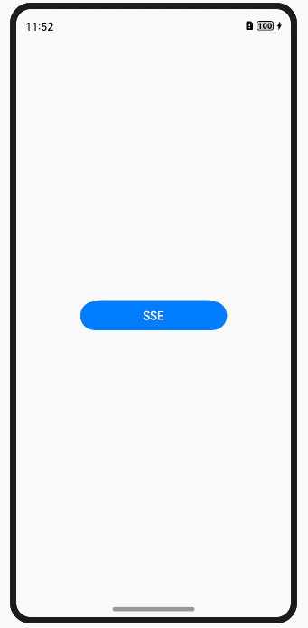

# eventsource
# 简介
eventsource三方库是EventSource客户端的纯JavaScript实现。它提供了一种在客户端与服务器之间建立单向持续连接的机制，服务器可以使用这个连接向客户端发送事件更新，而客户端能够实时接收并处理这些更新。



# 下载安装
    ohpm install @ohos/eventsource
OpenHarmony ohpm 环境配置等更多内容，请参考[如何安装OpenHarmony ohpm 包](https://gitee.com/openharmony-tpc/docs/blob/master/OpenHarmony_har_usage.md)


# 使用说明
1、引入依赖
```javascript
import EventSource from '@ohos/eventsource';
```


2、在module.json5中添加权限
```javascript
"requestPermissions": [
    {
        "name": "ohos.permission.INTERNET"
    }
]
```
### 需要SSE服务器配合使用
#### 服务端示例代码
创建一个可以传输事件流数据的node服务器，具体请看[server目录](./server)
```javascript
const express = require('express');
const serveStatic = require('serve-static');
const SseStream = require('ssestream');

const app = express()
app.use(serveStatic(__dirname));
app.get('/sse', (req, res) => {
  console.log('new connection');

  const sseStream = new SseStream(req);
  sseStream.pipe(res);
  const pusher = setInterval(() => {
    sseStream.write({
      event: 'server-time',
      data: new Date().toTimeString()
    })
  }, 1000)

  res.on('close', () => {
    console.log('lost connection');
    clearInterval(pusher);
    sseStream.unpipe(res);
  })
})

app.listen(8080, (err) => {
  if (err) throw err;
  console.log('server ready on http://localhost:8080');
})
```
#### 客户端端示例代码

```javascript
import promptAction from '@ohos.promptAction';
import EventSource from '@ohos/eventsource'
@State es: null | Eventsource = null;
@State url:string = "http://localhost:8080/sse";
eventListener = (e: Record<"data", string>) => {
  this.simpleList.push(e.data);
}
// 创建连接
this.es = new EventSource(this.url)

// 开启监听
this.es.addEventListener("server-time", this.eventListener);

// 取消监听
this.es.removeEventListener("server-time", this.eventListener);

// 断开连接
this.es.close();

// 错误监听
this.es.onFailure((e: Record<"message", string>) => {
    // 得到错误消息，对错误消息做处理
})
```
错误监听需在创建连接开启的时候同步开启


# 接口说明
### 接口列表
| 名称 | 参数类型                          | 说明                   |
| -------- |-------------------------------|----------------------|
| addEventListener | (type:string,callback:()=>{}) | 添加监听事件，当事件被触发的时候做出处理 |
| removeEventListener | (type:string,callback:()=>{}) |  移除监听事件               |
| close | 无传参                           | 断开连接                 |
| onFailure | ((e:object)=>{})              |  e为错误对象，捕获错误          |


**单元测试用例详见**[TEST.md](https://gitee.com/openharmony-tpc/openharmony_tpc_samples/blob/master/eventsource/TEST.md)

# 约束与限制
- DevEco Studio版本: 4.1.3.500, SDK: API11 Release(4.1.0)

# 目录结构
    |---- eventsource 
    |     |---- entry  # 示例代码文件夹
          |---- library # eventsource库文件
            |---- src
    |             |---- main
    |                  |---- ets
    |                       |---- eventsource.js  #eventsource           
    |     |---- README.md  # 安装使用方法  
    |     |---- README_zh.md  # 安装使用方法

# 贡献代码
使用过程中发现任何问题都可以提[ Issue ](https://gitee.com/openharmony-tpc/openharmony_tpc_samples/issues)给我们，当然，我们也欢迎你给我们发[PR](https://gitee.com/openharmony-tpc/openharmony_tpc_samples/pulls)

# 开源协议
本项目基于 [ MIT License](https://gitee.com/openharmony-tpc/openharmony_tpc_samples/blob/master/eventsource/LICENSE) ，请自由地享受和参与开源。