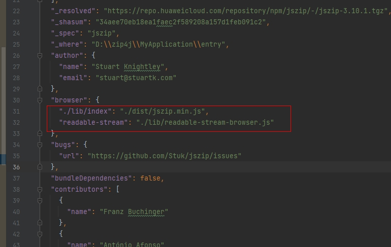
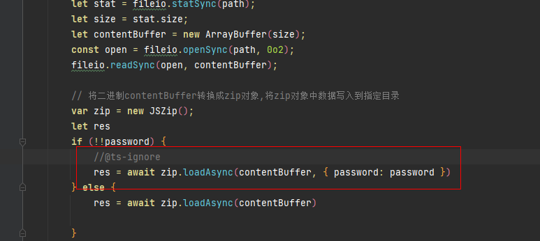

# jszipDemo

## 简介


本工程是 [jszip](https://github.com/Stuk/jszip) 在OpenHarmony应用开发中的使用示例。
jszip 组件定义了一个用于处理压缩和存档格式的 API，支持加密或不加密zip格式的压缩/解压功能。


## 配置PolyFill 插件

参照 [PolyFill](https://gitee.com/openharmony-sig/openharmony-polyfill )的配置规则，进行插件的配置。

## 安装模块

1.使用不加密功能npm install 安装

```
  npm install jszip --save
```

OpenHarmony npm环境配置等更多内容，请参照 [如何安装OpenHarmony npm包](https://gitee.com/openharmony-tpc/docs/blob/master/OpenHarmony_npm_usage.md) 。

2.使用加密功能npm install 安装
a.第一步，安装模块[xqdoo00o/jszip](https://github.com/xqdoo00o/jszip)
由于当前的加密功能的PR还没有合入到主库的[jszip](https://github.com/Stuk/jszip) 中，所以需要使用加密功能部分，需要执行如下命令安装模块：

```
  npm install xqdoo00o/jszip --save
```

b.第二步，修改node_modules 下jszip模块的packages.json
由于作者只将加密功能代码写入（lib）主代码库后，没有运行编译打包命令，生成对应的dist编译后的文件以及压缩版本，导致dist下的代码文件还是主库无加密功能版本。
所以需要修改node_modules下jszip模块的packages.json，删除里面的browser字段代码参数"./lib/index": "./dist/jszip.min.js"和"readable-stream": "./lib/readable-stream-browser.js",如图红框标注代码删除：


### 注意事项：使用密码接口处添加//@ts-ignore,忽略ts规范检查

由于作者只将加密功能代码写入（lib）主代码库后，跟目录下index.d.ts没有添加相关加密参数，在自己工程使用jszip接口时，会出现编辑报错。因此在加密接口相关使用处，添加//@ts-ignore，忽略ts规范检查。如：

## 使用说明

### zip 压缩功能

指定文件夹路径压缩zip文件夹。

``` javascript
import fileio from '@ohos.fileio';
import { zipCompress , zipDeCompress} from '../zip/zipApi';

  jsZipTest(): void {
    try {
      var data = globalThis.context.filesDir
      let time = Date.now()
      zipCompress(data + '/' + this.newFolder, data + '/' + this.newFolder + '/' + this.newFolder + '.zip').then((isSuccess) => {
        if (isSuccess) {
          AlertDialog.show({ title: '压缩成功',
            message: '请查看手机路径 ' + data + '/' + this.newFolder,
            confirm: { value: 'OK', action: () => {
            } }
          })
          let time1 = Date.now()
          this.timejsZip = time1 - time
        } else {
          AlertDialog.show({ title: '压缩失败',
            message: '请重新尝试',
            confirm: { value: 'OK', action: () => {
            } }
          })
        }
      })
    } catch (error) {
      console.error('File to obtain the file directory. Cause: ' + error.message);
    }
  }
```

### zip 解压功能

指定文件夹路径解压zip文件夹。

``` javascript

import fileio from '@ohos.fileio';
import { zipCompress , zipDeCompress} from '../zip/zipApi';

  unJsZipTest(): void {
    try {
      var data = globalThis.context.filesDir
      let time = Date.now()
      zipDeCompress(data + '/' + this.newFolder + '/' + this.newFolder + '.zip', data + '/newTarget')
        .then((isZipDecompree) => {
          if (isZipDecompree) {
            AlertDialog.show({ title: '解缩成功',
              message: '请查看手机路径 ' + data + "/newTarget",
              confirm: { value: 'OK', action: () => {
              } }
            })
          } else {
            AlertDialog.show({ title: '解压失败',
              message: '请重新尝试',
              confirm: { value: 'OK', action: () => {
              } }
            })
          }
        })
      let time1 = Date.now()
      this.timejsUNZip = time1 - time
    } catch (error) {
      console.error('File to obtain the file directory. Cause: ' + error.message);
    }
  }
```

### 加密压缩zip功能

指定文件夹路径加密压缩zip文件夹。

``` javascript
import jszip from "jszip";
import fileio from '@ohos.fileio';

async jsZipEncryption(password: string, name: string) {
    try {

      let data = globalThis.context.filesDir + '/' + this.newFolder + '/' + name;
      const stat = fileio.statSync(data);
      const reader = fileio.openSync(data, 0o2);
      const buf = new ArrayBuffer(stat.size);
      fileio.readSync(reader, buf);

      let time = Date.now()
      const zip = new JSZip();
      zip.file(name, buf);

      const content = await zip.generateAsync({
        type: 'arraybuffer',
        // @ts-ignore
        password: password,
        encryptStrength: 3
      });
      let time1 = Date.now()
      this.timejspassZip = time1 - time
      let path = globalThis.context.filesDir + '/helloTest.zip'
      const open = fileio.openSync(path, 0o102, 0o666);
      fileio.writeSync(open, content);
      fileio.closeSync(open)
      this.newName = name
      AlertDialog.show({ title: '压缩成功',
        message: '请查看手机路径 ' + data + '/',
        confirm: { value: 'OK', action: () => {
        } }
      })

    } catch (err) {
      console.error('File to obtain the file directory. Cause: ' + err);
      AlertDialog.show({ title: '压缩失败',
        message: '请重新尝试',
        confirm: { value: 'OK', action: () => {
        } }
      })

    }
  }
```

### 解压加密zip功能

指定文件夹路径解压加密zip文件夹。

``` javascript
import fileio from '@ohos.fileio';
import { zipDeCompress } from '../zip/zipApi'

jsZipUnEncryption(unpassword: string) {
    let path = globalThis.context.filesDir + '/helloTest.zip'
    let target = globalThis.context.filesDir + '/target'
    let time = Date.now()
    zipDeCompress(path, target, unpassword).then((data) => {
      let time1 = Date.now()
      this.timejsunpassZip = time1 - time
      if (data) {
        AlertDialog.show({ title: '解缩成功',
          message: '请查看手机路径 ' + target,
          confirm: { value: 'OK', action: () => {
          } }
        })
      } else {
        AlertDialog.show({ title: '解压失败',
          message: '请重新尝试',
          confirm: { value: 'OK', action: () => {
          } }
        })
      }

    }).catch((error) => {
      console.error('File to obtain the file directory. Cause: ' + error.message);
    });

  }
```

## 目录

```
/jszipDemo # demo代码
|—— entry
├── src      # 框架代码
│   └── main
│   	└── ets
│   	    └── Application
│   	    └── MainAbility
│   	    └── pages
│       	    └── index.ets  # zip压缩/解压实例界面
│   	    └── zip
│       	    └── zipApi.ts  # zip调用jszip模块方法文件

```

## 兼容性

支持 OpenHarmony API version 9 及以上版本。

## 开源协议

本项目基于 [Apache License 2.0](https://gitee.com/openharmony-tpc/openharmony_tpc_samples/blob/master/jszipDemo/LICENSE ) ，请自由地享受和参与开源。

## 贡献代码

使用过程中发现任何问题都可以提 [Issue](https://gitee.com/openharmony-tpc/openharmony_tpc_samples/issues ) 给我们，当然，我们也非常欢迎你给我们发 [PR](https://gitee.com/openharmony-tpc/openharmony_tpc_samples/pulls ) 。