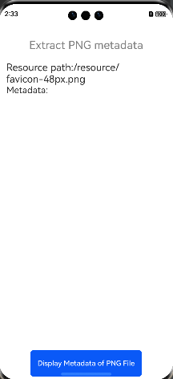
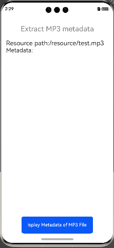
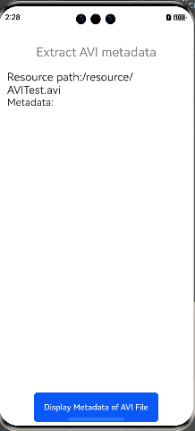

# metadata-extractor

## Introduction

> Metadata-extractor is a component used to extract EXIF, IPTC, XMP, ICC, and other metadata from image, video, and audio files.





## How to Install

```shell
ohpm install @ohos/metadata-extractor
```

OpenHarmony

For details about the OpenHarmony ohpm environment configuration, see [OpenHarmony HAR](https://gitcode.com/openharmony-tpc/docs/blob/master/OpenHarmony_har_usage.en.md).

## How to Use

1. Import files and code dependencies.

    ```
       import {Metadata} from '@ohos/metadata-extractor'
       import {ImageMetadataReader} from '@ohos/metadata_extractor'
    ```

2. Read data.

    ```
     private getMetaData() {
       let path = globalThis.fileDir.concat("/AVITest.avi")
        let metadata: Metadata = ImageMetadataReader.readMetadata(path)
         // iterate over the metadata and print to System.out
         for (let directory of metadata.getDirectories()) {
           let directoryName = directory.getName()
           for (let tag of directory.getTags()) {
             let tagName = tag.getTagName()
             let description = tag.getDescription()
      
             // truncate the description if it's too longzg zg
             if (description != null && description.length > 1024) {
               description = description.substring(0, 1024) + "..."
             }
             this.data.push("\n" + "[" + directoryName + "] " + tagName + " = " + description)
           }
         }
     }
    ```

3. Display data.

    ```
   Column() {
     Text("Metadata:").fontSize (20).width('100%')
       .textAlign(TextAlign.Start)
     Text("" + this.data).fontSize(20).width('100%')
       .textAlign(TextAlign.Start)
       .visibility(this.isVisibility)
   }.height("80%").padding({ bottom: 10 })
   ```

## Available APIs

Note: The unified entry of `ImageMetadataReader.readMetadata(path)` is supported. The MetadataReader in the corresponding file format is also supported, for example, `PngMetadataReader.readMetadata(filepath)` or `JpegMetadataReader.readMetadata(filepath)`.

- `ImageMetadataReader.readMetadata()`: reads metadata.
- `Metadata.getDirectories()`: obtains directory information.
- `Metadata.getDirectoriesOfType()`: obtains the directory type.
- `Metadata.getDirectoryCount()`: obtains the number of directories.
- `Metadata.getFirstDirectoryOfType()`: obtains the type of the first directory.
- `Directory.getName()`: obtains the directory name.
- `Directory.getTags()`: obtains tag information.
- `Directory.getTagCount()`: obtains the number of tags.
- `Directory.getParent()`: obtains the parent directory.
- `Directory.getDate()`: obtains date information
- `Tag.getTagName()`: obtains the tag name.
- `Tag.getTagDescription()`: obtains the tag description.

## About obfuscation
- Code obfuscation, please see[Code Obfuscation](https://docs.openharmony.cn/pages/v5.0/zh-cn/application-dev/arkts-utils/source-obfuscation.md)
- If you want the metadata-extractor library not to be obfuscated during code obfuscation, you need to add corresponding exclusion rules in the obfuscation rule configuration file obfuscation-rules.txt：
```
-keep
./oh_modules/@ohos/metadata-extractor
```

## Constraints

This project has been verified in the following version:

- DevEco Studio: 4.1 Canary (4.1.3.317)

- OpenHarmony SDK: API 11 (4.1.0.36)

## Directory Structure

````
|---- metadata-extractor
|     |---- entry  # Sample code
|     |---- library # Library folder
|           |---- index.ets  # External APIs
|           |---- src
|                 |---- main
|                       |---- com
|                             |---- drew
|                                   |---- imaging  # File parser (including image, audio, and video files)
|                                          |---- avi  # AVI video format parsing
|                                          |---- avi  # GIF image format parsing
|                                          |---- jpeg # JPEG image format parsing
|                                          |---- mp3 # MP3 image format parsing
|                                          |---- mp4 # MP4 image format parsing
|                                          |---- FileType.ets # File type
|                                          |---- FileTypeDetector.ets  # File format identification
|                                          |---- ImageMetadataReader.ets # Entry for the file parser
|                                          |---- ImageProcessingException.ets # Exception Handling
|                                          |---- TypeChecker.ets # File format interface callbacks
|                                   |---- lang   # Utility class
|                                          |---- StreamReader.ets   # File stream reader
|                                   |---- metadata  # File data configuration, including the dictionary
|                                          |---- avi # Obtain data of the file in AVI format.
|                                          |---- gif # Obtain data of the file in GIF format.
|                                          |---- jpeg # Obtain data of the file in JPEG format.
|                                          |---- mp3 # Obtain data of the file in MP3 format.
|                                          |---- mp4 # Obtain data of the file in MP4 format.
|                                          |---- Directory.ets # Data dictionary abstract class
|                                          |---- Metadata.ets # File metadata
|                                          |---- MetadataReader.ets # Reader for file metadata
|                                          |---- Tag.ets # Specified dictionary type
|                                          |---- TagDescriptor.ets # Description of the specified dictionary type
|     |---- README.md  # Readme                   
|     |---- README_zh.md  # Readme                   
````

## How to Contribute

If you find any problem when using metadata-extractor, submit an [issue](https://gitcode.com/openharmony-tpc/openharmony_tpc_samples/issues) or a [PR](https://gitcode.com/openharmony-tpc/openharmony_tpc_samples/pulls).

## License

This project is licensed under [Apache-2.0 License](https://gitcode.com/openharmony-tpc/openharmony_tpc_samples/blob/master/metadata-extractor/LICENSE).

