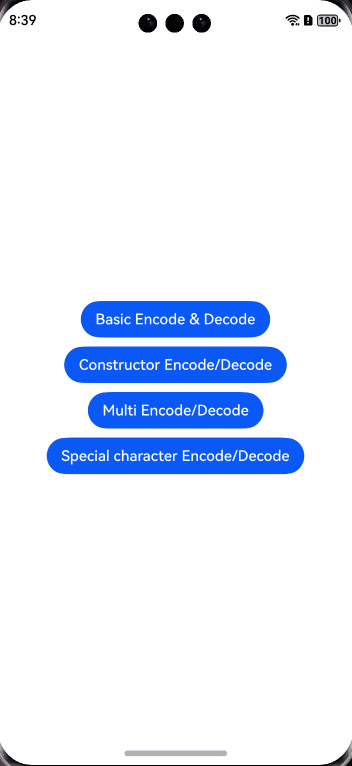

# msgpack-javascript

## Introduction
MessagePack is a library that provides efficient object serialization. It is like JSON but offers higher efficiency and smaller data size.

Currently, MessagePack 3.0 can be used to implement complex int64 encoding.




## How to Install
```shell
ohpm install @msgpack/msgpack
```
For details about the OpenHarmony ohpm environment configuration, see [OpenHarmony HAR](https://gitee.com/openharmony-tpc/docs/blob/master/OpenHarmony_har_usage.en.md).

## How to Use

### Encoding and Decoding
```javascript
import { encode,decode } from "@msgpack/msgpack";

// Encode.
let encoded:Uint8Array = encode({ foo: "bar" });
// Decode.
let decodedObject = decode(encoded);
```

### Encoding and Decoding Using Constructors
```javascript
import { Encoder,Decoder } from "@msgpack/msgpack";
// Construct a reusable encoder.
let encoder = new Encoder()
// Construct a reusable decoder.
let decoder = new Decoder()
// Encode.
let encoded:Uint8Array = encoder.encode({ foo: "bar" });
// Decode.
let decodedObject = decoder.decode(encoded);
```

### Encoding and Decoding an Array Object

```javascript
import { encode,decodeMulti } from "@msgpack/msgpack";

let items = [
  "foo",
  10,
  {
    name: "bar",
  },
  [1, 2, 3],
];
// Encode the item array.
let encodedItems = items.map((item) => encode(item));
// Create a blank buffer for storing streams.
let encoded = new Uint8Array(encodedItems.reduce((p, c) => p + c.byteLength, 0));
let offset = 0;
// Store the encoded items in the buffer.
for (let encodedItem of encodedItems) {
  encoded.set(encodedItem, offset);
  offset += encodedItem.byteLength;
}
let result: Array<unknown> = [];
// Store the decoded items in the result array.
for (let item of decodeMulti(encoded)) {
  result.push(item);
}
// The value of result is the same as that of items.
expect(result).assertDeepEquals(items);
```
## Available APIs

| API                          |        Parameter       |                                   Description|
| :--------------------------------- | :----------------: | -----------------------------------------: |
| encode(object: unknown)            |  **object**: content to encode  | Encodes the object and returns a copy of the encoder's internal buffer.|
| decode(buffer: ArrayLike\<number>) | **buffer**: content to decode|                             Decodes the content from the buffer.|
| new Encoder()                      |                    |                         Constructs a reusable encoder.|
| new Decoder()                      |                    |                         Constructs a reusable decoder.|

## Directory Structure
````
|---- msgpackJavaScript  
|     |---- entry  # Sample code
|           |---- Index.ets  # External APIs
			|---- EncodeDecodePage.ets  # Basic encoding and decoding
			|---- EncodeDecodeConstructorPage.ets # Encoding and decoding using constructors
			|---- MultiDecodePage.ets # Decoding complex objects
|     |---- README.MD  # Readme                   
````

## Constraints

This project has been verified in the following versions:

- DevEco Studio: 4.1 (4.1.3.322), SDK: API 11 (4.1.0.36)
- DevEco Studio: 4.0 (4.0.3.513), SDK: API 10 (4.0.10.10)
- DevEco Studio: 3.1 Beta2 (3.1.0.400), SDK: API 9 Release (3.2.11.9)

## How to Contribute

If you find any problem when using the project, submit an [issue](https://gitee.com/openharmony-tpc/openharmony_tpc_samples/issues) or a [PR](https://gitee.com/openharmony-tpc/openharmony_tpc_samples).

## License
This project is licensed under [ISC License](https://github.com/msgpack/msgpack-javascript/blob/main/LICENSE).
