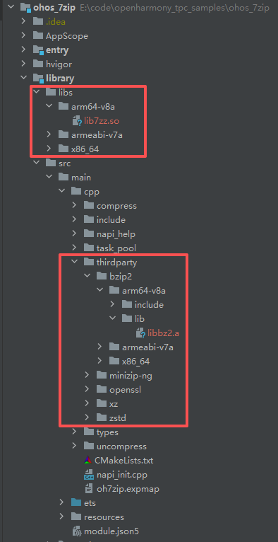

# ohos_7zip

## 简介

对7zip命令行的封装，支持沙箱路径文件的压缩和解压，支持压缩和解压的规格参考官网[7-zip](https://7-zip.org/)。

## 下载安装

```shell
ohpm install @ohos/oh7zip
```

OpenHarmony ohpm环境配置等更多内容，请参考 [如何安装OpenHarmony har包](https://gitcode.com/openharmony-tpc/docs/blob/master/OpenHarmony_har_usage.md) 。

### 编译运行

本项目依赖7zip、bzip2、minizip-ng、openssl、xz、zstd库，编译产物.so文件和头文件需要自行编译，
参考[bzip2本地编译脚本](https://gitcode.com/openharmony-sig/tpc_c_cplusplus/tree/master/thirdparty/bzip2)
参考[minizip-ng本地编译脚本](https://gitcode.com/openharmony-sig/tpc_c_cplusplus/tree/master/community/minizip-ng)
参考[openssl本地编译脚本](https://gitcode.com/openharmony-sig/tpc_c_cplusplus/tree/master/thirdparty/openssl)
参考[xz本地编译脚本](https://gitcode.com/openharmony-sig/tpc_c_cplusplus/tree/master/community/xz)
参考[zstd本地编译脚本](https://gitcode.com/openharmony-sig/tpc_c_cplusplus/tree/master/thirdparty/zstd)

在library下新增libs目录，并将编译生成的7zip库拷贝到该目录下，
在cpp目录下新增thirdparty目录，并将编译生成的bzip2、minizip-ng、openssl、xz、zstd库拷贝到该目录下，如下图所示：



## 使用说明

- C++

```
#include "uncompress.h"
#include "common.h"

using namespace Oh7zip;

void Test()
{
// 创建解压配置
std::shared_ptr<Config7z> config = std::make_shared<Config7z>();
config->src = xxxx;
config->dst = xxxx;
config->pwd = xxxx;
// 创建解压句柄
std::shared_ptr<Uncompress> uncompress = std::make_shared<Uncompress>();
// 调用同步解压
uncompress->ExtractSync(config);
// 调用异步解压
uncompress->ExtractAsync(config);
}
```

- arkts

```
import { Uncompress, Config7z } from '@ohos/oh7zip'

test()
{
let uncompress: Uncompress = new Uncompress()
let config: Config7z = {
src: getContext().resourceDir + "/test_7z.7z",
dst: getContext().filesDir,
pwd: "test_7z"
}
// 同步
uncompress.extractSync(config)

    // 异步
    uncompress.extractAsync(config).then((result)=>{})
}
```

## 接口说明

##### 结构体Config7z变量说明

| 名称                           | 描述                                                       |
| ------------------------------ | ---------------------------------------------------------- |
| std::vector\<std::string\> src | 压缩的文件或目录/解压的文件(解压文件仅src[0]生效)          |
| std::string dst                | 压缩生成的目标文件/解压文件后存放的目录                    |
| std::string pwd                | 压缩/解压的密码，可选                                      |
| std::string fmt                | 压缩的格式，"zip", "7z", "tar", "xz", "gzip", "bzip2"      |
| std::vector\<std::string\> xr  | 压缩时，需要排除递归子目录中的文件，例如"!hello.*", "!dir" |


##### 枚举类ErrorInfo成员说明

| 名称                     | 描述                                                         |
| ------------------------ | ------------------------------------------------------------ |
| OK                       | 0 压缩/解压成功                                              |
| CONFIG_NULL              | 1 解析Config7z为空                                           |
| ILLEGAL_SRC              | 2 传入非法的src路径                                          |
| ILLEGAL_DST              | 3 传入非法的dst路径                                          |
| DST_NO_PERMISSION        | 4 传入的dst路径合法，但是没有权限                            |
| COMPRESS_FAIL            | 5 调用7zip压缩失败                                           |
| UNCOMPRESS_FAIL          | 6 调用7zip解压失败                                           |
| ASYNCDATA_NULL           | 7 异步数据为空                                               |
| COMPRESS_FMT_NOT_SUPPURT | 8 传入的压缩格式不支持                                       |
| COMPRESS_FMT_SRC_ILLEGAL | 9 传入的压缩格式支持，src不支持，例如压缩gzip格式，传入一个目录而非文件 |
| MISSING_PASSWORD         | 10 压缩包需要正确的密码，请输入正确的密码                    |


##### 类Uncompress接口说明

| 名称                                                         | 描述                             |
| ------------------------------------------------------------ | -------------------------------- |
| ErrorInfo ExtractSync(std::shared_ptr\<Config7z> config)     | 同步操作，解压一个文件到沙箱路径 |
| std::shared_future\<ErrorInfo> ExtractAsync(std::shared_ptr\<Config7z> config) | 异步操作，解压一个文件到沙箱路径 |


##### 类Compress接口说明

| 名称                                                         | 描述                               |
| ------------------------------------------------------------ | ---------------------------------- |
| ErrorInfo CompressSync(std::shared_ptr\<Config7z> config)    | 同步操作，压缩文件或目录到沙箱路径 |
| std::shared_future\<ErrorInfo> CompressAsync(std::shared_ptr\<Config7z> config) | 异步操作，压缩文件或目录到沙箱路径 |


## 关于混淆
- 代码混淆，请查看[代码混淆简介](https://docs.openharmony.cn/pages/v5.0/zh-cn/application-dev/arkts-utils/source-obfuscation.md)
- 如果希望ohos_7zip库在代码混淆过程中不会被混淆，需要在混淆规则配置文件obfuscation-rules.txt中添加相应的排除规则：

```
-keep
./oh_modules/@ohos/ohos_7zip
```

## 约束与限制

- DevEco Studio 版本： 5.0.5 Release  OpenHarmony SDK:API16 (5.0.4)

## 目录结构

````
|---- ohos_7zip
|     |---- entry  # 示例代码文件夹
|     |---- library  # ohos_7zip库文件夹
|	    |---- libs    #so库
|	    |---- src
          |---- main
              |---- cpp   #cpp 核心功能实现模块
|     |---- README.md  # 安装使用方法                    
````

## 贡献代码

使用过程中发现任何问题都可以提 [Issue](https://gitcode.com/openharmony-tpc/openharmony_tpc_samples/issues) 给组件，当然，也非常欢迎给发[PR](https://gitcode.com/openharmony-tpc/openharmony_tpc_samples/pulls)共建 。


## 开源协议

本项目基于 [MIT LICENSE](https://gitcode.com/openharmony-tpc/openharmony_tpc_samples/ohos_7zip/blob/master/LICENSE) ，请自由地享受和参与开源。
