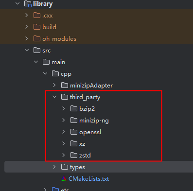

# ohos_minizip

## 介绍
基于minizip_ng的解压缩库。

## 下载安装

```shell
ohpm install @ohos/minizip
```
OpenHarmony ohpm环境配置等更多内容，请参考 [如何安装OpenHarmony ohpm包](https://gitcode.com/openharmony-tpc/docs/blob/master/OpenHarmony_har_usage.md) 。

### 编译运行

本项目依赖bzip2、minizip-ng、openssl、xz、zstd库，编译产物.so文件和头文件需要自行编译

参考[bzip2本地编译脚本](https://gitcode.com/openharmony-sig/tpc_c_cplusplus/tree/master/thirdparty/bzip2)

参考[minizip-ng本地编译脚本](https://gitcode.com/openharmony-sig/tpc_c_cplusplus/tree/master/thirdparty/minizip-ng)

参考[openssl本地编译脚本](https://gitcode.com/openharmony-sig/tpc_c_cplusplus/tree/master/thirdparty/openssl)

参考[xz本地编译脚本](https://gitcode.com/openharmony-sig/tpc_c_cplusplus/tree/master/thirdparty/xz)

参考[zstd本地编译脚本](https://gitcode.com/openharmony-sig/tpc_c_cplusplus/tree/master/thirdparty/zstd)


在cpp目录下新增third_party目录，并将编译生成的bzip2、minizip-ng、openssl、xz、zstd库拷贝到该目录下，如下图所示：



## 使用说明

### 解压zip包获取文件内容

```typescript
import { MinizipNative } from '@ohos/minizip'

let minizipEntry = new MinizipNative(this.selectFilePath);
if (minizipEntry.Open() == 0) {
  let entryNames = minizipEntry.GetEntryNames();
  for (let i = 0; i < entryNames.length; i++) {
    console.log('Minizip names:' + entryNames[i]);
    if(!entryNames[i].endsWith("/")) {
      let arrBuffer = minizipEntry.ExtractFileToJS(entryNames[i], this.password);
      console.log("Minizip arrBuffer: " + arrBuffer?.byteLength)
    }
  }
}
```

1. 使用三方库解压zip文件内容到内存，返回至JS。
2. GetEntryNames()获取zip文件所有的文件夹路径以及文件路径。
3. ExtractFileToJS(entryname, password)，解压指定的文件并将内容返回至JS侧，若文件没有密码参考如下：
```typescript
ExtractFileToJS(entryname, "");
```

### 解压zip包到磁盘
```typescript
import { unzipToDirectory } from '@ohos/minizip'

unzipToDirectory(this.selectFilePath, this.targetPath, this.password).then(() => {
  
}).catch(() => {
 
});
```

### 将文件压缩成zip包并获取文件内容

```typescript
import { MinizipCompressNative } from '@ohos/minizip'

let minizipCompressEntry = new MinizipCompressNative(this.selectFilePath);
if (minizipCompressEntry.Create() == 0) {
  let arrBuffer = minizipCompressEntry.CompressToJS(this.targetPath, this.password);
  console.log("Minizip arrBuffer: " + arrBuffer?.byteLength)
}
```

1. 使用三方库压缩文件内容到zip包中，并返回至JS。
2. CompressToJS(entryname, password)，压缩指定的文件并将内容返回至JS侧，若文件没有密码参考如下：
```typescript
CompressToJS(entryname, "");
```

### 压缩zip包到磁盘

```typescript
import { MinizipCompressNative } from '@ohos/minizip'

let minizipCompressEntry = new MinizipCompressNative(this.selectFilePath， this.selectFilePath);
if (minizipCompressEntry.Create() == 0) {
  let code : number = minizipCompressEntry.Compress(this.targetPath, this.password);
  console.log("" + code);
  minizipCompressEntry.Close();
}
```

## 接口说明

| 接口                 | 参数                                                                               | 参数说明                                                                                                                             | 返回值                                                                 | 接口说明               |
|--------------------|----------------------------------------------------------------------------------|----------------------------------------------------------------------------------------------------------------------------------|---------------------------------------------------------------------|--------------------|
| MinizipNative      | path:string                                                                      | zip压缩包路径                                                                                                                         | MinizipNative实例                                             | 创建MinizipNative实例  |
| Open               | 无                                                                                | 无                                                                                                                                | 当返回值为0时，打开文件成功                                         | 打开文件               |
| SetCharEncoding    | charEncoding:number                                                              | charEncoding: 字符编码类型，可设置为 437(CP437 主要用于英文和一些西欧语言环境) 932(CP932 主要用于日语环境) 936(CP936 主要用于简体中文环境) 950(CP950 主要用于繁体中文环境) 65001(UTF8) | 无返回值。设置压缩包的字符编码类型   | 设置字符编码类型           |
| GetEntryNames      | 无                                                                                | 无                                                                                                                                | Array< string > 获取文件列表，如果调用过SetCharEncoding设置字符编码，则返回的文件名字符串为utf8编码 | 获取文件列表             |
| ExtractFileToJS    | entryName : string, password : string                                            | entryName：文件名， password：密码                                                                                                       | ArrayBuffer或者undefined 解压文件内容，密码错误或entryName为文件夹名时，返回undefined      | 解压文件内容             |
| unzipToDirectory   | selectPath: string, targetPath: string, password?: string, charEncoding?: number | selectPath: 待解压文件路径， targetPath: 解压到此路径下， password?: 密码，<br> charEncoding?: 字符编码类型                                               | Promise< string > 是否解压成功                                   | 解压缩文件到文件夹          |
| IsEncrypto         | entryName : string                                                               | entryName: entry文件名                                                                                                              | boolean 是否加密                                                | 判断entry是否加密        |
| IsUtf8             | entryName : string                                                               | entryName: entry文件名                                                                                                              | boolean 文件路径是否utf8编码                                      | 判断entry路径名是否utf8编码 |

| 接口                  | 参数                                 | 参数说明                                                                                           | 返回值                                                       | 接口说明                      |
| --------------------- | ------------------------------------ |------------------------------------------------------------------------------------------------| ------------------------------------------------------------ | ----------------------------- |
| MinizipCompressNative | catchPath:string, zipFilePath:string | catchPath获取压缩包内容时压缩包暂存路径，zipFilePath压缩包路径                                                      | MinizipCompressNative实例                                    | 创建MinizipCompressNative实例 |
| Create                | 无                                   | 无                                                                                              | 当返回值为0时，创建文件成功                                  | 创建zip文件                   |
| Close                 | 无                                   | 无                                                                                              | 无返回值                                                     | 关闭zip文件                   |
| SetCompressMethod     | compressMethod:number                | compressMethod: 压缩方法，可设置为 0(不压缩) 8(Deflate 压缩) 12(Bzip2 压缩) 14(LZMA1 压缩) 93(ZSTD 压缩) 95(XZ 压缩) | 当返回值为0时，设置成功                                      | 设置压缩方法                  |
| SetCompressLevel      | compressLevel:number                 | compressLevel：压缩等级，可设置为 -1(默认等级) 2(Fast 压缩等级) 6(Mid 压缩等级) 9(Slow 压缩等级)                         | 当返回值为0时，设置成功                                      | 设置压缩等级                  |
| SetzipFilePath        | zipFilePath:string                   | zipFilePath：压缩包名                                                                               | 无返回值。重新设置压缩包名                                   | 设置压缩包名                  |
| Compress              | entries : Array, password : string   | entries : 需要压缩的文件， password : 密码                                                               | 当返回值为0时，压缩成功                                      | 压缩文件                      |
| CompressToJS          | eentries : Array, password : string  | entries：需要压缩的文件， password：密码                                                                   | ArrayBuffer或者undefined 压缩文件内容，密码错误或压缩失败时，返回undefined | 压缩文件并获取文件内容        |


## 注意事项
- 创建minizipNative对象需要传入完整的文件路径:**文件路径**+**文件名**。

- **创建对象**之后**一定要调用Open函数**，并且每一次new minizipNative**只能调用一次Open**，若Open函数返回值非0则是打开文件失败。

## 关于混淆
- 代码混淆，请查看[代码混淆简介](https://docs.openharmony.cn/pages/v5.0/zh-cn/application-dev/arkts-utils/source-obfuscation.md)。
- 如果希望minizip库在代码混淆过程中不会被混淆，需要在混淆规则配置文件obfuscation-rules.txt中添加相应的排除规则：

```
-keep
./oh_modules/@ohos/minizip
```

## 约束与限制
在下述版本验证通过：

DevEco Studio: NEXT Beta1-5.0.3.806, SDK: API12 Release (5.0.0.66)。

DevEco Studio: NEXT Developer Beta1-5.0.3.320, SDK: API12(5.0.0.23)。

## 目录结构
````
|----ohos_minizip  
|     |---- entry  # 示例代码文件夹
|     |---- library  
|                |---- cpp # c/c++和napi代码
|                      |---- minizipAdapter # minizip的napi逻辑代码
|                      |---- CMakeLists.txt  # 构建脚本
|                      |---- thirdparty # 三方依赖
|                      |---- types # 接口声明
|           |---- index.ets  # 对外接口
|     |---- README.md  # 安装使用方法
|     |---- README_zh.md  # 安装使用方法   
````

## 贡献代码
使用过程中发现任何问题都可以提 [Issue](https://gitcode.com/openharmony-tpc/openharmony_tpc_samples/issues) 给我们，当然，我们也非常欢迎你给我们发 [PR](https://gitcode.com/openharmony-tpc/openharmony_tpc_samples/pulls) 。

## 开源协议
本项目基于 [Apache License License - v 2.0](https://gitcode.com/openharmony-tpc/openharmony_tpc_samples/blob/master/ohos_minizip/LICENSE) ，请自由地享受和参与开源。 
    


