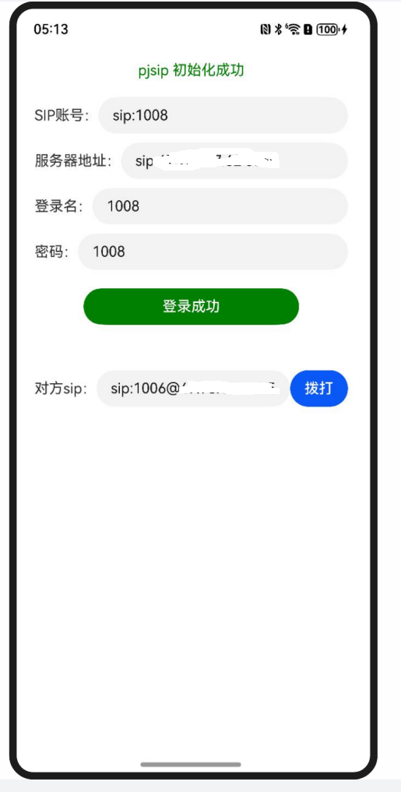
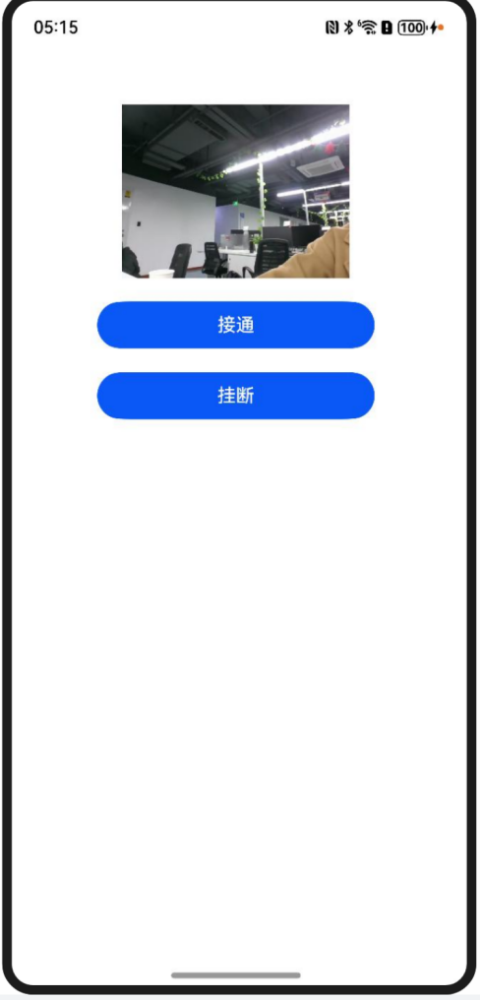
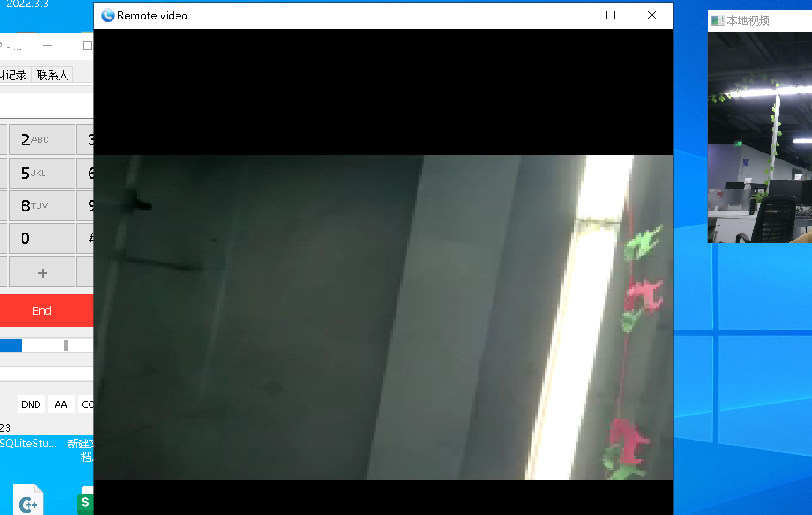

# ohos_pjsip_demo

#### 介绍
pjsip项目，鸿蒙验证demo，测试验证如下：
##### 手机界面


##### PC界面



#### 安装教程

1、编译 适配版本的pjsip项目

2、搭建SIP服务器

#### 编译说明

1、在psjip目录（pjlib/include/pj）下，新建config_site.h文件

2、配置鸿蒙编译配置，在其文件内配置：

```
#define PJMEDIA_AUDIO_DEV_HAS_OHOS         1
#define PJMEDIA_HAS_VIDEO                  1
#define PJMEDIA_VIDEO_DEV_HAS_OHOS         1
#define PJMEDIA_VIDEO_DEV_HAS_OHOS_OPENGL  1
#define PJMEDIA_HAS_LIBYUV 		   1
#define PJMEDIA_HAS_OHOS_AVCODEC           1
//支持openh264 
//#define PJMEDIA_HAS_OPENH264_CODEC       1

```

#### 搭建SIP服务器，如（asterisk服务器）

1、下载安装服务器sudo apt-get install asterisk

2、修改配置文件

    1.配置账户信息：sudo gedit /etc/asterisk/sip.conf

```
[general]
context=default 
bindport=5060
bindaddr=0.0.0.0
videosupport = yes
nat = force_rport,comedia ; 启用 NAT 和对称 RTP
externaddr = sterisk 的公网 IP; 
localnet = 内网地址段/255.255.255.0  ; 内网地址段	

[1006]
type = friend
callerid=User 1006 
username=1006
secret = 1006
host = dynamic 
canreinvite =no 
dtmfmode =rfc2833 
mailbox =1006 
transport =udp 
nat=force_rport,comedia
videosupport=yes 
disallow=all 
allow =ulaw 
allow=alaw
allow = h264

```

    2.配置打电话策略：sudo gedit /etc/asterisk/extensions.conf

```
[default]
include => demo
exten => _1XXX,1,Dial(SIP/${EXTEN},20,tr)
exten => _1XXX,n,Hangup()

```

    3.启动服务器sudo /etc/init.d/asterisk restart


