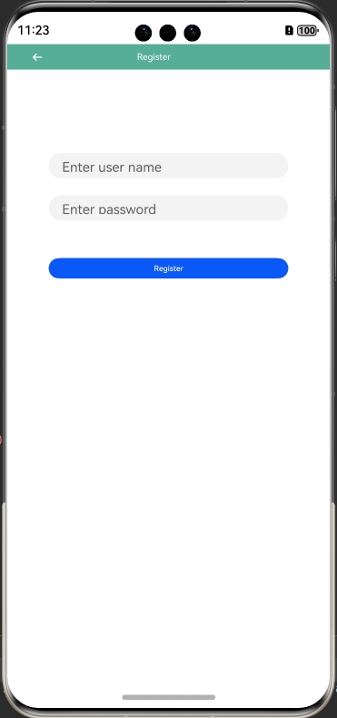

# Smack
## Introduction
>Smack is an XMPP-based chat client.

## Effect


## How to Install
```
ohpm install @ohos/smack
```
For details about the OpenHarmony ohpm environment configuration, see [OpenHarmony HAR](https://gitee.com/openharmony-tpc/docs/blob/master/OpenHarmony_har_usage.en.md).


## Configuring the x86 Emulator

See [Running Your App/Service on an Emulator](https://developer.huawei.com/consumer/en/deveco-developer-suite/enabling/kit?currentPage=1&pageSize=100).


## How to Use

1. Create a background service.
```
Download Openfire from https://igniterealtime.org/downloads/ and install it as a server.
```


2. Add a reference and set service information on the page.

 ```
Add a reference: import { Smack } from '@ohos/smack'
Set service information, for example, Constant.ets class.
static HOST_IP: string = "10.50.40.65"
static HOST_DOMAIN: string = "he-202101111234"
 ```

3. Calling method

 ```
  1. Register user: Smack.registers("10.50.80.58",dongpo_003","test2")
  2. Unregister user: Smack.unregister()
  3. User login: Smack.Login(this.userName + '@' + Constant.HOST_IP, this.passWord)
  4. User logout: Smack.loginout()
  5. Change the password: Smack.changPwd('123456')
  6. Set user status (free, online, leave and more): Smack.changePresence(presenceType, this.states[this.select])
  7. Send messages: Smack.send(userName, msg)
  8. Receive messages: Smack.registerMessageCallback((id, msg)=>{})
  9. Add friends to a specific group: Smack.addFriends(this.name + "@" + Constant.HOST_DOMAIN, this.name, this.group)
  10. Delete friends: Smack.delfriend(this.userName + '@' + Constant.HOST_IP)
  11. Friend list: Smack.getFriendList()
  12. Change group name: Smack.changeGroup(this.oldName, this.newName)
  13. Change friend group: Smack.changeFriendGroup(name + "@" + Constant.HOST_DOMAIN, this.newGroup)
  14. Create group chat: Smack.createRoom("444@"+Constant.HOST_IP+Constant.HOST_RES, "room1", Constant.HOST_DOMAIN, Constant.SERVICE_NAME)
  15. Join a group: Smack.join()
  16. Leave the group: Smack.leave("leave msg")
  17. Send group messages: Smack.sendGroupMessage("group msg test")
  18. Set the group subject: Smack.setSubject("subject")
  19. Destroy the group: Smack.destroy("444@"+Constant.HOST_IP+Constant.HOST_RES, "123")
  20. Kick out from the group: Smack.kick("555", "kick")
  21. Kick out from the group and add to blacklist: Smack.ban("555", "ban")
  22. Grant voice: Smack.grantVoice("555", "grantVoice")
  23. Revoke voice: Smack.revokeVoice("555", "revokeVoice")
  24. Set a position: Smack.setAffiliation("555", MUCRoomAffiliation.AffiliationOwner, "AffiliationOwner")
  25. Set a role: RoleModerator Smack.setRole("888", MUCRoomRole.RoleModerator, "RoleModerator")
  26. Invite members: Smack.invite("777"+this.service, "invite")
  27. Get all group members: Smack.getRoomItems()
  28. Filter group members: Smack.requestList(MUCOperation.RequestOwnerList)
  29. Refuse to join the group: Smack.declineInvitation("888_room@"+Constant.SERVICE_NAME+"."+Constant.HOST_DOMAIN, "888@"+Constant.HOST_DOMAIN, "room inviation refuesd")
  30. Create and join a group: Smack.createOrJoinRoom("room4", Constant.HOST_DOMAIN, Constant.SERVICE_NAME, "123")
  31. Use password to join the encrypted group: Smack.setPassword("123123")
  32. Get group information: Smack.getRoomInfo()
  33. Obtain group configuration: Smack.requestRoomConfig()
  34. Set group chat configuration: Smack.setRoomConfig(JSON.stringify(this.roomConfig))
  35. Kick out user group from the chat room: Smack.bans("888,555", "bans")
  36. Change chat room member's nickname: Smack.setNick("new_nike_name")
  37. Whether in a group chat: Smack.isJoined()
  38. Return user's nickname in the room: Smack.nick()
  39. Whether to establish a connection: Smack.isConnected()
  40. User name: Smack.username()
  41. Establish a connection: Smack.connect()
  42. Set the domain name or IP address: Smack.setServer(Constant.HOST_IP)
  43. Enter user name and password: Smack.setUsernameAndPassword("zhang", "123456")
  44. Set the port number: Smack.setPort(Constant.HOST_PORT)
  45. Obtain the password: Smack.password ();
  46. Set resource: Smack.setResource(Constant.HOST_RES.replace("/",""))
  47. Set multi-user role: Smack.setRoles(this.getUsers(), MUCRoomRole.RoleParticipant, "RoleParticipant")
  48. Grant multi-user voice: Smack.grantVoices(this.getUsers(), "grantVoices");
  49. Revoke multi-user voice: Smack.revokeVoices(this.getUsers(), "revokeVoices")
  50. Set multi-user subordinate relationship: Smack.setAffiliations("555,333", MUCRoomAffiliation.AffiliationOwner, "AffiliationOwner")
  51. Obtain the port number: Smack.port()
  52. Obtain the IP address or domain name: Smack.server()
  53. Accept friend request: Smack.receiveFriends("444@"+Constant.HOST_DOMAIN, "group", msg: "accept")
  54. Reject friend request: Smack.rejectFriends("444@"+Constant.HOST_DOMAIN, "reject")
  
 ```


## Available APIs

1. Registers user: `Smack.registers("dongpo_003","test2");`
2. Unresgisters user: `Smack.unregister();`
3. User login: `Smack.Login(this.userName + '@' + Constant.HOST_IP, this.passWord);`
4. User logout: `Smack.loginout();`
5. Changes the password: `Smack.changPwd('123456')`
6. Sets user status (free, online, leave and more): `Smack.changePresence(presenceType, this.states[this.select]);`
7. Sends messages: `Smack.send(userName, msg)`
8. Receives messages: `Smack.registerMessageCallback((id, msg)=>{})`
9. Adds friends to a specific group: `Smack.addFriends(this.name + "@" + Constant.HOST_DOMAIN, this.name, this.group);`
10. Deletes friends: `Smack.delfriend(this.userName + '@' + Constant.HOST_IP);`
11. Friend list: `Smack.getFriendList();`
12. Changes group name: `Smack.changeGroup(this.oldName, this.newName);`
13. Changes friend group: `Smack.changeFriendGroup(name + "@" + Constant.HOST_DOMAIN, this.newGroup);`
14. Creates group chat: `Smack.createRoom("444@"+Constant.HOST_IP+Constant.HOST_RES, "room1", Constant.HOST_DOMAIN, Constant.SERVICE_NAME);`
15. Joins a group: `Smack.join();`
16. Leaves the group: `Smack.leave("leave msg");`
17. Sends group messages: `Smack.sendGroupMessage("group msg test");`
18. Sets the group subject: `Smack.setSubject("subject");`
19. Destroys the group: `Smack.destroy("444@"+Constant.HOST_IP+Constant.HOST_RES, "123");`
20. Kicks out from the group: `Smack.kick("555", "kick");`
21. Kicks out from the group and adds to blacklist: `Smack.ban("555", "ban");`
22. Grants voice: `Smack.grantVoice("555", "grantVoice");`
23. Revokes voice: `Smack.revokeVoice("555", "revokeVoice");`
24. Sets a position: `Smack.setAffiliation("555", MUCRoomAffiliation.AffiliationOwner, "AffiliationOwner");`
25. Sets a role: `RoleModerator Smack.setRole("888", MUCRoomRole.RoleModerator, "RoleModerator");`
26. Invites members: `Smack.invite("777"+this.service, "invite");`
27. Gets all group members: `Smack.getRoomItems();`
28. Filters group members: `Smack.requestList(MUCOperation.RequestOwnerList);`
29. Refuses to join the group: `Smack.declineInvitation("888_room@"+Constant.SERVICE_NAME+"."+Constant.HOST_DOMAIN, "888@"+Constant.HOST_DOMAIN, "room inviation refuesd");`
30. Creates and joins a group: `Smack.createOrJoinRoom("room4", Constant.HOST_DOMAIN, Constant.SERVICE_NAME, "123");`
31. Uses password to join the encrypted group: `Smack.setPassword("123123");`
32. Gets group information: `Smack.getRoomInfo();`
33. Obtains group configuration: `Smack.requestRoomConfig();`
34. Sets group chat configuration: `Smack.setRoomConfig(JSON.stringify(this.roomConfig));`
35. Kicks out user group from the chat room: `Smack.bans("888,555", "bans");`
36. Changes chat room member's nickname: `Smack.setNick("new_nike_name");`
37. Whether in a group chat: `Smack.isJoined();`
38. Returns user's nickname in the room: `Smack.nick();`
39. Whether to establish a connection: `Smack.isConnected();`
40. User name: `Smack.username();`
41. Establishes a connection: `Smack.connect();`
42. Sets the domain name or IP address: `Smack.setServer(Constant.HOST_IP);`
43. Enters user name and password: `Smack.setUsernameAndPassword("zhang", "123456");`
44. Sets the port number: `Smack.setPort(Constant.HOST_PORT);`
45. Obtains the password: `Smack.password();`.
46. Sets resource: `Smack.setResource(Constant.HOST_RES.replace("/",""));`
47. Sets multi-user role: `Smack.setRoles(this.getUsers(), MUCRoomRole.RoleParticipant, "RoleParticipant");`
48. Grants multi-user voice: `Smack.grantVoices(this.getUsers(), "grantVoices");`
49. Revokes multi-user voice: `Smack.revokeVoices(this.getUsers(), "revokeVoices");`
50. Sets multi-user subordinate relationship: `Smack.setAffiliations("555,333", MUCRoomAffiliation.AffiliationOwner, "AffiliationOwner");`
51. Obtains the port number: `Smack.port();`
52. Obtains the IP address or domain name: `Smack.server();`
53. Accepts friend request: `Smack.receiveFriends("444@"+Constant.HOST_DOMAIN, "group", msg: "accept")`
54. Rejects friend request: `Smack.rejectFriends("444@"+Constant.HOST_DOMAIN, "reject")`

## Downloading Source Code
1. This project depends on the gloox library, which is introduced through `git submodule`. The `--recursive` parameter needs to be added when the code is downloaded.
  ```
  git clone --recursive https://gitee.com/openharmony-tpc/openharmony_tpc_samples.git
  ```
2. Skip this step in the Linux environment. In the Windows environment, after the code is downloaded, integrate the OpenHarmony adaptation code. Run the cd command to go to the **ohos_smack/library/src/main/cpp/thirdModule** directory, run the modify.sh script, and integrate the patch file in this directory into the **gloox** source code.
3. Start building the project.

## Constraints
This project has been verified in the following versions:

- DevEco Studio: 4.1 Canary (4.1.3.317), OpenHarmony SDK: API 11 (4.1.0.36)
- IDE: DevEco Studio Next Developer Preview2, 4.1.3.600; OpenHarmony SDK: API 12 (5.0.0.19)

## Directory Structure
```
|---- ohos_smack
|     |---- entry  # Sample code
|     |---- library  # Smack library
|               |----cpp # C++ code
|                    |----gloox # C++ code implementation
|                    |----types # External APIs
|               |----ets # External APIs
|           |---- index.ets  # External APIs
|     |---- README.MD     # Readme
|     |---- README_zh.MD  # Readme
```

## How to Contribute
If you find any problem when using the project, submit an [issue](https://gitee.com/openharmony-tpc/openharmony_tpc_samples/issues) or
a [PR](https://gitee.com/openharmony-tpc/openharmony_tpc_samples/pulls).

## License
This project is licensed under [GPL 3.0](https://gitee.com/openharmony-tpc/openharmony_tpc_samples/tree/master/ohos_smack/LICENSE).
