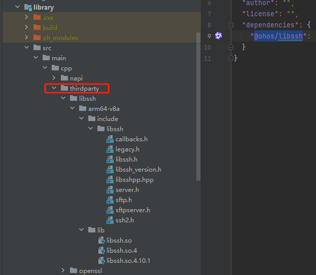

# ohos_ssh

## Introduction
A HarmonyOS third-party library that supports both SFTP servers and SSH clients, encapsulated based on the libssh-0.11.1 C++ library.

## How to Install

```shell
ohpm install @ohos/libssh
```
- For details about the OpenHarmony ohpm environment configuration, see [OpenHarmony HAR](https://gitcode.com/openharmony-tpc/docs/blob/master/OpenHarmony_har_usage.md) .

### How to Build

This project depends on the libssh library. The build products, .so file and header file, are imported through git submodule. The --recursive parameter must be carried in the command used to download the project code.
  ```
  git clone --recursive https://gitcode.com/openharmony-tpc/openharmony_tpc_samples.git
  ```

For details about how to build minizip_ng locally, see[Integrating libssh build](https://gitee.com/han_jin_fei/lycium/tree/master/main/libssh)。

Add the third_party directory to the cpp directory, and copy the library generated after compilation to the thirdparty directory.



## How to Use

### Generate Public and Private Keys

```typescript
import { libssh, SSH_KEYTYPES } from '@ohos/libssh';
......
this.ssh2Napi = new libssh();
let result = this.ssh2Napi.keygen(this.privateKeyPath, this.publicKeyPath, SSH_KEYTYPES.SSH_KEYTYPE_ECDSA);
......
```

### Set User Information
```typescript
import { libssh, SSH_KEYTYPES } from '@ohos/libssh';
......
this.ssh2Napi = new libssh();
let result = this.ssh2Napi.setUser(this.username, this.password);
......
```

### Algorithm Configuration

```typescript
import { libssh, SSH_KEYTYPES } from '@ohos/libssh';
......
this.ssh2Napi = new libssh();
let result = this.ssh2Napi.setSFTPKeyexChangeCer("curve25519-sha256")
result = this.ssh2Napi.setSFTPServerCer("aes256-ctr,aes128-ctr,aes192-ctr")
result = this.ssh2Napi.setSFTPMessageCer("hmac-sha2-512,hmac-sha2-265")
......
```

### Start SFTP Server

```typescript
import { libssh, SSH_KEYTYPES } from '@ohos/libssh';
......
let callback = (type: number) => {
  if (type == 2) {
    console.log("sftp started successfully")
  } else if (type == 3) {
    console.log("sftp failed to start")
  } else if (type == 4) {
    console.log("sftp client connected successfully")
  } else if (type == 5) {
    console.log("sftp service stopped successfully, connection disconnected")
  }
}
this.ssh2Napi.setUser(this.username, this.password);
//If setting multiple users in sftp server, execute setUser multiple times
// this.ssh2Napi.setUser("test", "test123");
this.ssh2Napi.startSFTPServer(this.privateKeyPath, this.publicKeyPath, this.port, callback);
......
```

### Stop SFTP Server

```typescript
import { libssh, SSH_KEYTYPES } from '@ohos/libssh';
......
this.ssh2Napi = new libssh();
//Note: Stopping sftp service is asynchronous, type=5 in startSFTPServer callback indicates success
let result = this.ssh2Napi.stopSFTPServer();
......
```

### Start SSH Client

```typescript
import { libssh, SSH_KEYTYPES } from '@ohos/libssh';
......
this.ssh2Napi = new libssh();
let callback = (type: number) => {
  if (type == 0) {
    console.log("sshClient started successfully")
  } else {
    console.log("sshClient failed to start, please setUser first or check if sshServer service is reachable")
  }
}
this.ssh2Napi.startSSHClient(this.sshServerIP, this.port, this.privateKeyPath, callback);
......
```

### Stop SSH Client

```typescript
import { libssh, SSH_KEYTYPES } from '@ohos/libssh';
......
this.ssh2Napi = new libssh();
let result = this.ssh2Napi.stopSSHClient();
......
```

### Create SSH Client Pseudo Terminal

```typescript
import { libssh, SSH_KEYTYPES } from '@ohos/libssh';
......
this.ssh2Napi = new libssh();
let result = this.ssh2Napi.createShell()
......
```

### Execute Commands on SSH Client

```typescript
import { libssh, SSH_KEYTYPES } from '@ohos/libssh';
......
this.ssh2Napi = new libssh();
this.ssh2Napi.executeSSHComm(this.command).then((result) => {
  console.log("executeSSHComm result: " + result)
});
......
```

### Get Public Key Fingerprint

```typescript
import { libssh, SSH_KEYTYPES } from '@ohos/libssh';
......
this.ssh2Napi = new libssh();
let result = await this.ssh2Napi.getPublicKeyFingerprint(this.publicKeyPath);
......
```

## Available APIs

## Interface Specification

| Interface  | Parameters   | Parameter Description                                                | Return Value                     | Function Description                    |
| ----------------------- | ------------------------------------------------------------ | ------------------------------------------------------------ | :------------------------------- | ------------------------------------- |
| keygen                  | privateKeyPath:string, publicKeyPath::string, type:SSH_KEYTYPES | Parameter 1: Private key generation path;<br/>Parameter 2: Public key generation path;<br/>Parameter 3: Key generation algorithm | number type: 0: Success; 1: Failure | Generate public/private keys |
| setUser                 | name:string,psw:string                                       | Parameter 1: Username<br/>Parameter 2: User password         | number type: 0: Success; 1: Failure | Set user information             |
| setSFTPKeyexChangeCer   | cer:string                                                   | Parameter 1: Supported key exchange algorithms, separated by commas | number type: 0: Success; 1: Failure | Set supported key exchange algorithms |
| setSFTPServerCer        | cer:string                                                   | Parameter 1: Supported encryption algorithms, separated by commas | number type: 0: Success; 1: Failure | Set supported encryption algorithms for SFTP server |
| setSFTPMessageCer       | cer:string                                                   | Parameter 1: Supported message authentication algorithms, separated by commas | number type: 0: Success; 1: Failure | Set supported message authentication algorithms |
| startSFTPServer         | privateKeyPath: string, publicKeyPath: string, port: number,callback:Function | Parameter 1: Private key storage path<br/>Parameter 2: Public key storage path<br/>Parameter 3: Port number<br/>Parameter 4: Callback function | Callback example: let callback = (type: number) => {<br/>      if (type == 2) {<br/>        console.log("sftp started successfully")<br/>      } else if (type == 3) {<br/>        console.log("sftp failed to start")<br/>      } else if (type == 4) {<br/>        console.log("sftp client connected successfully")<br/>      } else if (type == 5) {<br/>        console.log("sftp service stopped successfully, connection disconnected")<br/>      }<br/>    } | Start SFTP server |
| startSSHClient          | ip: string, port: number, privateKeyPath: string,callback:Function | Parameter 1: SSH server IP address<br/>Parameter 2: Port number<br/>Parameter 3: Private key storage path<br/>Parameter 4: Callback function | Callback example:    <br/>let callback = (type: number) => {<br/>      if (type == 0) {<br/>        console.log("sshClient started successfully")<br/>      } else {<br/>        console.log("sshClient failed to start, please setUser first or check SSH server connectivity")<br/>      }<br/>    } | Start SSH client   |
| executeSSHComm          | command:string                                               | Parameter 1: Specific command                                 | Promise<string> | Execute SSH client commands |
| stopSFTPServer          | None                                                         | None                                                         | number type: 0: Success; 1: Failure | Stop SFTP service |
| stopSSHClient           | None                                                         | None                                                         | number type: 0: Success; 1: Failure | Stop SSH client |
| getPublicKeyFingerprint | publicKeyPath: string 


## Precautions
- Both SFTP server and SSH client require consistent public/private key pairs.

- Public/private key generation rules and algorithm configurations must be aligned.

## About obfuscation
- Code obfuscation, please see[Code Obfuscation](https://docs.openharmony.cn/pages/v5.0/zh-cn/application-dev/arkts-utils/source-obfuscation.md).
- If you want the libssh library not to be obfuscated during code obfuscation, you need to add corresponding exclusion rules in the obfuscation rule configuration file obfuscation-rules.txt:

```
-keep
./oh_modules/@ohos/libssh
```

## Constraints
This project has been verified in the following version:

DevEco Studio: DevEco Studio 5.0.3 Beta2- 5.0.9.200, SDK: API12.

## Directory Structure
````
|----ohos_ssh  
|     |---- entry  # Example code directory
|     |---- library  
|                |---- cpp #  C/C++ and NAPI code
|                      |---- napi # SSH NAPI logic code
|                      |---- CMakeLists.txt  # Build script
|                      |---- thirdparty # Third-party dependencies
|                      |---- types # Interface declarations
|                      |---- utils # Utility classes
|           |---- index.ets  # Public interface
|     |---- README.md  # Installation and usage guide
|     |---- README_zh.md  # Installation and usage guide
````

## How to Contribute
If you find any problem when using the project, submit an [Issue](https://gitcode.com/openharmony-tpc/openharmony_tpc_samples/issues) or a [PR](https://gitcode.com/openharmony-tpc/openharmony_tpc_samples/pulls) .

## License
This project is licensed under [GNU - v 2.1](https://gitcode.com/openharmony-tpc/openharmony_tpc_samples/blob/master/ohos_ssh/LICENSE) . 
    


