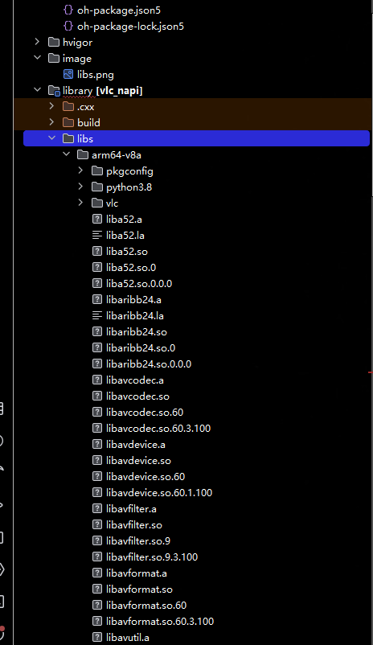

# @ohos/vlc

## 简介

> @ohos/vlc是适用于HarmonyOS系统的VLC库，提供视频播放、暂停、跳转和视频时长等接口。

## 编译运行

### ohos_vlc submodule 下载
在`ohos_vlc`目录执行如下命令拉取submodule
```shell
git submodule update --init --recursive
```

### FFmpeg和vlc依赖
基于[tpc_c_cplusplus](https://gitcode.com/openharmony-sig/tpc_c_cplusplus)仓库进行交叉编译编译，编译方式参考[README.md](https://gitcode.com/openharmony-sig/tpc_c_cplusplus/blob/master/README_zh.md)

 > 如果编译`vlc`库时提示需要链接`opengl`库，可以临时将`${OHOS_SDK}/native/sysroot/usr/include/GL/gl.h`的或者本地的`gl.h`名字修改后编译。

 > 以下编译时请使用`OHOS_SDK`17+版本。

1. 将`ohos_vlc/Script/`目录下的所有文件拷贝到`tpc_c_cplusplus/thirdparty/`下。
2. 在`tpc_c_cplusplus/lycium/`目录下执行`./build.sh vlc`命令编译。
3. 编译结束后，将`tpc_c_cplusplus/lycium/usr/`下所有目录中`/arm64-v8a/lib/`的文件拷贝到`ohos_vlc/library/libs/arm64-v8a/`。
4. 将`tpc_c_cplusplus/lycium/usr/vlc/arm64-v8a/include`下所有文件拷贝到`ohos_vlc/library/src/main/cpp/thirdpart/include/`下，如下图所示：


## 下载安装

```shell
ohpm install @ohos/vlc
```
OpenHarmony ohpm环境配置等更多内容，请参考 [如何安装OpenHarmony ohpm包](https://gitee.com/openharmony-tpc/docs/blob/master/OpenHarmony_har_usage.md)。


## 使用说明

1. 构造`LibVLC`、`MediaPlayer`和`Media`对象，将`XComponent`id通过`MediaPlayer.setVideoOut`传到底层。

```typescript
import { LibVLC, MediaPlayer, Media, MediaPlayerListener, MediaListener } from '@ohos/vlc'

vlc: LibVLC = new LibVLC([], "");
mediaPlayer: MediaPlayer = new MediaPlayer(this.vlc);
path = "file://" + getContext().resourceDir + "/5.mp4";
media: Media = new Media(this.vlc, this.path)
xcomponentId = 'myxcomponentid';

XComponent({ id: this.xcomponentId, type: 'surface', libraryname: 'vlc_napi' })
  .onLoad(() => {
    this.mediaPlayer.setVideoOut(this.xcomponentId)
    this.mediaPlayer.play()
  })
  .id('videoXComponent')
  .width('100%')
  .height(300)
```

2. 设置Media

```typescript
mediaPlayerListener: MediaPlayerListener = {}
mediaListener: MediaListener = {}

this.mediaPlayer.setEventListener(mediaPlayerListener);
this.media.setEventListener(this.mediaListener);
this.media.parse();
this.mediaPlayer.setMedia(this.media)
```

3. 控制视频流

```typescript
this.mediaPlayer.play();
this.mediaPlayer.pause();
this.mediaPlayer.stop();
```

4. 设置播放速率

```typescript
this.mediaPlayer.setRate(1)
```

5. 获取视频总时长

```typescript
this.media.getDuration()
```

## 接口说明

### MediaPlayer接口
- setEventListener -- 添加事件监听
- setVideoOut -- 设置视频输出的XComponentID
- setMedia -- 设置Media对象
- play -- 开始播放或者恢复暂停
- pause -- 暂停播放
- stop -- 停止播放
- getLength -- 获取视频时长，单位为ms
- addSlave -- 给当前媒体播放器添加从属媒体（slave media）
- getState -- 获取当前状态, Opening = 1; Playing = 3; Paused = 4; Stopped = 5; Ended = 6; Error = 7;
- setScale -- 设置视频缩放倍率
- isPlaying -- 是否在播放
- setTime -- 设置播放时间点
- getTime -- 获取当前时间点
- setPosition -- 设置播放位置
- getPosition -- 获取当前播放位置
- getRate -- 获取播放速率
- setRate -- 设置播放速率

### Media接口
- setEventListener -- 添加事件监听
- parse -- 异步解析媒体资源
- getDuration -- 获取视频时长

### LibVLC
- constructor(stringArray: string[], homePath: string) -- 构造VLC对象

## 约束与限制
在下述版本验证通过：

-  DevEco Studio: 5.1.1.850, SDK: API12 (5.0.0)
-  DevEco Studio: 6.0.1.249, SDK: API21 (6.0.1)


## 目录结构
```markdown
ohos_vlc
├── AppScope/                   # 应用全局资源
├── entry/                      # 主模块
│   ├── src/
│   │   ├── main/               # 主代码目录
│   │   ├── ohosTest/           # OpenHarmony测试目录
│   │   └── test/               # 单元测试目录
│   └── oh-package.json5        # 模块包配置
├── library/                    # 公共库模块
├── ├── lib/                    # 动态库
│   ├── src/
│   │   └── main/
│   │       └── cpp/            # 封装层
│   ├── oh-package.json5        # 包的元数据和依赖信息
│   ├── Index.d.ts              # 接口文件
│   └── ...                     # 其他文件
├── README_zh.md                # 项目中文文档和说明
└── oh-package.json5            # 项目配置文件
```


- 代码混淆，请查看[代码混淆简介](https://docs.openharmony.cn/pages/v5.0/zh-cn/application-dev/arkts-utils/source-obfuscation.md)
- 如果希望vlc库在代码混淆过程中不会被混淆，需要在混淆规则配置文件obfuscation-rules.txt中添加相应的排除规则：

```
-keep
./oh_modules/@ohos/vlc
```

## 贡献代码

使用过程中发现任何问题都可以提 [Issue](https://gitcode.com/openharmony-tpc/openharmony_tpc_samples/issues) 给组件，当然，也非常欢迎发 [PR](https://gitcode.com/openharmony-tpc/openharmony_tpc_samples/pulls)共建。

## 开源协议

本项目基于 [GPL-2.0](https://gitcode.com/openharmony-tpc/openharmony_tpc_samples/blob/master/ohos_vlc/LICENSE) ，请自由地享受和参与开源。