# parse-sdk

## 简介

Parse JavaScript SDK 是一个功能强大的客户端库，用于与 Parse Server 后端交互。

## 下载安装

```shell
ohpm install @ohos/parser-sdk
```

OpenHarmony ohpm环境配置等更多内容，请参考 [如何安装OpenHarmony har包](https://gitcode.com/openharmony-tpc/docs/blob/master/OpenHarmony_har_usage.md)。

## 使用说明

### 1.使用Parse
```
  Parse.initialize("YOUR_APP_ID", "YOUR_JAVASCRIPT_KEY");
  //javascriptKey is required only if you have it on server.

  Parse.serverURL = 'http://YOUR_PARSE_SERVER:1337/parse'
```

### 2.使用Parse.Object

| 创建、保存对象                                                          | 修改对象                                                               | 删除对象                                                               |
|------------------------------------------------------------------|--------------------------------------------------------------------|--------------------------------------------------------------------|
| 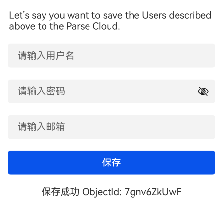 | 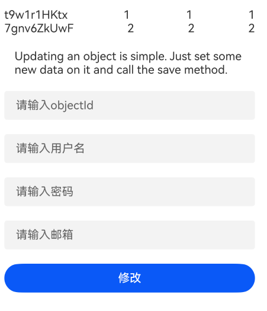 | 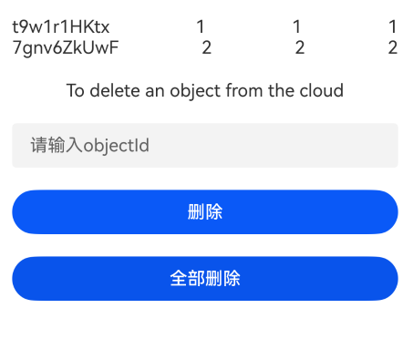 |
- 创建、保存对象
```
const GameScore = Parse.Object.extend("GameScore");
const gameScore = new GameScore();

gameScore.set("score", 1337);
gameScore.set("playerName", "Sean Plott");
gameScore.set("cheatMode", false);

gameScore.save()
.then((gameScore) => {
  
}, (error) => {
  
});
```
- 批量保存对象列表
```
    try {
      const Article: ESObject = ParseObject.extend("Article");
      const article: ESObject = new Article();
      article.set("title", "HarmonyOS");
      article.set("content", "Parse SDK");

      const Review: ESObject = ParseObject.extend("Review");
      const defaultReview: ESObject = new Review();
      defaultReview.set("content", "Parse SDK");
      defaultReview.set("parent", article);

      await Parse.Object.saveAll([article, defaultReview]);
      this.queryArticles();
    } catch (err) {
      console.error("HMLog-->", JSON.stringify(err));
    }
```
- 更新对象
```
const GameScore = Parse.Object.extend("GameScore");
const gameScore = new GameScore();

gameScore.set("score", 1337);
gameScore.set("playerName", "Sean Plott");
gameScore.set("cheatMode", false);
gameScore.set("skills", ["pwnage", "flying"]);

gameScore.save().then((gameScore) => {
  gameScore.set("cheatMode", true);
  gameScore.set("score", 1338);
  return gameScore.save();
});
```
- 删除对象
```
myObject.destroy().then((myObject) => {
  // The object was deleted from the Parse Cloud.
}, (error) => {
  // The delete failed.
  // error is a Parse.Error with an error code and message.
});
```

### 3.使用Queries

| 添加数据                                                           | 删除数据                                                              | 修改数据                                                                | 查询数据                                                              
|----------------------------------------------------------------|-------------------------------------------------------------------|---------------------------------------------------------------------|-------------------------------------------------------------------|
| 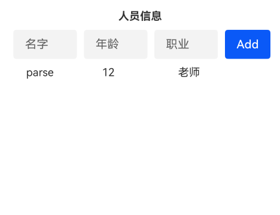 | 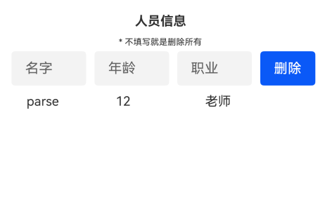 | 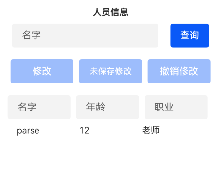   | 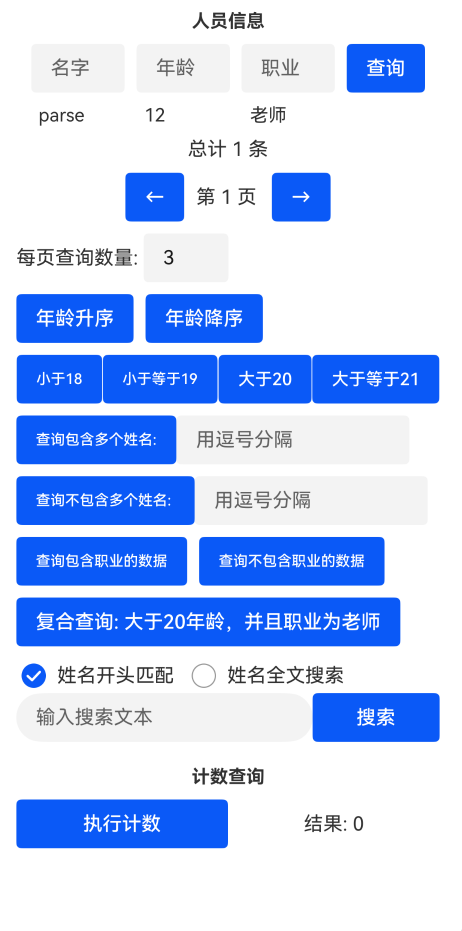  |
- 添加数据
```
const Personnel:ESObject = ParseObject.extend('PersonnelObject');
const personnel:ESObject = new Personnel();
const query = new ParseQuery(Personnel);
personnel.set('name', 'parse');
personnel.set('age', '3');
personnel.set('occupation', 'parse');
personnel.save();
```
- 删除数据
```
const Personnel = ParseObject.extend('PersonnelObject');
const query = new ParseQuery(Personnel);

query.find()
  .then((results) => {
    // Delete successful
  })
  .catch((error:ESObject) => {
    // Delete unsuccessful
  });
```
- 修改数据
```
// Get selected object
const selected = resultsData[selectedIndex];

// Application modification
selected.set('name', 'parse');
selected.set('age', '3');
selected.set('occupation', 'teacher');

// Save changes
selected.save();
```
- 查看数据
```
const Personnel = ParseObject.extend("PersonnelObject");
const query = new ParseQuery(Personnel);
query.find()
    .then(() => {
      // Query successful
    })
    .catch(() => {
      // Query failed
    });
```
- 分页查询
```
const query = new Parse.Query("PersonnelObject");
  
const pageSize = 10; 
const currentPage = 0; 

query.limit(pageSize);
query.skip(currentPage * pageSize);

const results = await query.find();
```
- 复合查询
```
const ageQuery = new Parse.Query("PersonnelObject").greaterThan("age", 20);
const jobQuery = new Parse.Query("PersonnelObject").equalTo("occupation", "teacher");

const results = await Parse.Query.and(ageQuery, jobQuery).find();
```
- 升降序查询
```
const Personnel = ParseObject.extend("PersonnelObject");
const query = new ParseQuery(Personnel);

query.exists('age');

query.doesNotExist('age');

query.find()
    .then((response: ESObject) => {
      // Query successful
    })
    .catch(() => {
      // Query failed
    });
```
- 条件查询
```
const GameScore = Parse.Object.extend("GameScore");
const query = new Parse.Query(GameScore);
query.equalTo("playerName", "Dan Stemkoski");
const results = await query.find();

// Do something with the returned Parse.Object values
for (let i = 0; i < results.length; i++) {
  const object = results[i];
  console.log(object.id + ' - ' + object.get('playerName'))
}
```
- 比较条件查询
```
const GameScore = ParseObject.extend("PersonnelObject");
const query = new ParseQuery(GameScore);

switch(compareType) {
  case 'lessThan':
    query.lessThan("age", 18);
    break;
  case 'lessThanOrEqualTo':
     query.lessThanOrEqualTo("age", 19);
     break;
   case 'greaterThan':
     query.greaterThan("age", 20);
     break;
   case 'greaterThanOrEqualTo':
     query.greaterThanOrEqualTo("age", 21);
     break;
 }

query.find()
  .then(() => {
   // Query successful
  })
  .catch(() => {
   // Query failed
  });
```
- 列表查询
```
const names = nameList.split(',').map(n => n.trim()).filter(n => n);
const query = new Parse.Query("PersonnelObject");
  
if (names.length) {
  isContain 
    ? query.containedIn("name", names)
    : query.notContainedIn("name", names);
}

query.find()
  .then(() => {
   // Query successful
  })
  .catch(() => {
   // Query failed
  });
```
- 搜索查询
```
const searchText = "zhang";
const searchType = "startsWith";

const query = new Parse.Query("PersonnelObject");

if (searchText) {
  searchType === "startsWith" 
    ? query.startsWith("name", searchText)
    : query.fullText("name", searchText);
}

query.find()
  .then(() => {
   // Query successful
  })
  .catch(() => {
   // Query failed
  });
```

### 4.使用Parse.User

| 用户操作                                                      |                                                         
|-----------------------------------------------------------|
| 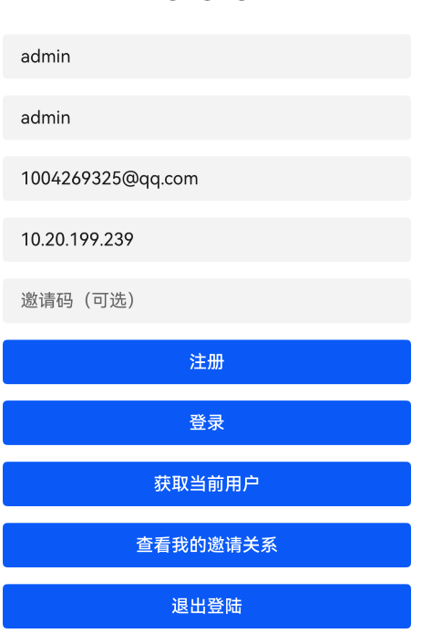 |

- 注册
```
const user = new Parse.User();
user.set("username", "my name");
user.set("password", "my pass");
user.set("email", "email@example.com");

// other fields can be set just like with Parse.Object
user.set("phone", "415-392-0202");
try {
  await user.signUp();
  // Hooray! Let them use the app now.
} catch (error) {
  // Show the error message somewhere and let the user try again.
}
```
- 登录
```
const user = await Parse.User.logIn("myname", "mypass", { usePost: false });
```
- 获取当前用户
```
const currentUser = Parse.User.current();
```
- 加密当前用户
```
Parse.enableEncryptedUser();
Parse.secret = 'my Secrey Key';
```
- 重置密码
```
Parse.User.requestPasswordReset("email@example.com")
.then(() => {
  // Password reset request was sent successfully
}).catch((error) => {
  // Show the error message somewhere
  alert("Error: " + error.code + " " + error.message);
});
```
- 查询用户
```
const query = new Parse.Query(Parse.User);
query.equalTo("gender", "female");  // find all the women
const women = await query.find();
```
- 链接用户
```
const user = Parse.User.current();

await user.linkWith('parse', {
  authData: { id: '123'}
  });
```
- 退出登录
```
await Parse.User.logOut();
```
- 给对象设置访问权限
```
const Note = Parse.Object.extend("Note");
const privateNote = new Note();
privateNote.set("content", "This note is private!");
privateNote.setACL(new Parse.ACL(Parse.User.current()));
privateNote.save();
```

### 5.使用Sessions

| Sessions操作                                                      |                                                         
|-----------------------------------------------------------|
| 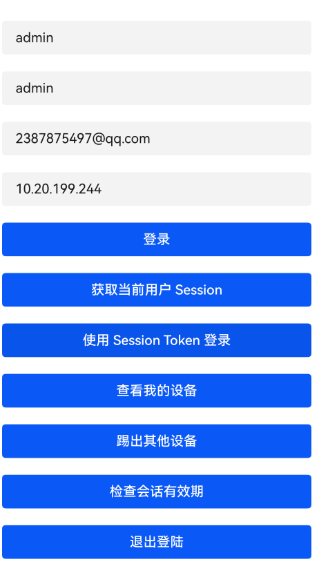 |
- 获取当前用户Session
```
const currentUser = Parse.User.current();
const sessionToken = currentUser.getSessionToken(); // 获取 Session Token
// 检查 Session 是否可撤销
const isRevocable = ParseSession.isCurrentSessionRevocable();
```
- 使用Session Token登录
```
const sessionToken = currentUser.getSessionToken();
const user = await Parse.User.become(sessionToken);
```
- 无效会话令牌错误处理
```
handleParseError(err: ESObject) {
    switch (err.code) {
      case Parse.Error.INVALID_SESSION_TOKEN:
        Parse.User.logOut()
        break;
    }
  }
```

### 6.使用Parse.Role

| Role操作                                                    |                                                         
|-----------------------------------------------------------|
| 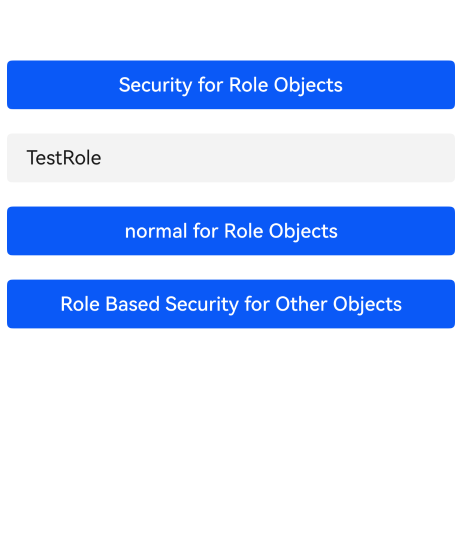 |
- 创建管理员角色
```
const roleACL = new Parse.ACL();
roleACL.setPublicReadAccess(true);
const role = new Parse.Role("Administrator", roleACL);
role.save();
```
- 创建角色
```
const role = new Parse.Role('TestRole', new Parse.ACL());
await role.save();
```
- 为角色提供对对象的读取或写入权限
```
const wallPost = new Parse.Object("WallPost");
const postACL = new Parse.ACL();
postACL.setRoleWriteAccess("Moderators", true);
wallPost.setACL(postACL);
wallPost.save();
```

### 7.使用Files

| Files操作                                                   |                                                         
|-----------------------------------------------------------|
| 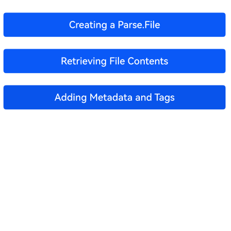 |
- 创建、保存文件
```
const Post: ESObject = ParseObject.extend('Post');
const post: ESObject = new Post();
const textFile = new Parse.File('test.txt', { base64: base64Data });

post.set('txt', textFile);
post.save();
```
- 查看文件内容
```
const Post: ESObject = ParseObject.extend('Post');
const query = new Parse.Query(Post);
query.get(this.objectId).then((post) => {
  const parseFile: ParseFile = post.get('txt');
  if (parseFile) {
    parseFile.getData().then((val) => {
      this.message = '获取文件内容成功 ：' + val;
    }).catch((err: ESObject) => {
      this.message = '获取文件内容失败：' + JSON.stringify(err);
    })
  } else {
    this.message = 'Post中没有关联文件';
  }
}).catch((err: ESObject) => {
  this.message = '获取Post对象失败'
})
```
- 添加元数据和标签
```
parseFile.addMetadata('createdById', 'some-user-id');
parseFile.addTag('groupId', 'some-group-id');
post.set('txt', parseFile);
post.save();
```

### 8.使用GeoPoints

| GeoPoints操作                                                   |                                                         
|---------------------------------------------------------------|
|  |
- 添加GepPoint
```
const point = new Parse.GeoPoint({latitude: 40.0, longitude: -30.0});
let placeObject = new Parse.Object("PlaceObject");
placeObject.set("location", point);
```
- 查询 Parse.Polygon 是否包含 Parse.GeoPoint
```
const points = [[0,0], [0,1], [1,1], [1,0]];
const inside = new Parse.GeoPoint(0.5, 0.5);
const outside = new Parse.GeoPoint(10, 10);
const polygon = new Parse.Polygon(points as Coordinate[]);
// Returns True
polygon.containsPoint(inside);
// Returns False
polygon.containsPoint(outside);
```
- 地理查询
```
// User's location
const userGeoPoint = userObject.get("location");
// Create a query for places
const query = new Parse.Query(PlaceObject);
// Interested in locations near user.
query.near("location", userGeoPoint);
// Limit what could be a lot of points.
query.limit(10);
// Final list of objects
const placesObjects = await query.find();
```
- 按距离查询
```
const bund = new Parse.GeoPoint(31.2412, 121.4928);
const query = new Parse.Query("PlaceObject");
query.withinKilometers("location", bund, 2);
const results = await query.find();
```
- 按距离查询
```
const bund = new Parse.GeoPoint(31.2412, 121.4928);
const query = new Parse.Query("PlaceObject");
query.withinKilometers("location", bund, 2);
const results = await query.find();
```
- 按矩形边界查询
```
const southwest = new Parse.GeoPoint(31.230, 121.490);
const northeast = new Parse.GeoPoint(31.245, 121.515);
const query = new Parse.Query("PlaceObject");
query.withinGeoBox("location", southwest, northeast);
const results = await query.find();
```
- 按多边形区域查询
```
const lujiazuiArea = [
  [121.495, 31.238], 
  [121.495, 31.242], 
  [121.505, 31.242], 
  [121.505, 31.238], 
  [121.495, 31.238]  
  ];

const query = new Parse.Query("PlaceObject");
query.withinPolygon("location", lujiazuiArea);
const results = await query.find();
```

### 9.使用Local Datastore

| Local Datastore操作                                                    |                                                         
|----------------------------------------------------------------------|
| 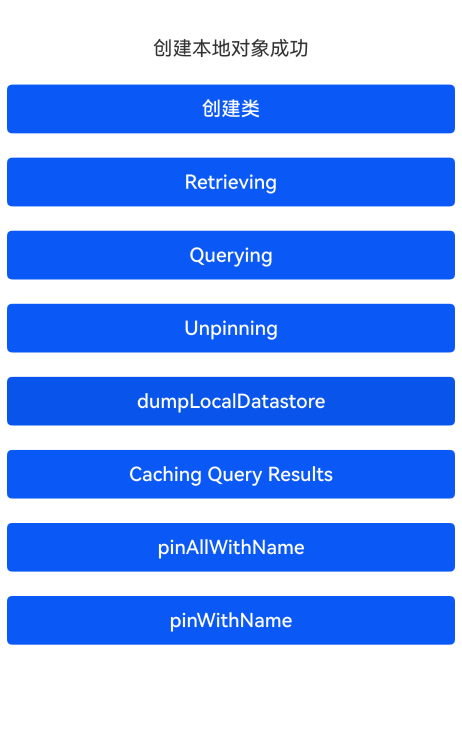 |
- 将对象固定到本地存储
```
const GameScore: ESObject = Parse.Object.extend("GameScore");
const gameScore: ESObject = new GameScore();
await gameScore.save();
await gameScore.pin();

await Parse.Object.pinAll([gameScore]);
```
- 查询本地数据存储
```
const GameScore = Parse.Object.extend("GameScore");
const query = new Parse.Query(GameScore);
query.fromLocalDatastore();
const result = await query.get(gameScore.id);
```
- 条件查询本地数据存储
```
const GameScore = Parse.Object.extend("GameScore");
const query = new Parse.Query(GameScore);
query.equalTo('playerName', 'Joe Bob');
query.fromLocalDatastore();
const results = await query.find();
```
- 取消固定
```
await gameScore.unPin();

await Parse.Object.unPinAllObjects();
```
- 查询本地数据存储的内容
```
const LDS = await Parse.dumpLocalDatastore();
```
- 缓存查询结果
```
const GameScore: ESObject = Parse.Object.extend("GameScore");
const query = new Parse.Query(GameScore);
query.equalTo("playerName", "foo");
const results = await query.find();
await Parse.Object.unPinAllObjectsWithName('HighScores');
await Parse.Object.pinAllWithName('HighScores', results);
let localDatastore: ESObject = await Parse.LocalDatastore._getAllContents()
this.message += ' Caching Query Results : ' + JSON.stringify(localDatastore) + '\r\n\r\n'
```
- 使用标签固定
```
// Add several objects with a label.
await Parse.Object.pinAllWithName('MyScores', listOfObjects);

// Add another object with the same label.
await anotherGameScore.pinWithName('MyScores');
```

### 10.使用Live Queries

| Live Queries操作                                                    |                                                         
|-------------------------------------------------------------------|
| 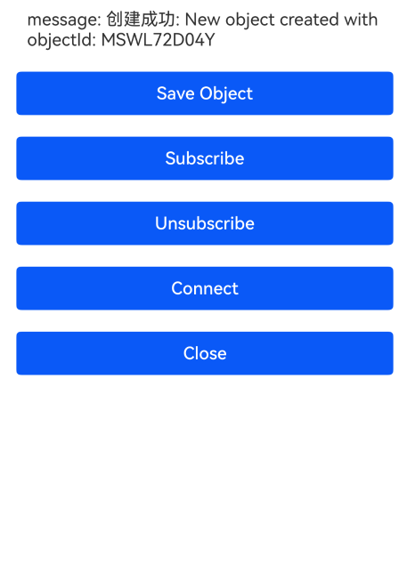 |
- 创建订阅
```
let query = new Parse.Query('GameScore');
let subscription = await query.subscribe();
```
- 事件处理
```
subscription.on('open', () => {
 console.log('subscription opened');
});
subscription.on('create', (object) => {
  console.log('object created');
});
subscription.on('update', (object) => {
  console.log('object updated');
});
subscription.on('enter', (object) => {
  console.log('object entered');
});
subscription.on('leave', (object) => {
  console.log('object left');
});
subscription.on('delete', (object) => {
  console.log('object deleted');
});
subscription.on('close', () => {
  console.log('subscription closed');
});
```
- 取消订阅
```
subscription.unsubscribe();
```
- 连接、关闭LiveQueryServer
```
let config: ESObject = {
  serverURL: 'ws://10.20.199.239:1337',
}
let client = new LiveQueryClient(config);
client.open();

client.close();
```
- 事件处理
```
client.on('open', () => {
  console.log('connection opened');
});
client.on('close', () => {
  console.log('connection closed');
});
client.on('error', (error) => {
  console.log('connection error');
});
```
### 11.使用分析
- 自定义分析
```
const dimensions = {
  // Define ranges to bucket data points into meaningful segments
  priceRange: '1000-1500',
  // Did the user filter the query?
  source: 'craigslist',
  // Do searches happen more often on weekdays or weekends?
  dayType: 'weekday'
};
// Send the dimensions to Parse along with the 'search' event
Parse.Analytics.track('search', dimensions);
```

## 接口说明

### Objects

| 接口名                      | 参数                                                                  | 返回值                                                           | 说明                    |
|--------------------------|:--------------------------------------------------------------------|---------------------------------------------------------------|-----------------------|
| save                     | 无                                                                   | ParseObject                                                   | 创建对象                  |
| saveAll                  | 无                                                                   | ParseObject[]                                                 | 批量保存对象                |
| destroy                  | 无                                                                   | ParseObject                                                   | 删除对象                  |
| destroyAll               | list: ParseObject<Attributes>[], options?: SaveOptions \| undefined | Promise<ParseObject<Attributes> \| ParseObject<Attributes>[]> | 批量删除对象                |
| pin                      | 无                                                                   | 无                                                             | 将对象固定到本地存储            |
| pinAll                   | ParseObject[]                                                       | 无                                                             | 将多个对象固定到本地存储          |
| unPin                    | 无                                                                   | 无                                                             | 取消固定                  |
| unPinAll                 | objects: ParseObject[]                                              | Promise<void>                                                 | 取消多个固定                |
| unPinAllObjects          | 无                                                                   | 无                                                             | 从 default pin 中删除所有对象 |
| dumpLocalDatastore       | 无                                                                   | any                                                           | 查看本地数据存储的内容           |
| pinAllWithName           | name, ParseObject[]                                                 | 无                                                             | 一组对象和标签一起存储           |
| pinWithName              | name                                                                | 无                                                             | 对象和标签一起存储             |


### Queries

| 接口名                    | 参数                                                                                                                | 返回值                                           | 说明                                       |
|------------------------|:------------------------------------------------------------------------------------------------------------------|-----------------------------------------------|------------------------------------------|
| get                    | objectId                                                                                                          | ParseObject                                   | 根据id查找对象                                 |
| get                    | objectId                                                                                                          | ParseObject                                   | 根据id查找对象                                 |
| count                  | 无                                                                                                                 | Promise<number>                               | 查询匹配的对象数量                                |
| withCount              | includeCount?: boolean                                                                                            | ParseQuery<ParseObject<Attributes>>           | 查询返回满足条件的对象总数                            |
| containsAll            | key: string, values: any[]                                                                                        | ParseQuery<ParseObject<Attributes>>           | 查询包含约束条件的数组                              |
| ascending              | ...keys: string[]                                                                                                 | ParseQuery<ParseObject<Attributes>>           | 按给定键的升序对结果进行排序                           |
| descending             | ...keys: string[]                                                                                                 | ParseQuery<ParseObject<Attributes>>           | 按给定键的降序对结果进行排序                           |
| find                   | 无                                                                                                                 | ParseObject[]                                 | 查找所有                                     |
| equalTo                | key, value                                                                                                        | 无                                             | 查找时添加的约束                                 |
| fromLocalDatastore     | 无                                                                                                                 | ParseQuery<ParseObject[]>                     | 查找本地数据存储                                 |
| limit                  | n: number                                                                                                         | ParseQuery<ParseObject<Attributes>>           | 查询结果数量的限制                                |
| skip                   | n: number                                                                                                         | ParseQuery<ParseObject<Attributes>>           | 查询跳过的结果数                                 |
| readPreference         | readPreference: string, includeReadPreference?: string \| undefined, subqueryReadPreference?: string \| undefined | ParseQuery<ParseObject<Attributes>>           | 查询偏好设置                                   |
| lessThan               | key: string, value: any                                                                                           | 无                                             | 该约束要求特定键的值小于所提供的值                        |
| lessThanOrEqualTo      | key: string, value: any                                                                                           | 无                                             | 该约束要求特定键的值小于或等于所提供的值                     |
| greaterThan            | key: string, value: any                                                                                           | 无                                             | 该约束要求特定键的值大于所提供的值                        |
| greaterThanOrEqualTo   | key: string, value: any                                                                                           | 无                                             | 该约束要求特定键的值大于或等于所提供的值                     |
| containedIn            | key: string, value: any[]                                                                                         | 无                                             | 要求在提供的值列表中包含特定键的值                        |
| notContainedIn         | key: string, value: any[]                                                                                         | 无                                             | 要求特定键的值不能包含在提供的值列表中                      |
| exists                 | key: string                                                                                                       | 无                                             | 添加查找包含给定键的对象的约束                          |
| doesNotExist           | key: string                                                                                                       | 无                                             | 添加查找不包含给定键的对象的约束                         |
| startsWith             | key: string, prefix: string, modifiers?: string \| undefined                                                      | 无                                             | 查找以提供的字符串开头的字符串值添加约束                     |
| fullText               | key: string, value: string, options?: FullTextQueryOptions \| undefined                                           | 无                                             | 查找包含所提供字符串的字符串值的约束                       |
| and                    | ...queries: ParseQuery<ParseObject<Attributes>>[]                                                                 | ParseQuery<ParseObject<Attributes>>           | 查找包含多条约束的对象                              |
| select                 | ...keys: (string \| string[])[]                                                                                   | ParseQuery<ParseObject<Attributes>>           | 限制返回对象，使其仅包含所提供的键                        |
| exclude                | ...keys: (string \| string[])[]                                                                                   | ParseQuery<ParseObject<Attributes>>           | 限制返回对象，使其包含提供的键之外的所有键                    |
| matchesKeyInQuery      | key: string, queryKey: string, query: ParseQuery                                                                  | 无                                             | 添加一个约束，该约束要求键的值与由其他Parse.Query返回的对象中的值匹配 |
| doesNotMatchKeyInQuery | key: string, queryKey: string, query: ParseQuery                                                                  | 无                                             | 添加一个约束，要求键的值不能与其他Parse.Query返回的对象中的值匹配   |
| first                  | options?: QueryOptions                                                                                            | Promise<ParseObject<Attributes> \| undefined> | 返回查询结果中的第一条记录                            |
| include                | ...keys: ("post" \| "post"[])[]                                                                                   | 无                                             | 预加载关联对象数据                                |

### User

| 接口名                  | 参数                                                                                                       | 返回值                            | 说明                           |
|----------------------|----------------------------------------------------------------------------------------------------------|--------------------------------|------------------------------|
| signUp               | 无                                                                                                        | ParseUser                      | 注册用户                         |
| set                  | key: Attributes \| "username" \| Pick , value?: any, options?: SetOptions \| undefined                   | 无                              | 设置对象字段值                      |
| logIn                | userName, passWord                                                                                       | 无                              | 登录                           |
| current              | 无                                                                                                        | ParseUser                      | 获取当前用户                       |
| logOut               | 无                                                                                                        | 无                              | 退出登录                         |
| become               | sessionToken                                                                                             | ParseUser                      | 使用Session Token 登录           |
| requestPasswordReset | email: string, options?: RequestOptions \| undefined                                                     | Promise<void>                  | 请求将密码重置邮件发送到与用户帐户关联的指定电子邮件地址 |
| linkWith             | provider: string \| AuthProvider, options: { authData?: AuthData \| undefined; }, saveOpts?: FullOptions | Promise<ParseUser<Attributes>> | 将第三方账号绑定到当前用户                |
| _isLinked            | provider: any                                                                                            | boolean                        | 检查用户是否链接第三方账号                |
| _unlinkFrom          | provider: any, options?: FullOptions \| undefined                                                        | Promise<ParseUser<Attributes>> | 解除用户与第三方账号的链接                |
| become               | sessionToken: string, options?: RequestOptions \| undefined                                              | Promise<T>                     | 使用会话令牌登录用户                   |
| become               | sessionToken: string, options?: RequestOptions \| undefined                                              | Promise<T>                     | 使用会话令牌登录用户                   |

### Sessions

| 接口名                       | 参数                 | 返回值       | 说明                |
|---------------------------|--------------------|-----------|-------------------|
| getSessionToken           | 无                  | string    | 获取Session Token   |
| isCurrentSessionRevocable | 无                  | boolean   | 检查Session 是否可撤销   |

### Roles

| 接口名    | 参数                                                                                                   | 返回值                            | 说明   |
|--------|------------------------------------------------------------------------------------------------------|--------------------------------|------|
| Role   | name: string, acl?: ParseACL \| undefined                                                            | ParseRole<Attributes>          | 创建角色 |
| save   | (arg1?: Attributes \| Pick<Attributes, string> \| null \| undefined, arg2?: SaveOptions \| undefined | Promise<ParseRole<Attributes>> | 保存角色 |

### Files

| 接口名         | 参数                                                                                                                                 | 返回值       | 说明     |
|-------------|------------------------------------------------------------------------------------------------------------------------------------|-----------|--------|
| File        | name: string, data?: FileData \| undefined, type?: string \| undefined, metadata?: object \| undefined, tags?: object \| undefined | ParseFile | 创建文件   |
| save        | 无                                                                                                                                  | ParseFile | 保存文件   |
| getData     | 无                                                                                                                                  | string    | 获取文件内容 |
| addMetadata | key, value                                                                                                                         | 无         | 添加元数据  |
| addTag      | key, value                                                                                                                         | 无         | 添加标签   |

### Live Queries

| 接口名               | 参数              | 返回值                     | 说明                 |
|-------------------|-----------------|-------------------------|--------------------|
| subscribe         | 无               | LiveQuerySubscription   | 创建订阅               |
| on                | string, any     | 无                       | 事件处理               |
| unsubscribe       | 无               | 无                       | 取消订阅               |
| open              | 无               | 无                       | 连接 LiveQueryServer |
| close             | 无               | 无                       | 关闭 LiveQueryServer |

## 关于混淆
- 代码混淆，请查看[代码混淆简介](https://docs.openharmony.cn/pages/v5.0/zh-cn/application-dev/arkts-utils/source-obfuscation.md)。
- 如果希望net-snmp库在代码混淆过程中不会被混淆，需要在混淆规则配置文件obfuscation-rules.txt中添加相应的排除规则：

```
-keep
./oh_modules/@ohos/parser-sdk
```

## 约束与限制

- DevEco Studio 版本： 5.0.3.300SP2  OpenHarmony SDK:API12 (5.0.0.22)。

## 目录结构

````
|---parse-sdk
|   |---entry   # 示例代码文件夹
|   |---library   # parser-sdk库文件夹
|       |---src
|           |---main  
|               |---ets
|                   |---Xhr.harmonyos.ts  # 和服务端通信
|                   |---ParseObject.ts  # 核心功能
|   |---README.md  # 安装使用方法
````

## 贡献代码

使用过程中发现任何问题都可以提 [Issue](https://gitcode.com/openharmony-tpc/openharmony_tpc_samples/issues) 给组件，当然，也非常欢迎给发[PR](https://gitcode.com/openharmony-tpc/openharmony_tpc_samples/pulls)共建。

## 遗留问题

- [ ] push功能暂不支持(目前parse-server端不支持Harmony,需要集成HMS)。
- [ ] config功能不支持(config功能需要masterKey,源库中特别说明masterKey，只能在node环境中使用)。
- [ ] 删除文件功能不支持(删除文件功能需要masterKey,源库中特别说明masterKey，只能在node环境中使用)。


## 开源协议

本项目基于 [Apache License](https://gitcode.com/openharmony-tpc/openharmony_tpc_samples/blob/master/parse-sdk/LICENSE) ，请自由地享受和参与开源。
