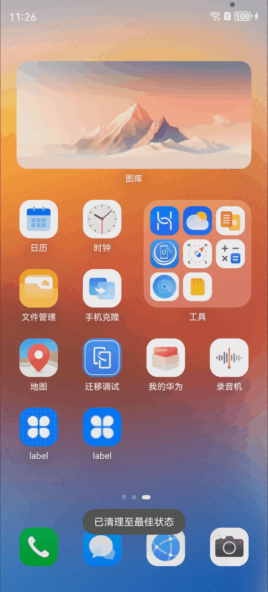

# parser-html-json

## 简介

将字符串的html解析为json数据，获取其中相关内容


## 安装

```
ohpm install parser-html-json
```

OpenHarmony ohpm 环境配置等更多内容，请参考[如何安装 OpenHarmony ohpm 包](https://gitee.com/openharmony-tpc/docs/blob/master/OpenHarmony_har_usage.md)

## 使用说明

### 提取css

```
import * as ParserHTMLJson from 'parser-html-json';

let parserJson = new ParserHTMLJson.default(html);
let result = JSON.stringify(parserJson.getClassStyleJson());
```

### 获取json格式的html

```
import * as ParserHTMLJson from 'parser-html-json';

let parserJson = new ParserHTMLJson.default(html);
let result = JSON.stringify(parserJson.getHtmlJson());
```

### 接口说明
|          接口名          |接口说明	|备注|
|:---------------------:|:---:|:---:|
|         getClassStyleJson         |获取html的css的json数据   |        |
|        getHtmlJson        |输出转换成json格式的html数据   |        |

## 目录结构

```
|---- parserHtmlJsonDemo
|     |---- entry/src/main/ets  # 示例代码文件夹
|           |---- entryability
|                            |---- EntryAbility.ets
|           |---- pages
|                     |---- Index.ets
|     |---- README.md  # 安装使用方法
|     |---- demo.gif  # 演示示例
```

## 贡献代码

使用过程中发现任何问题都可以提[Issue](https://gitee.com/openharmony-tpc/openharmony_tpc_samples/issues) 给我们，当然，我们也非常欢迎你给我们提[PR](https://gitee.com/openharmony-tpc/openharmony_tpc_samples/pulls)。

## 开源协议

本项目基于 [MIT License](https://gitee.com/openharmony-tpc/openharmony_tpc_samples/blob/master/parserHtmlJsonDemo/LICENSE)，请自由地享受和参与开源。
