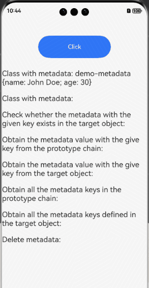

# reflect-metadata

## Introduction

**reflect-metadata** provides APIs for manipulating metadata in TypeScript. You can use the APIs to add and read metadata when declaring classes and properties.

## Effect


## How to Install

````
ohpm install reflect-metadata@0.2.1
````

For details about the OpenHarmony ohpm environment configuration, see [OpenHarmony HAR](https://gitee.com/openharmony-tpc/docs/blob/master/OpenHarmony_har_usage.en.md).

## How to Use

```typescript
// Import reflect-metadata.
import("reflect-metadata").then((reflectMetadata) => {
  @Reflect.metadata(METADATA_KEY, 'John Doe')
  class Person {
    name: string = 'John Doe';
  }
  // Call APIs.
  Reflect.hasMetadata(METADATA_KEY, Person);
  Reflect.hasOwnMetadata(METADATA_KEY, Person);
  Reflect.getMetadata(METADATA_KEY, Person);
  Reflect.getOwnMetadata(METADATA_KEY, Person);
  Reflect.getMetadataKeys(Person);
  Reflect.getOwnMetadataKeys(Person);
  Reflect.deleteMetadata(METADATA_KEY, Person);
})
```

## Available APIs

| API                        | Description                    |
| -------------------------- | ------------------------------ |
| Reflect.hasMetadata        | Checks whether the metadata with the given key exists in the prototype chain.  |
| Reflect.hasOwnMetadata     | Checks whether the metadata with the given key exists in the target object.    |
| Reflect.getMetadata        | Obtains the metadata value with the give key from the prototype chain.|
| Reflect.getOwnMetadata     | Obtains the metadata value with the give key from the target object.  |
| Reflect.getMetadataKeys    | Obtains all the metadata keys in the prototype chain.    |
| Reflect.getOwnMetadataKeys | Obtains all the metadata keys defined in the target object.        |
| Reflect.deleteMetadata     | Deletes metadata.                    |

## Constraints

This project has been verified in the following version:

- DevEco Studio: 4.1 Canary (4.1.3.317); OpenHarmony SDK: API11 (4.1.0.36)


## Directory Structure

````
|---- reflect-metadata 
|     |---- entry      # Sample code
|     |---- README.md  # Readme     
|     |---- README_zh.md  # Readme     
````

## How to Contribute
If you find any problem when using the project, submit an [issue](https://gitee.com/openharmony-tpc/openharmony_tpc_samples/issues) or a [PR](https://gitee.com/openharmony-tpc/openharmony_tpc_samples/pulls).

## License
This project is licensed under [Apache License 2.0](https://gitee.com/openharmony-tpc/openharmony_tpc_samples/tree/master/reflect-metadata/blob/master/LICENSE).
