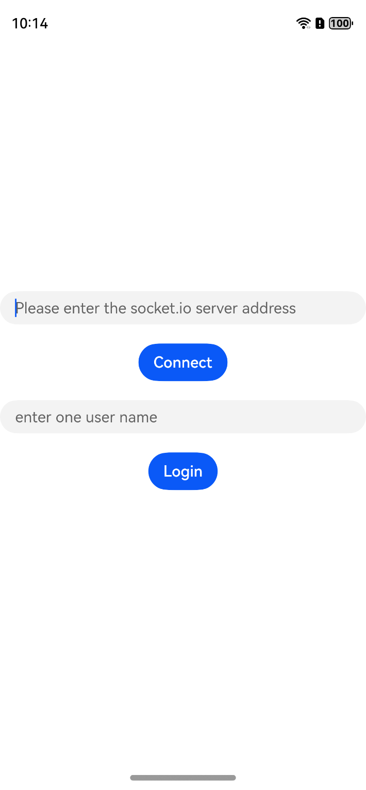
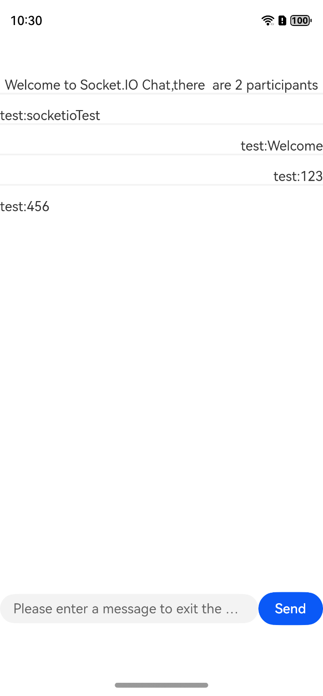

# socketio

## Overview

socketio is a library that implements low-latency, two-way, and event-based communication between clients and servers. It is built on the WebSocket protocol and provides additional protection, such as fallback to HTTP long polling or automatic reconnection.
### Notes:
- socketio only supports HTTP-based connections and does not support HTTPS (TLS) protocol;
- If you need to establish encrypted connections via HTTPS (TLS), please use [socket_tls](https://gitcode.com/openharmony-tpc/openharmony_tpc_samples/tree/master/socketio_tls) version;
- The two versions are designed for HTTP and HTTPS scenarios respectively and **cannot be mixed**.
### Compatibility
- **Compatible server versions: Socket.IO 3.x / 4.x**

## Display Effects





## How to Install

```shell
ohpm install @ohos/socketio 
```
For details, see [Installing an OpenHarmony HAR](https://gitcode.com/openharmony-tpc/docs/blob/master/OpenHarmony_har_usage.en.md).


## Configuring the x86 Simulator

See [Running Your App/Service on an Emulator](https://developer.huawei.com/consumer/cn/deveco-developer-suite/enabling/kit?currentPage=1&pageSize=100).


## How to Use

1. Import the dependency libraries.

```typescript
import { client_socket } from '@ohos/socketio';
```

2. Initialize the socket.io client.

```typescript
client: client_socket = new client_socket();
```

3. Set listening events.

```typescript
this.client.set_open_listener(this.on_open.bind(this));
this.client.set_fail_listener(this.on_fail.bind(this));
this.client.set_reconnecting_listener(this.on_reconnecting.bind(this));
this.client.set_reconnect_listener(this.on_reconnect.bind(this));
this.client.set_close_listener(this.on_close.bind(this));
this.client.set_socket_open_listener(this.on_socket_open.bind(this));
this.client.set_socket_close_listener(this.on_socket_close.bind(this));
```

4. Connect to the server.

```typescript
this.client.connect(uri) // uri: socket.io server address
```

5. Enable listening for user joining and leaving events.

- Implementation of event listening

```typescript
on_user_left_listener(event_json: string): void {
	// Callback data processing
}
```

- Set the listener.

```typescript
this.client.on("new message", this.on_new_message_listener.bind(this));
this.client.on("user joined", this.on_user_joined_listener.bind(this));
this.client.on("user left", this.on_user_left_listener.bind(this));
this.client.on("login", this.on_login_listener.bind(this));
```

6. Log in to the server, and set the login success callback.

```typescript
this.client.emit("add user", username, this.on_emit_callback.bind(this));
```

7. Send a message, and set the listener for message sending events.

```typescript
this.client.emit("new message", message, this.on_emit_callback);
```

8. Close the server connection

```typescript
this.client.close();
```

9. Supplementary Information

- This sample code provides a simple encapsulation that can be used as a reference.
- In addition, the sample code adds processing for switching between the foreground and background.
- You can modify the code according to your requirements.

## Available APIs

- Initialize the client.

```typescript
client: client_socket = new client_socket();
```

- Set the listener for client open events.

```typescript
set_open_listener(on_open: () => void)
```

- Set the listener for client failure events.

```typescript
set_fail_listener(on_fail: () => void)
```

- Set the listener for client reconnecting events.

```typescript
set_reconnecting_listener(on_reconnecting: () => void)
```

- Set the listener for client reconnection events.

```typescript
set_reconnect_listener(on_reconnect: () => void)
```
- Set the listener for client close events.
```typescript
set_close_listener(on_close: (reason: string) => void)
```
- Set the listener for client open events.
```typescript
set_socket_open_listener(on_socket_open: (nsp: string) => void)
```
- Set the listener for client close events.
```typescript
set_socket_close_listener(on_socket_close: (nsp: string) => void)
```
- Set the header.
```typescript
set_headers(headers: string)
```
- Connect to the server.
```typescript
connect(uri: string)
```
- Clear all listeners.
```typescript
clear_con_listeners()
```
- Clear all socket listeners.
```typescript
clear_socket_listeners()
```
- Set the number of reconnection times.
```typescript
set_reconnect_attempts(attempts: number)
```
- Set the delay for reconnection attempts.
```typescript
set_reconnect_delay(millis: number)
```
- Set the maximum delay for reconnection.
```typescript
set_reconnect_delay_max(millis: number)
```
- Close the connection.
```typescript
close()
```
- Disable synchronization.
```typescript
sync_close()
```
- Check whether the function is enabled.
```typescript
opened(): boolean
```
- Obtain the session ID.
```typescript
get_sessionid(): string
```
- Register a new event handler for server events.
```typescript
on(event_name: string, on_event_listener: (event_json: string) => void)
```
- Disable listening for socket events.
```typescript
socket_close()
```
- Set the listener for errors.
```typescript
on_error(on_error_listener: (message: string) => void)
```
- Disable the listener for errors.
```typescript
off_error()
```
- Send an event with the specified name to the socket with the specified flag.  
This is the response used by the response server to confirm the message.
```typescript
emit(name: string, message: string, on_emit_callback?: (emit_callback_json: string) => void)
```
- Get the current connection status.
0: Not connected, 1: Disconnected, 2: Connecting, 3: Connected
```typescript
get_current_state(): number 
```
- Fixed Event: disconnect  
Description: The disconnect event is triggered when the client disconnects.
```typescript
// Demo example
this.client.on("disconnect", data: string => {
    console.log("disconnect", data);
});
```
- Fixed Event: ping_pong  
Description: The ping_pong event is a heartbeat check between the client and the server.
```typescript
// Demo example
this.client.on("ping_pong", data: string => {
    console.log("ping_pong", data);
});
```

## Source Code Downloading
1. This project depends on the **socket.io-client-cpp** library, which is introduced through `git submodule`. You need to add the `--recursive` parameter when downloading code.
  ```
  git clone --recursive https://gitcode.com/openharmony-tpc/openharmony_tpc_samples.git
  ```
2. Skip this step in the Linux environment. In the Windows environment, after the code is downloaded, integrate the OpenHarmony adaptation code. Run the `cd` command to go to the **socketio/library/src/main/cpp/thirdModule** directory and run the `modify.sh` script, integrate the patch file in this directory into the** socket.io-client-cpp** source code.
3. Start project building.

## About obfuscation
- Code obfuscation, please see[Code Obfuscation](https://docs.openharmony.cn/pages/v5.0/zh-cn/application-dev/arkts-utils/source-obfuscation.md)
- If you want the socketio library not to be obfuscated during code obfuscation, you need to add corresponding exclusion rules in the obfuscation rule configuration file obfuscation-rules.txt：
```
-keep
./oh_modules/@ohos/socketio
```

## Constraints
socket-io has been verified in the following versions:

- IDE: DevEco Studio 4.1.3.532, SDK: 4.1.0.67(SP3)
- IDE: DevEco Studio Next, Developer Beta1 (5.0.3.121), SDK:API12 (5.0.0.16)
- IDE: DevEco Studio NEXT Developer Beta2 (5.0.3.500); SDK: API12 (5.0.0.31).
- IDE：DevEco Studio 5.0.1 Release(5.0.5.310); SDK: API13 (5.0.1.115)

## Directory Structure
````
|---- socketio  
|     |---- entry  # Sample code
|     |---- library  # socket.io library
|           |---- ets # External APIs
				  |---- client_socket.ets # External APIs
            |---- cpp # Module code
                  |---- src # Core class
                  |---- client_socket.cpp # NAPI layer of the socket.io client
|     |---- README_EN.md  # Readme                   
````

## How to Contribute
If you find any problem when using socket-io, submit an [Issue](https://gitcode.com/openharmony-tpc/openharmony_tpc_samples/issues) or
a [PR](https://gitcode.com/openharmony-tpc/openharmony_tpc_samples/pulls) to us.

## License
This project is licensed under [MIT License](https://gitcode.com/openharmony-tpc/openharmony_tpc_samples/blob/master/socketio/LICENSE).

  
