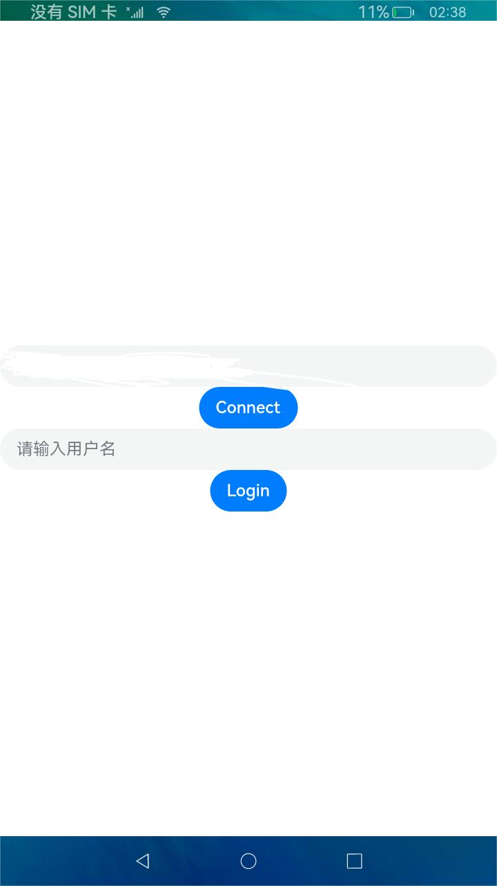
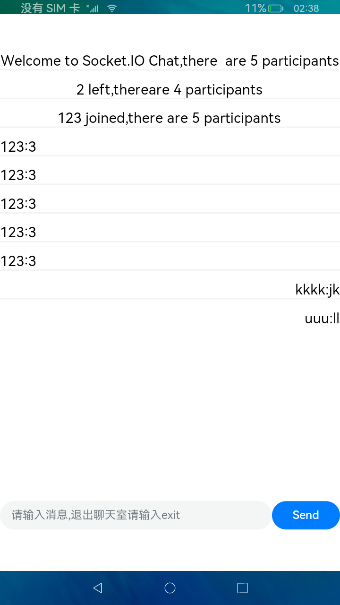

# socket-io 2.x

## 简介

> socketio_2.x是基于socket.io-client-cpp 2.x版本封装的一个在客户端和服务器之间实现低延迟、双向和基于事件的通信的库，兼容socketio服务端版本1.x和2.x。该客户端建立在 WebSocket 协议之上，并提供额外的保证，例如回退到 HTTP 长轮询或自动重新连接。

## 效果展示





## 下载安装

```shell
ohpm install @ohos/socketio_2.x
```
OpenHarmony ohpm 环境配置等更多内容，请参考[如何安装 OpenHarmony ohpm 包](https://gitee.com/openharmony-tpc/docs/blob/master/OpenHarmony_har_usage.md)


## X86模拟器配置

[使用模拟器运行应用/服务](https://developer.huawei.com/consumer/cn/deveco-developer-suite/enabling/kit?currentPage=1&pageSize=100)


## 使用说明

1. 导入依赖库

```typescript
import { client_socket } from '@ohos/socketio_2.x';
```

2. 初始化socket.io客户端

```typescript
client: client_socket = new client_socket(uri); //uri: socket.io服务端地址
```

3. 设置监听事件

```typescript
this.client.set_open_listener(this.on_open.bind(this));
this.client.set_fail_listener(this.on_fail.bind(this));
this.client.set_reconnecting_listener(this.on_reconnecting.bind(this));
this.client.set_reconnect_listener(this.on_reconnect.bind(this));
this.client.set_close_listener(this.on_close.bind(this));
this.client.set_socket_open_listener(this.on_socket_open.bind(this));
this.client.set_socket_close_listener(this.on_socket_close.bind(this));
```

4. 连接服务器

```typescript
this.client.connect(uri) //uri: socket.io服务端地址
```

5. 设置用户消息监听以及用户加入离开监听

- 监听事件实现

```typescript
on_user_left_listener(event_json: string): void {
	//回调数据处理
}
```

- 设置监听

```typescript
this.client.on("new message", this.on_new_message_listener.bind(this));
this.client.on("user joined", this.on_user_joined_listener.bind(this));
this.client.on("user left", this.on_user_left_listener.bind(this));
this.client.on("login", this.on_login_listener.bind(this));
```

6. 登录服务器，并设置登录成功回调

```typescript
this.client.emit("add user", username, this.on_emit_callback.bind(this));
```

7. 发送消息并设置发送消息监听

```typescript
this.client.emit("new message", message, this.on_emit_callback);
```

8. 关闭服务器链接

```typescript
this.client.close();
```

9. 补充说明

- 本示例代码中提供了一个简单的封装，可以作为参考，另外在示例代码中，增加了前后台切换时的处理，具体使用时可以根据自己的需求进行修改。

## 接口说明

- 初始化客户端

```typescript
client: client_socket = new client_socket();
```

- 设置客户端监听器

```typescript
set_open_listener(on_open: () => void)
```

- 设置客户端失败监听器

```typescript
set_fail_listener(on_fail: () => void)
```

- 设置客户端正在重新连接监听器

```typescript
set_reconnecting_listener(on_reconnecting: () => void)
```

- 设置客户端重新连接监听器

```typescript
set_reconnect_listener(on_reconnect: () => void)
```
- 设置客户端关闭监听器
```typescript
set_close_listener(on_close: (reason: string) => void)
```
- 设置socket打开监听
```typescript
set_socket_open_listener(on_socket_open: (nsp: string) => void)
```
- 设置socket关闭监听
```typescript
set_socket_close_listener(on_socket_close: (nsp: string) => void)
```
- 设置 header
```typescript
set_headers(headers: string)
```
- 连接服务器
```typescript
connect(uri: string)
```
- 清除所有监听器
```typescript
clear_con_listeners()
```
- 清除所有socket监听器
```typescript
clear_socket_listeners()
```
- 设置重连次数
```typescript
set_reconnect_attempts(attempts: number)
```
- 设置重新连接尝试的延迟时间
```typescript
set_reconnect_delay(millis: number)
```
- 设置重新连接的最大延迟。
```typescript
set_reconnect_delay_max(millis: number)
```
- 关闭连接
```typescript
close()
```
- 同步关闭
```typescript
sync_close()
```
- 判断是否打开
```typescript
opened(): boolean
```
- 获取sessionID
```typescript
get_sessionid(): string
```
- 注册一个新的响应服务器事件的事件处理器
```typescript
on(event_name: string, on_event_listener: (event_json: string) => void)
```
- 设置socket监听关闭
```typescript
socket_close()
```
- 设置错误监听
```typescript
on_error(on_error_listener: (message: string) => void)
```
- 关闭错误监听
```typescript
off_error()
```
- 通过提供的name事件名称向socket标志发送事件  
说明: 响应服务器用来确认消息的应答
```typescript
emit(name: string, message: string, on_emit_callback?: (emit_callback_json: string) => void)
```
- 获取当前连接状态  
  说明：0: 未连接，1: 断开连接，2: 正在连接，3: 已连接
```typescript
get_current_state(): number 
```
- 固定事件：disconnect  
  说明：disconnect事件是在客户端断开连接时触发
```typescript
// demo示例
this.client.on("disconnect", data: string => {
    console.log("disconnect", data);
});
```
- 固定事件：ping_pong  
  说明：ping_pong事件是在客户端与服务器之间的心跳检测
```typescript
// demo示例
this.client.on("ping_pong", data: string => {
    console.log("ping_pong", data);
});
```
## 源码下载
1. 本项目依赖 socket.io-client-cpp 库，通过`git submodule`引入，下载代码时需加上`--recursive`参数。
  ```
  git clone --recursive https://gitee.com/openharmony-tpc/openharmony_tpc_samples.git
  ```
2. Linux环境无需执行该步骤，如果是windows环境下，代码下载完成后合入OHOS适配的代码，cd 进入到socketio_2.x/library/src/main/cpp/thirdModule 目录下，执行 modify.sh 脚本，将本目录下的 patch 文件合入到 socket.io-client-cpp 源码中。
3. 开始编译项目。

## 约束与限制
在下述版本验证通过：

- IDE：DevEco Studio 4.1.3.532; SDK: 4.1.0.67(SP3)。
- IDE：DevEco Studio Next ,Developer Beta1(5.0.3.121); SDK:API12 (5.0.0.16)。
- IDE：DevEco Studio NEXT Developer Beta2(5.0.3.500); SDK: API12 (5.0.0.31)。
- IDE：DevEco Studio NEXT Developer Beta1(5.0.3.810); SDK: API12 (5.0.0.68)。
- IDE：DevEco Studio 5.0.1 Release(5.0.5.310); SDK: API13 (5.0.1.115)。

## 目录结构
````
|---- socketio_2.x  
|     |---- entry  # 示例代码文件夹
|     |---- library  # socket.io库
|           |---- ets #对外接口目录
				  |---- client_socket.ets # 对外接口
            |---- cpp # 组件代码目录
                  |---- src # 核心类目录
                  |---- client_socket.cpp # socket.io客户端NAPI层
|     |---- README.md  # 安装使用方法                    
````

## 贡献代码
使用过程中发现任何问题都可以提 [Issue](https://gitee.com/openharmony-tpc/openharmony_tpc_samples/issues) 给组件，当然，也非常欢迎
发 [PR](https://gitee.com/openharmony-tpc/openharmony_tpc_samples/pulls) 共建。

## 开源协议
本项目基于 [MIT LICENSE](https://gitee.com/openharmony-tpc/openharmony_tpc_samples/tree/master/socketio/LICENSE) ，请自由地享受和参与开源。

  

