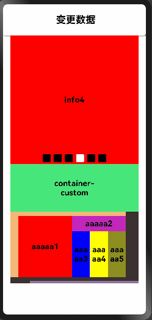

# Tangram

Tangram是一套动态化构建Native页面的框架。底层依赖[vlayout](https://gitee.com/openharmony-sig/vlayout)。

## 特点

- 通过json创建页面视图。
- 框架提供多种默认的布局方式。
- 通过代码支持自定义布局样式。
- [vlayout](https://gitee.com/openharmony-sig/vlayout)。

## 效果展示：



## 下载安装

```typescript
npm install @ohos/tangram --save
```

OpenHarmony npm环境配置等更多内容，参考安装教程 [如何安装OpenHarmony npm包](https://gitee.com/openharmony-tpc/docs/blob/master/OpenHarmony_npm_usage.md)。

## 使用说明

1.准备数据（网络请求或者本地加载json）。

```typescript
[
  {
    "type": "container-banner",
    "style": {
      "bgColor": "red",
      "indicatorMargin": 5,
      "infinite": "true",
      "indicatorImg2": "https//img.alicdn.com/tps/TB1XRNFNXXXXXXKXXXXXXXXXXXX-32-4.png",
      "indicatorImg1": "https//img.alicdn.com/tps/TB16i4qNXXXXXbBXFXXXXXXXXXX-32-4.png",
      "indicatorGap": 8,
      "indicatorHeight": 20,
      "indicatorRadius": 2,
      "itemRation": 1,
      "pageRation": 1,
      "hGap": 20
    },
    "items" : [
      {
        "type": "100",
        "msg": "info1",
        "style": {
          "bgColor": "#FF38DB40"
        }
      },
      {
        "type": "100",
        "msg": "info2",
        "style": {
          "bgColor": "#FF38DB40"
        }
      },
      {
        "type": "100",
        "msg": "info3"
      },
      {
        "type": "100",
        "msg": "info4"
      },
      {
        "type": "100",
        "msg": "info5"
      },
      {
        "type": "100",
        "msg": "info6"
      }
    ]
  },
  {
    "type": "1",
    "msg": "测试文本3",
    "style": {
      "bgColor": "#FFE2C3C3"
    },
    "loadType": "-1",
    "loaded": false
  }
]
```

2.将数据解析成对象。

```typescript
@State dataBean:CardProperty[] = [];
customLayoutType?: string[] = ["container-custom"]
customViewType?: string[] = ["100","1","redText","blueText"]
aboutToAppear(){
  // 将本地json串作为数据
  this.dataBean = this.setStyle(this.parseJson(new DataUtil().getDataFormLocal()))
}
```

3.将解析出来的对象绑定到组件中，并设置其他属性。

```typescript
  build() {
    Column() {
      Stack({alignContent: Alignment.Center}) {
        Text(this.text)
          .fontSize(25)
          .fontColor("#000000")
          .fontWeight(FontWeight.Bold)
      }
      .width('100%')
      .height('10%')
      .borderRadius(5)
      .shadow({ radius: 8, color: "#ff696767", offsetX: 5, offsetY: 5})
      .onClick(()=>{
        if(this.dataBean[0].items.length > 2){
          this.dataBean[0].items[1].style.bgColor = '#984521'
          this.dataBean[0].items[1].msg = '变更数据完成'
          this.dataBean[0].items.splice(this.dataBean[0].items.length - 1)
          this.dataBean[0].items.splice(this.dataBean[0].items.length - 1)
          this.dataBean.push(null)
          this.dataBean.splice(this.dataBean.length - 1)
        }
      })

      Column(){
        Tangram({
          // 绑定json解析出来的对象
          cardProperties: this.dataBean,
          // 自定义布局的类型列表，列表中的类型才有解析
          customLayoutType: this.customLayoutType,
          // 自定义组件的类型列表，列表中有的类型才会解析
          customViewType: this.customViewType,
          // 自定义布局解析的UI方法
          customLayout:(cardProperty, child)=>{
            this.customLayout(cardProperty, child)
          },
          // 自定义组件解析的UI方法
          customView:(cardProperty) =>{
            this.customView(cardProperty)
          },
          // 异步加载、异步分页加载的合并类
          cardLoadSupport: new CardLoadSupport((loadinfo:string)=>{
          console.log('异步加载信息：'+loadinfo)
          setTimeout(()=>{
            let a = new CardProperty();
            a.type = '1'
            a.msg = '异步加载测试文本'
            a.style = new Style();
            this.dataBean.push(a);
          }, 5000)
          },(page:number, loadinfo: string)=>{
            console.log('异步分页加载：第'+page+'页')
            if(page <= 3){
              setTimeout(()=>{
                let newDataBean = this.parseJson(new DataUtil().getData2FormLocal())
                for(var i=0; i<newDataBean.length; i++){
                  this.dataBean.push(newDataBean[i])
                }
              },5000)
            }
          }),
          // 当前显示条目索引变化回调监听
          onScrollIndex: (firstIndex:number, lastIndex:number)=>{
            console.log("当前显示的条目头尾为"+firstIndex+'-'+lastIndex)
          }
        })
      }
      .backgroundColor("#ff3b3131")
      .width("90%")
      .height("80%")
    }
    .width('100%')
    .height('100%')
  }

  // 自定义解析布局
  @Builder customLayout(cardProperty: CardProperty, child:(any)){
    if(cardProperty.type == 'container-custom'){
      Column(){
        TangramLayout({
          cardProperty: cardProperty.items[0],
          customLayoutType: this.customLayoutType,
          customViewType: this.customViewType,
          customLayout: (cardProperty, child)=>{
            this.customLayout(cardProperty,child)
          },
          customView:(cardProperty)=>{
            this.customView(cardProperty)
          }
        })
      }
      .padding({
        top:10,
        bottom:10,
        left:'25%',
        right:'25%'
      })
      .backgroundColor(cardProperty.style.bgColor)
    }
  }

  // 自定义解析组件
  @Builder customView(cardProperty: CardProperty){
    if(cardProperty.type == '100'){
      Text(cardProperty.msg)
        .fontSize(20)
        .textAlign(TextAlign.Center)
        .width('100%')
        .height('100%')
        .fontColor('#000000')
        .backgroundColor(cardProperty.style.bgColor)
        .fontWeight(FontWeight.Bold)
    }else if(cardProperty.type == '1'){
      Text(cardProperty.msg)
        .fontSize(20)
        .textAlign(TextAlign.Center)
        .width('100%')
        .height('100%')
        .fontColor('#000000')
        .backgroundColor(cardProperty.style.bgColor)
        .fontWeight(FontWeight.Bold)
    }else if(cardProperty.type == 'redText'){
      Text(cardProperty.msg)
        .fontSize(20)
        .textAlign(TextAlign.Center)
        .width('100%')
        .fontColor('red')
        .backgroundColor('green')
        .fontWeight(FontWeight.Bold)
    }else if(cardProperty.type == 'blueText'){
      Text(cardProperty.msg)
        .fontSize(20)
        .textAlign(TextAlign.Center)
        .width('100%')
        .fontColor('blue')
        .fontWeight(FontWeight.Bold)
        .backgroundColor('red')
    }
  }
```

## 兼容性

支持 OpenHarmony API version 9 及以上版本。

## 目录结构

```
/Tangram/src/
- main/ets/components
    - banner               # 轮播banner相关
    - gridView     		   # 宫格布局相关
    - porterties           # 属性相关
    - support              # 支持相关
    - utils                # 工具类相关
    - vlayout              # vlayout布局相关
    - Tangram.ets  		   # Tangram门面
    - TangramLayout.ets    # Tangramlayout布局类       
/tangram/src/
- main/ets
	- Application
	- MainAbility
    - pages                             # 测试page页面列表
       - data.json    	   # 测试data数据
       - data-2.json       # 测试data-2数据
       - DataUtil.ets      # 测试数据解析工具类
       - index.ets         # 本地测试页面
```

## 贡献代码

使用过程中发现任何问题都可以提 [issue](https://gitee.com/openharmony-sig/Tangram/issues) 给我们，当然，我们也非常欢迎你给我们发 [PR](https://gitee.com/openharmony-sig/Tangram/issues) 。

## 开源协议

本项目基于 [Apache License 2.0](https://gitee.com/openharmony-sig/Tangram/blob/master/LICENSE) ，请自由的享受和参与开源。
