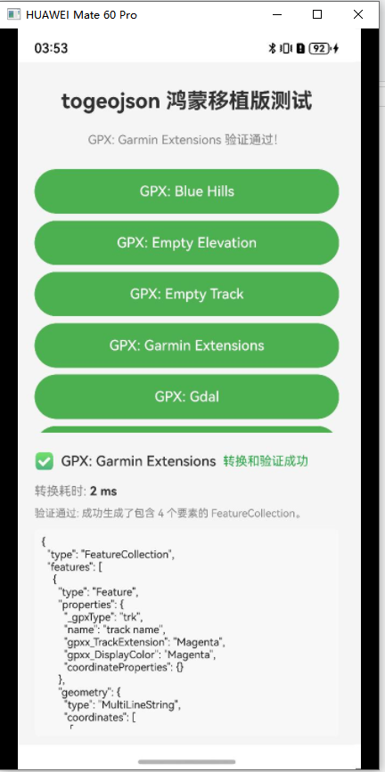

# togeojson

togeojson supports converting geographic data files in GPX, KML, and TCX formats to GeoJSON format.
This project is a complete port of the togeojson library, which originally ran in Node.js and browser environments, to the HarmonyOS operating system, enabling HarmonyOS applications to directly handle the conversion of various geographic data formats. The project includes the complete library files, a test interface, and unit tests.

## Features

- **GPX Conversion**: Supports converting GPS track files to GeoJSON.
- **KML Conversion**: Supports converting Google Earth KML files to GeoJSON.
- **TCX Conversion**: Supports converting Garmin Training Center TCX files to GeoJSON.
- **Complete Testing**: Includes unit tests covering various scenarios.

## Showcase


## Download and Installation
```shell
ohpm install @ohos/togeojson 
```
For more details on setting up the OpenHarmony ohpm environment, please refer to [How to install OpenHarmony ohpm packages](https://gitcode.com/openharmony-tpc/docs/blob/master/OpenHarmony_har_usage.md).

## X86 Emulator Configuration

[Using the Emulator to Run an App/Service](https://developer.huawei.com/consumer/cn/deveco-developer-suite/enabling/kit?currentPage=1&pageSize=100).

## Usage Example

### Usage in a HarmonyOS App
- **Workflow**
- Import the module, read the file, parse the XML, and call the conversion interface.

1. Import dependencies
```typescript
import * as tj from '@ohos/togeojson';
import type { F } from '@ohos/togeojson';
import { DOMParser } from '@xmldom/xmldom';
```
2. Read the file
```typescript
const xmlContent = await this.resourceManager.getRawFileContent('track.gpx');
const xmlString = new util.TextDecoder('utf-8').decodeWithStream(xmlContent);
```
3. Parse the XML
```typescript
const doc = new DOMParser().parseFromString(xmlString, "text/xml");
```

4. Call the conversion interface
```typescript
const result = tj.gpx(doc);
let generator: Generator<F, void, void> | null = null; // Used to receive the return value of the generator function
generator = tj.tcxGen(doc as XDocument);
const features: F[] = Array.from(generator); // Extract all features from the generator result at once and store them in the 'features' array
```

5. Log the conversion result
```typescript
console.log(JSON.stringify(result, null, 2)); // Result from a standard conversion function
console.log(JSON.stringify(features, null, 2)); // Result from a generator-based conversion
```


## Output Format

All conversion functions can ultimately return a standard GeoJSON FeatureCollection format similar to the following:

```json
{
  "type": "FeatureCollection",
  "features": [
    {
      "type": "Feature",
      "properties": {
        "name": "Track Name",
        "time": "2023-01-01T12:00:00Z",
        "_gpxType": "trk",
        "coordinateProperties": {
          "times": ["2023-01-01T12:00:00Z", "2023-01-01T12:01:00Z"],
          "heartRates": [120, 125]
        }
      },
      "geometry": {
        "type": "LineString",
        "coordinates": [[116.404, 39.915, 50], [116.405, 39.916, 52]]
      }
    }
  ]
}
```


## Dependencies

This project depends on the following libraries:
- @xmldom/xmldom: For parsing XML documents.
- @types/geojson: Provides strict type declarations for GeoJSON data structures.

## API and Method Reference

### GPX Related

- **gpx(doc: Document): FeatureCollection**
  - Converts an entire GPX (GPS eXchange Format) XML document into a standard GeoJSON FeatureCollection.
  - Parameters: `doc` is an XML DOM object (usually obtained by parsing with `@xmldom/xmldom`'s `DOMParser`).
  - Returns: A GeoJSON FeatureCollection, containing tracks, routes, waypoints, etc.

- **gpxGen(doc: Document): Generator<Feature>**
  - Outputs each geographic feature (Feature) from the GPX file one by one using a generator, suitable for handling large files or stream processing.
  - Parameters: Same as above.
  - Returns: A Feature generator that can be used to iterate over each geographic feature.

### KML Related

- **kml(doc: Document, options?: KMLOptions): FeatureCollection**
  - Converts an entire KML (Keyhole Markup Language) XML document into a standard GeoJSON FeatureCollection.
  - Parameters:
    - `doc`: XML DOM object.
    - `options` (optional): `{ skipNullGeometry?: boolean }`. If true, skips features with no geometry.
  - Returns: A GeoJSON FeatureCollection, containing points, lines, polygons, overlays, etc.

- **kmlGen(doc: Document, options?: KMLOptions): Generator<Feature>**
  - Outputs each geographic feature (Feature) from the KML file one by one using a generator.
  - Parameters: Same as above.
  - Returns: A Feature generator.

- **kmlWithFolders(doc: Document, options?: KMLOptions): Root**
  - Preserves the KML Folder hierarchy, returning a tree-like structure (Root) where `children` can be Folders or Features.
  - Parameters: Same as above.
  - Returns: A Root object containing a tree of folders and features.


### TCX Related

- **tcx(doc: Document): FeatureCollection**
  - Converts an entire TCX (Garmin Training Center XML) document into a standard GeoJSON FeatureCollection.
  - Parameters: `doc` is an XML DOM object.
  - Returns: A GeoJSON FeatureCollection, containing activity tracks, courses, etc.

- **tcxGen(doc: Document): Generator<Feature>**
  - Outputs each geographic feature (Feature) from the TCX file one by one using a generator.
  - Parameters: Same as above.
  - Returns: A Feature generator.

### Other Utilities

- **F**
  - A type alias for GeoJSON Feature, facilitating type inference and declarations.

---

#### Return Value Type Descriptions

- **FeatureCollection**: A standard GeoJSON collection of features, `{ type: "FeatureCollection", features: Feature[] }`
- **Feature**: A single GeoJSON feature, `{ type: "Feature", geometry, properties }`
- **Root/Folder**: A tree-like object representing the KML hierarchical structure.

## Download Source Code
1. This project can be cloned locally using the git command. Navigate to the corresponding directory to compile and run.
  ```
 git clone https://gitcode.com/openharmony-tpc/openharmony_tpc_samples.git
  ```

## Constraints and Limitations
Verified on the following versions:
- IDE: DevEco Studio 5.1.0 Release (5.1.0.828); SDK: API18 (5.1.0.110).

## Directory Structure

````
togeojson/
├── library/                    # togeojson core library
│   └── src/main/ets/            # Main source code
│       ├── index.ts             # Main entry file
│       ├── gpx.ts               # GPX conversion functions
│       ├── kml.ts               # KML conversion functions
│       ├── tcx.ts               # TCX conversion functions
│       └── shared.ts            # Shared utility functions
├── entry/                       # Test application entry
│   └── src/main/ets/pages/      # Test UI pages
│   └── src/ohostest/ets/        # Unit tests
│       ├──index.test.ts         # The first 'describe' block from the original library's index.test.ts
|       ├──index.test2.ts        # The second 'describe' block from the original library's index.test.ts
|   
└── README.md                    # Project description

````

## Contributing
If you encounter any issues while using this component, please feel free to submit an [Issue](https://gitcode.com/openharmony-tpc/openharmony_tpc_samples/issues). We also warmly welcome you to contribute by submitting a [PR](https://gitcode.com/openharmony-tpc/openharmony_tpc_samples/pulls).

## License

This project is licensed under the [BSD LICENSE](https://gitcode.com/openharmony-tpc/openharmony_tpc_samples/blob/master/togeojson/LICENSE). Please feel free to enjoy and participate in open source.