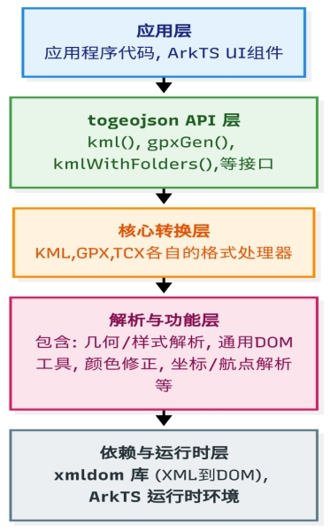
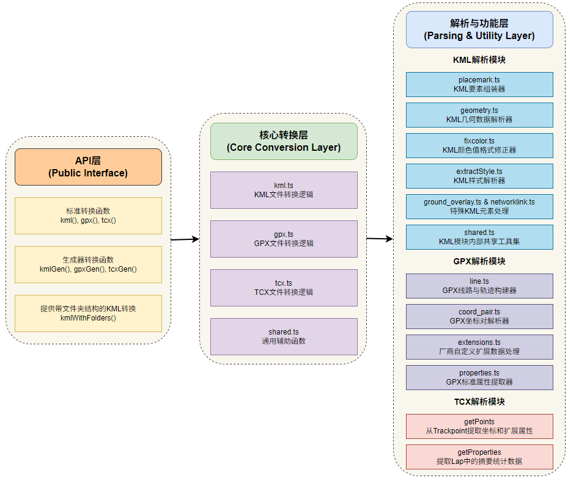
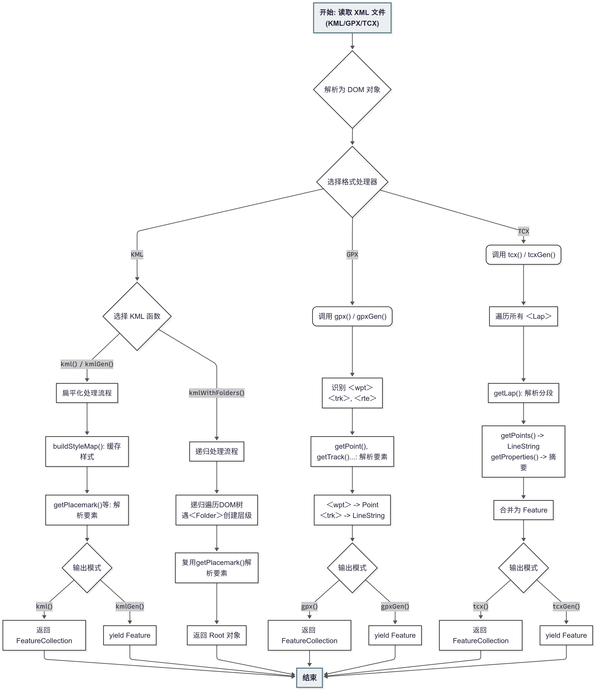
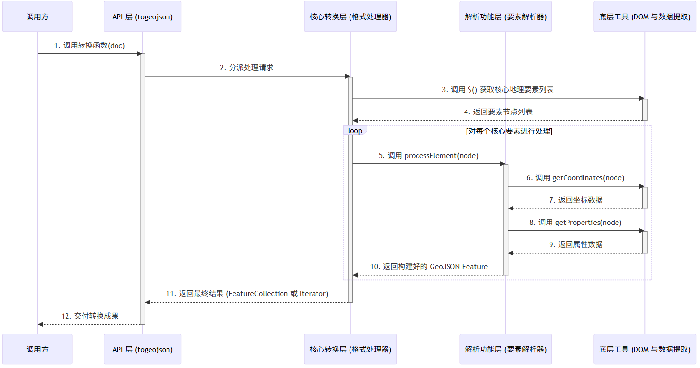

 

 

 

 

 

 

 

 

 

 

 

 

 

#  

# 1 **第零层设计描述**

## 1.1 软件系统上下文定义

 

 

# 2 **第一层设计描述** 

## 2.1 系统结构

### 2.1.1 模块划分

 

### 2.1.2 系统架构说明

  togeojson库是一个高效的地理数据格式转换库，可以将GPX、KML、TCX等格式的地理数据文件转换为标准GeoJSON格式。使用TypeScript实现，支持声明式调用，适用于地图应用、运动轨迹分析、导航等需要处理地理数据的场景。

(1) API层 (Public Interface)

index.ts：作为库的统一入口，负责导出标准转换函数 (kml, gpx, tcx)、生成器转换函数 (kmlGen, gpxGen, tcxGen) 以及 KML 的特殊处理函数 (kmlWithFolders)。

(2) 核心转换层 (Core Conversion Layer)

1. kml.ts：KML 转换流程的主模块，遍历` <Placemark>` 等地理元素，并调用下层功能模块进行解析与组装。

2. gpx.ts：GPX 转换流程的主模块，识别 `<trk>、<rte>、<wpt> `核心元素，并调度下层模块生成对应的 LineString 或 Point。

3. tcx.ts：TCX 转换流程的主模块，处理 `<Lap>` 和` <Courses>`元素，并解析与组装。

4. shared.ts ：作为通用工具，提供 $、nodeVal 等 DOM 操作函数。

(3) 解析与功能层 (Parsing & Utility Layer)

1. KML 解析模块

geometry.ts：几何解析，从` <Point>`、`<LineString>` 等标签中提取和解析坐标数据。

placemark.ts：KML 组装器，将解析出的几何体、属性、样式整合成一个标准的 GeoJSON Feature。

extractStyle.ts：作为 KML 的样式解析器，从 `<Style> `标签中提取颜色、线宽等信息。

fixcolor.ts：作为颜色修正器，将 KML 的 AABBGGRR 颜色格式转换为标准的 Web 颜色。

 

2. GPX 解析模块：

line.ts：GPX 线构建器，将离散的轨迹点（`<trkpt>`）序列连接成 LineString 几何体。

coord_pair.ts：GPX 坐标解析器，从点标签中提取经度、纬度和高程信息。

extensions.ts：GPX 扩展数据解析器，处理 Garmin 等厂商自定义的心率、踏频等信息。

3. TCX 解析模块

  getPoints：解析TCX 轨迹，从 `<Trackpoint>` 序列中提取坐标、时间和速度、功率等传感器数据。

getProperties：TCX 摘要数据提取器，从` <Lap>` 元素中解析总时间、总距离等宏观统计数据。

## 2.2 模块功能描述

### 2.2.1 功能描述

| 功能名称         | 功能描述                                                     | 功能场景                                         |
| ---------------- | ------------------------------------------------------------ | ------------------------------------------------ |
| 地理数据格式转换 | 将GPX/KML/TCX格式文件转换为标准GeoJSON，支持轨迹、地标、样式和扩展数据 | 地图应用、运动轨迹分析、地理数据可视化、导航系统 |

####  

## 2.3 流程说明

### 2.3.1 处理流程

首先，在实际使用时，需要先将地理数据文件（KML/TCX/GPX）通过文件系统读取内容并传递给 xmldom 解析器，将 XML 格式的字符串解析为一个结构化、可编程操作的 DOM 文档对象，完整表示 XML 文档的层级关系（根元素、子节点、属性等）。根据文件类型 (KML, GPX, TCX)，调用对应的处理函数，将解析好的 doc 对象作为参数传入。经过逐层解析与组装，返回Feature 对象。

 

 

 

## 2.4 接口描述

### 2.4.1 提供接口

#### 不涉及

| 编号 | 接口函数                      | 输入                            | 输出                   | 返回值               | 接口具体描述                      |
| ---- | ----------------------------- | ------------------------------- | ---------------------- | -------------------- | --------------------------------- |
| 1    | kml(doc, options?)            | DOM 对象, 可选配置项 KMLOptions | 完整的 GeoJSON 对象    | FeatureCollection    | 将KML文档转换为 FeatureCollection |
| 2    | kmlGen(doc, options?)         | DOM 对象, 可选配置项 KMLOptions | 可迭代的 Feature 对象  | Generator`<Feature>` | 迭代解析KML文档                   |
| 3    | kmlWithFolders(doc, options?) | DOM 对象, 可选配置项 KMLOptions | 保留层级结构的树状对象 | Root                 | 转换 KML保留嵌套结构              |
| 4    | gpx(doc, options?)            | DOM 对象                        | 完整的 GeoJSON 对象    | FeatureCollection    | 将GPX文档转为 FeatureCollection   |
| 5    | gpxGen(doc, options?)         | DOM 对象                        | 可迭代的 Feature 对象  | Generator`<Feature>` | 迭代解析GPX文档                   |
| 6    | tcx(doc, options?)            | DOM 对象                        | 完整的 GeoJSON 对象    | FeatureCollection    | 将TCX文档转换为 FeatureCollection |
| 7    | tcxGen(doc, options?)         | DOM 对象                        | 可迭代的 Feature 对象  | Generator`<Feature>` | 迭代解析TCX文档                   |

 

# 3 **第二层设计描述**

## 3.1 分配需求1设计(功能需求)

### 3.1.1 需求基本信息

#### 1. 部件

支持KML、GPX、TCX地理空间数据格式转换为GeoJSON格式，以便在地图应用中进行可视化和空间分析，增强地理信息的展示和交互能力。

#### 2. 需求依赖

@xmldom/xmldom: 由于 KML、GPX、TCX 均为 XML 格式，依赖其将输入的原始 XML 字符串解析为标准的、可供程序遍历和查询的 DOM 文档对象。

#### 3. 使用范围

适用于需要处理和展示 KML、GPX 或 TCX 数据的鸿蒙应用

地图与导航应用：加载并显示由 Google Earth 导出的 KML地标、路线，或由 GPS 设备记录的 GPX 轨迹。

运动健康应用：解析并可视化用户通过运动手表（如 Garmin）记录的 TCX 或 GPX 格式的运动轨迹、心率、海拔等数据。

#### 4. 使用接口

kml(doc: Document, options?: KMLOptions): FeatureCollection

gpx(doc: Document): FeatureCollection

tcx(doc: Document): FeatureCollection

说明： 全量转换接口。接收一个已解析的 XML DOM 对象，一次性完整地将文件内容转换为一个标准的 GeoJSON FeatureCollection 对象，便于整体加载和使用。

kmlGen(doc: Document, options?: KMLOptions): Generator`<Feature>`

gpxGen(doc: Document): Generator`<Feature>`

tcxGen(doc: Document): Generator`<Feature>`

说明： 迭代转换接口。返回一个迭代器（Generator），允许开发者通过 Array.from()获取 Feature 对象。这种方式极大地降低了内存消耗，避免了因一次性加载大文件而导致的程序卡顿或崩溃。

### 3.1.2 实现功能设计

#### 1. 顺序图

 

#### 2. 系统响应

接收由 xmldom 解析好的 Document 对象作为输入

返回对应输入文件类型的Geojosn结果