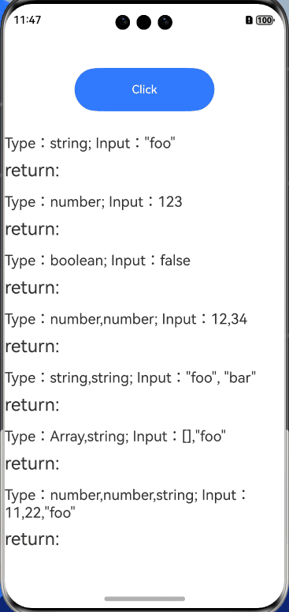

# typed-function

## Introduction

typed-function supports the transfer of type checking logic and type conversion to functions in a flexible and organized manner.

## Effect


## How to Install

````
ohpm install typed-function@4.2.1
````

For details about the OpenHarmony ohpm environment configuration, see [OpenHarmony HAR](https://gitee.com/openharmony-tpc/docs/blob/master/OpenHarmony_har_usage.en.md).

## How to Use

```typescript
// Introduce typed-function.
import typed from 'typed-function'
// Example API call
let fn: ESObject = typed({
  string: (value: string) => {
    return 'string:' + value
  },
  number: (value: number) => {
    return 'number:' + value
  },
  boolean: (value: boolean) => {
    return 'boolean:' + value
  },
  'number,number': () => {
    return 'number,number'
  },
  'string,string': () => {
    return 'string,string'
  },
  'Array,string': () => {
    return 'Array,string'
  },
  'number,number,string': () => {
    return 'three'
  }
});
```

## Available APIs

1. Typed function construction: typed([name: string], ...Object.<string, function>|function)
2. Convert the value to the type using typed.convert(value: *, type: string).
3. Create a new and independent typed function instance using typed.create().
4. Parse a typed function and return an executable function using typed.resolve(fn: typed-function, argList: Array).
5. Search for the typed function that matches the given function signature using typed.findSignature(fn: typed-function, signature: string | Array, options: object).
6. Search for the function that matches the given signature in the typed function using typed.find(fn: typed-function, signature: string | Array, options: object).
7. Create a reference to a typed function using typed.referTo(...string, callback: (resolvedFunctions:...function) => function).
8. Create a reference to itself in the typed function using typed.referToSelf(callback: (self) == > function).
9. Check whether the given entity is a typed function using typed.isTypedFunction(entity: ESObject).
10. Adding a user-defined type to the typed function library using typed.addType(type: {name: string, test: function, [, beforeObjectTest=true]).
11. Clear the type definition of the typed function using typed.clear().
12. Add customized type conversion to the typed function library using typed.addConversion(conversion: {from: string, to: string, convert: function}).
13. Remove a user-defined type conversion from the typed function library using typed.removeConversion(conversion: ConversionDef).
14. Clear the user-defined type conversion of the typed function using typed.clearConversions().

## Constraints

This project has been verified in the following version:

- DevEco Studio: 4.1 Canary (4.1.3.317), OpenHarmony SDK: API11 (4.1.0.36)

## Directory Structure

````
|---- typed-function 
|     |---- entry  # Sample code
|     |---- README.md     # Readme    
|     |---- README_zh.md  # Readme   
````

## How to Contribute
If you find any problem during the use, submit an [issue](https://gitee.com/openharmony-tpc/openharmony_tpc_samples/issues) or a [PR](https://gitee.com/openharmony-tpc/openharmony_tpc_samples/pulls) to us.

## License
This project is licensed under [MIT License](https://gitee.com/openharmony-tpc/openharmony_tpc_samples/blob/master/typed-function/LICENSE).
