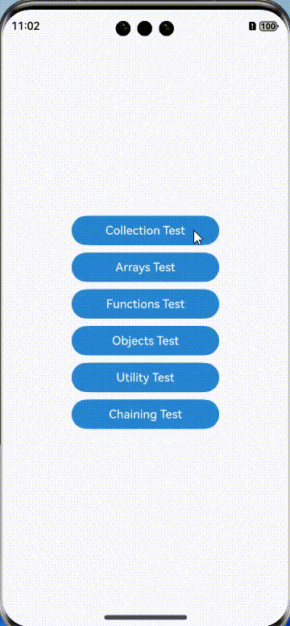

# Underscore

## Introduction

Underscore is a JavaScript utility library that provides common functions (such as **each**, **map**, **reduce**, and **filter**) without extending core JavaScript objects.

## Effect


## How to Install

````
ohpm install underscore@1.13.7
ohpm install @types/underscore  // Install @types/underscore to prevent import syntax errors due to missing type declarations in the underscore package.
````

For details about the OpenHarmony ohpm environment configuration, see [OpenHarmony HAR](https://gitcode.com/openharmony-tpc/docs/blob/master/OpenHarmony_har_usage.en.md).

## How to Use

```typescript
// Import underscore.
import { first, last, union, indexOf, range } from 'underscore'
// Call APIs
first([5, 4, 3, 2, 1]); //5
last([5, 4, 3, 2, 1]); //1
union([1, 2, 3], [101, 2, 1, 10], [2, 1]); //1,2,3,101,10
indexOf([1, 2, 3], 2); //1
range(10); //0,1,2,3,4,5,6,7,8,9
```
For details, see the implementation on the sample page of the open-source library.

## Available APIs

| API                                          | Description                                                  |
| -------------------------------------------- | ------------------------------------------------------------ |
| each(obj, iteratee, context)                 | Traverses elements in an array, object or collection.                                        |
| map(obj, iteratee, context)                  | Creates an array with the results of calling the function specified by **iteratee** on every element in the collection.|
| reduce(collection, iteratee, [initialValue]) | Performs the reduction operation on elements in a collection.                                  |
| filter(obj, predicate, context)              | Creates an array with all the elements that match the specified conditions.          |
| chain(obj)                                   | Creates a sequence for method chaining.                                        |
| invoke(collection, methodName, [arguments])  | Invokes the specified method for each element in the collection.                              |
| random(min, max)                             | Generates a random number in the given range.                                      |
| escape()                                     | Escapes the HTML characters in a string.                                |
| now()                                        | Obtains the current date and time, in the number of milliseconds.                                        |
| first(collection)                            | Obtains the first element from a collection.                                      |
| last(collection)                             | Obtains the last element from a collection.                                      |
| union(array1, array2, ...)                   | Creates an array of unique values in order from all the given arrays.                |
| indexOf(array, value, [isSorted])            | Obtains the element of the specified index in a collection.                              |
| range([start], stop, [step])                 | Creates an array of numbers.                                            |
| keys(obj)                                    | Obtains all the keys (property names) in an object.                                |
| values(obj)                                  | Obtains all the values in an object.                                            |
| pairs(obj)                                   | Converts an object into an array of key-value pairs.                                |
| extend(target, source1, source2, ...)        | Copies the properties from an object to the target object.              |
| clone(obj)                                   | Creates a shallow copy of an object.                                            |

## Constraints

This project has been verified in the following version:

- DevEco Studio: 4.1 Canary (4.1.3.317), OpenHarmony SDK: API 11 (4.1.0.36)

## Project Directory

````
|---- underscore 
|     |---- entry  # Sample code
|     |---- README.md  # Readme
|     |---- README_zh.md  # Readme     
````

## How to Contribute
If you find any problem when using the project, submit an [issue](https://gitcode.com/openharmony-tpc/openharmony_tpc_samples/issues) or a [PR](https://gitcode.com/openharmony-tpc/openharmony_tpc_samples/pulls).

## License
This project is licensed under [MIT License](https://gitcode.com/openharmony-tpc/openharmony_tpc_samples/blob/master/underscore/LICENSE).
