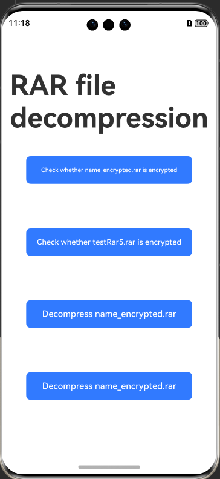

# Unrar

## Introduction

This library is adapted based on [Unrar](https://www.rarlab.com/rar_add.htm) to ensure compatibility with OpenHarmony, while retaining its original usage and features. [Unrar](https://www.rarlab.com/rar_add.htm) is a decompression library for RAR files. It provides the following capabilities:

- Checking whether a package is encrypted
- Decompressing a file to the specified path
- Decompressing an unencrypted or encrypted package



## How to Install

```
ohpm install @ohos/unrar
```
For details about the OpenHarmony ohpm environment configuration, see [OpenHarmony HAR](https://gitcode.com/openharmony-tpc/docs/blob/master/OpenHarmony_har_usage.en.md).


## Configuring the x86 Emulator

See [Running Your App/Service on an Emulator](https://developer.huawei.com/consumer/en/doc/harmonyos-guides-V5/ide-run-emulator-V5).


## How to Use
```javascript
import unrar from '@ohos/unrar'
```

## Available APIs
| API        |                         Parameter                        | Description        |
| ---------------- | :----------------------------------------------------------: | ---------------- |
| isEncrypted      |                    (path:string)=>number                     | Checks whether a package is encrypted.|
| extract          |   (path: string, dest: string, password?: string)=>string    | Synchronously decompresses a file.    |
| RarFiles_Extract | (path: string, dest: string, callBack: ICallBack, password?: string)=>void | Asynchronously decompresses a file.  |


### Checking Whether a Package Is Encrypted

```
// path: file path. Currently, only the sandbox path is supported.
unrar.isEncrypted(path)

```

### Decompressing an Unencrypted File

```
unrar.RarFiles_Extract(path, globalThis.context.filesDir).then((value) => {
                let resultss;
                if (value = ='Decompression succeeded') {
                  resultss = 'The testRar5.rar file is decompressed successfully. The decompressed file is stored in:' + globalThis.context.filesDir;
                } else {
                  resultss = value;
                }
                this.tag = true;
                this.showDialog(resultss)
              }).catch((error) => {
                this.tag = true;
                this.showDialog('Decompression failed.')
              });

```

### Decompressing an Encrypted File

```
unrar.RarFiles_Extract(path, globalThis.context.filesDir, passwords).then((value) => {
                  let resultss;
                  if (value = ='Decompression succeeded') {
                    resultss = 'The name_encrypted.rar file is decompressed successfully. The decompressed file is stored in:' + globalThis.context.filesDir;
                  } else {
                    resultss = 'Decompression failed.'
                  }
                  this.showDialog(resultss)
                }).catch((error) => {
                  this.showDialog('Decompression failed.')
                });
```
## About obfuscation
- Code obfuscation, please see[Code Obfuscation](https://docs.openharmony.cn/pages/v5.0/zh-cn/application-dev/arkts-utils/source-obfuscation.md)
- If you want the unrar library not to be obfuscated during code obfuscation, you need to add corresponding exclusion rules in the obfuscation rule configuration file obfuscation-rules.txt：
```
-keep
./oh_modules/@ohos/unrar
```

## Constraints

This project has been verified in the following versions:

DevEco Studio: NEXT Beta1-5.0.3.806, SDK: API12 Release(5.0.0.66)

- DevEco Studio: (5.0.3.122), SDK: API 12 (5.0.0.17)

- DevEco Studio: 4.0 (4.0.3.512), SDK: API 10 (4.0.10.9)

- DevEco Studio: 4.0 Canary1 (4.0.0.112), SDK: API 10 (4.0.7.2)


## Directory Structure
```javascript
|---- ohosunrar
|     |---- entry  # Sample code
|     |---- library  # Unrar library
|           |---- src   #  Decompression core code of the unrar library
|                 |---- cpp # Core code of unrar
|     |---- README_EN.md  # Readme
```

## How to Contribute

If you find any problem when using unrar, submit an [issue](https://gitcode.com/openharmony-tpc/openharmony_tpc_samples/issues) or a [PR](https://gitcode.com/openharmony-tpc/openharmony_tpc_samples/pulls).

## License

This project is licensed under [Apache License 2.0](https://gitcode.com/openharmony-tpc/openharmony_tpc_samples/blob/master/unrar/LICENSE).
