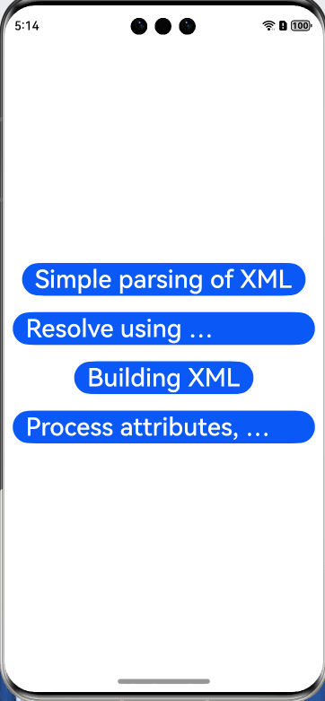

# xml2jsDemo

## Introduction

**xml2js** supports conversion from XML to JavaScript objects, and vice versa. It uses **sax-js** and **xmlbuilder-js** tool libraries.
This project develops a demo for OpenHarmony based on the open source library [node-xml2js](https://github.com/Leonidas-from-XIV/node-xml2js).




## How to Install

Run **ohpm install** to install the project.

```
  ohpm install xml2js@0.4.23
  ohpm install @types/xml2js --save-dev // Install @types/xml2js to prevent import syntax errors due to missing type declarations in the xml2js package.

```

Carry out the following modifications:

1. In the **oh-package.json5** file of the **xmlbuilder** dependency library, change the **"main": ."/lib/index"** statement to **"main": ."/lib/index.js"**.

2. Modify the local **hivgor rollup** packaging configuration by referring to the temporary solution for the **require rollup** problem.

For details about how to configure the OpenHarmony ohpm environment, see [OpenHarmony HAR](https://gitcode.com/openharmony-tpc/docs/blob/master/OpenHarmony_har_usage.en.md).

## How to Use

### Parsing an XML File

1. Import the dependency.

``` javascript
import xml2js from 'xml2js';
```

2. Parse an XML file.

``` javascript
    xml2js.parseString(this.xml, (err, result) => {
      this.message = JSON.stringify(result)
    })
```

3. Customize the parameters of options.

``` javascript
attrkey (default value: $): prefix used to access the attributes. The default value is @ in version 0.1.

charkey (default value: _): prefix used to access the character content. The default value is # in version 0.1.

explicitCharkey (default value: false): determines whether to use the charkey prefix for elements without attributes.

trim (default value: false): trims the whitespace at the beginning and end of text nodes.

normalizeTags (default value: false): normalizes all tag names to lowercase letters.

normalize (default value: false): trims the whitespace inside text nodes.

explicitRoot (default value: true): Set this parameter to true if you want to obtain the root node from the resulting object.

emptyTag (default value: ""): indicates the value of an empty node. If you want to use an empty object as the default value, you are advised to use the factory function ( )=> ( {} ). Otherwise, the common object becomes a shared reference for all instances.

explicitArray (default value: true): If the value is true, the child nodes are always placed in the array. Otherwise, an array is created only when there are multiple child nodes.

ignoreAttrs (default value: false): ignores all XML attributes and creates text nodes only.

mergeAttrs (default value: false): merges attributes and their child elements as attributes of the parents, instead of setting the attribute as the key frame of the child attribute object. If the value of ignoreAttrs is true, this parameter is ignored.

validator (default value: null): specifies a callable function to validate the resulting structure in a certain way. For details about the example, see the test in node-xml2js library.

xmlns (default value: false): adds a field called "$ns" to each element (the first character of the field is the same as attrkey). This field contains its local name and namespace URI.

explicitChildren (default value: false): places child elements into separate attributes. If mergeAttrs is set to true, this parameter does not take effect. If an element does not have child elements, no child element is created. This parameter is added in version 0.2.5.

childkey (default value: $$): prefix used to access child elements if explicitChildren is set to true. This parameter is added in version 0.2.5.

preserveChildrenOrder (default value: false): modifies the behavior of explicitChildren so that the value of the "children" attribute becomes an ordered array. When this parameter is true, each node gets a #name field whose value corresponds to the XML nodeName, so that you can iterate over "children" arrays and determine the node names. Named (and possibly unordered) attributes are also retained in this configuration, at the same level as the ordered Child arrays. This parameter is added in version 0.4.9.

charsAsChildren (default value: false): determines whether a character should be treated as a child if explicitChildron is enabled. This parameter is added in version 0.2.5.

includeWhiteChars (default value: false): determines whether to include whitespace-only text nodes. This parameter is added in version 0.4.17.

async (default value: false): specifies whether a callback should be asynchronous. This may be an incompatible change if your code uses a synchronous callback. Future versions of xml2js may change this default value. Therefore, you are advised not to depend on synchronous execution. This parameter is added in version 0.2.6.

strict (default value: true): sets sax-js to strict or non-strict parsing mode. It is highly recommended that you retain the default value true because parsing XML with incorrect formats may cause unexpected results. This parameter is added in version 0.2.7.

Add the following code to version 0.4.14:
attrNameProcessors (default value: null): allows the addition of attribute name processing functions and accepts a function array with the following signature:
function (name){
    //do something with `name`
    return name
}

Add the following code to 0.4.1:
attrValueProcessors (default value: null): allows the addition of attribute value processing functions and accepts a function array with the following signature:
function (value, name){
  //do something with `name`
  return name
}

Add the following code to 0.4.1:
tagNameProcessors (default value: null): allows the addition of tag name processing functions and accepts a function array with the following signature:
function (name){
  //do something with `name`
  return name
}

Add the following code to 0.4.6:
ValueProcessors (default value: null): allows the addition of value processing functions and accepts a function array with the following signature:
function (value, name){
  //do something with `name`
  return name
}

```

## Available APIs

| Name                                                     | Description            |
| ------------------------------------------------------------ | ---------------- |
| xml2js.parseString(str, a, b) | Parses an XML string into a JavaScript object.|
| xml2js.parseStringPromise(xml/*, options*/)| Asynchronously parses an XML string into a JavaScript object.   |
| builder.buildObject(obj) | Builds an XML object.   |

## Constraints
This project has been verified in the following version:

DevEco Studio version: 4.1 Canary (4.1.3.414); OpenHarmony SDK: API version 11 (4.1.0.36)


## Directory Structure

```
/xml2jsDemo  # Demo code
|—— entry
├── src      # Framework code
│   └── main
│   	└── ets
│   	    └── Application
│   	    └── MainAbility
│   	    └── pages
│       	    └── index.ets  # Home page of the XML parsing example
│   	        └── processingAttribute.ets  # Simply parse an XML string
│       	    └── promiseUsage.ets  # Parse an XML string through PromiseUsage
│       	    └── simpleParseXml.ets  # Build an XML object
│       	    └── xmlBuilder.ets  # Process attributes, tag names, and values


```

## How to Contribute

If you find any problem when using the project, submit an [issue](https://gitcode.com/openharmony-tpc/openharmony_tpc_samples/issues) or a [PR](https://gitcode.com/openharmony-tpc/openharmony_tpc_samples/pulls).

## License

This project is licensed under [MIT License](https://gitcode.com/openharmony-tpc/openharmony_tpc_samples/blob/master/xml2jsDemo/LICENSE).

